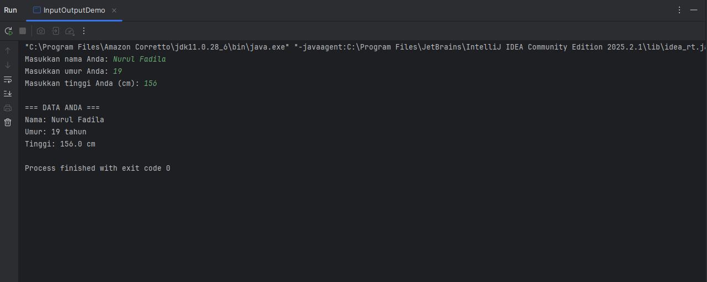
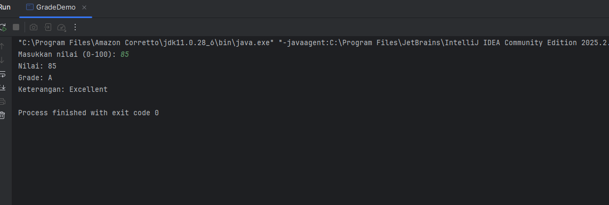
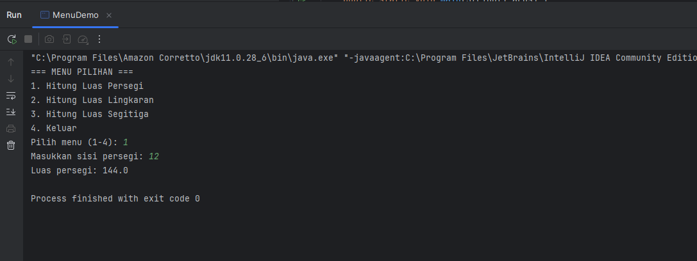
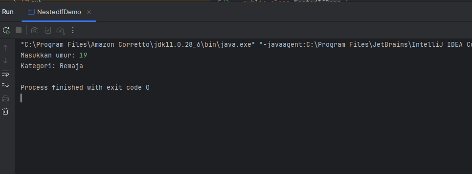
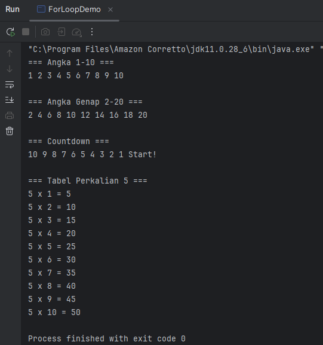
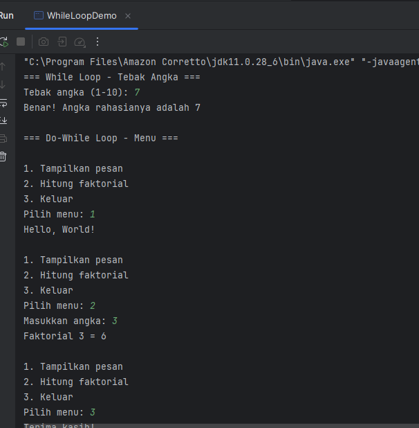
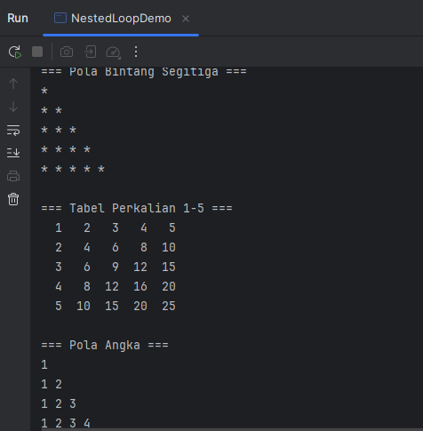

# Laporan Modul 2: Dasar Pemrograman Java
**Mata Kuliah:** Praktikum Pemrograman Berorientasi Objek   
**Nama:** Nurul Fadila  
**NIM:** 2024573010026  
**Kelas:** TI 2A

---

## 1. Abstrak 
Praktikum Dasar Pemrograman Java bertujuan untuk memberikan pemahaman awal mengenai konsep, sintaksis, serta implementasi logika pemrograman menggunakan bahasa Java. Java merupakan bahasa pemrograman berorientasi objek (Object-Oriented Programming) yang memiliki keunggulan berupa portabilitas, kemudahan dalam penggunaan, serta dukungan pustaka yang luas. 

Dalam praktikum ini, mahasiswa diperkenalkan pada struktur dasar program Java, penggunaan variabel, tipe data, operator, percabangan, perulangan, serta penerapan array dan fungsi sederhana. Melalui serangkaian percobaan seperti pembuatan program tebak angka, perhitungan faktorial, serta implementasi pola bintang dan tabel perkalian, mahasiswa dilatih untuk mengembangkan logika algoritma dan menuangkannya dalam bentuk kode program yang dapat dijalankan. 

Hasil praktikum menunjukkan bahwa pemahaman terhadap struktur kontrol dan alur logika sangat penting dalam membangun program yang efektif dan efisien. Dengan demikian, praktikum ini menjadi dasar yang kuat bagi mahasiswa untuk mempelajari konsep pemrograman yang lebih kompleks pada tahap selanjutnya.

---
## 2. Praktikum
### Praktikum 1 - Variabel dan Tipe Data
#### Dasar Teori
Java memiliki dua kategori tipe data:

1. Tipe Data Primitif

- byte: 8-bit signed integer (-128 to 127)

- short: 16-bit signed integer (-32,768 to 32,767)

- int: 32-bit signed integer (-2,147,483,648 to 2,147,483,647)

- long: 64-bit signed integer

- float: 32-bit IEEE 754 floating point

- double: 64-bit IEEE 754 floating point

- boolean: true atau false

- char: 16-bit Unicode character

2. Tipe Data Reference (Non primitif)

- String, Array, Object, class, dll.

3. Aturan Penamaan Variabel

- Dimulai dengan huruf, underscore (_), atau dollar sign ($)

- Tidak boleh dimulai dengan angka

- Case sensitive

- Tidak boleh menggunakan keyword java
#### Langkah Praktikum
Langkah 1: Variabel dan Tipe data

1. Buat file baru dengan nama VariabelDemo.java
   2. Ketik kode berikut:
   
            package MODUL_2;

            public class VariabelDemo {
            public static void main(String[] args) {

           int umur = 20;
           double tinggi = 175.5;
           char grade = 'A';
           boolean lulus = true;
           String nama = "John Doe";
        
           System.out.println("Nama :" + nama);
           System.out.println("Umur :" + umur + " tahun");
           System.out.println("Tinggi :" + tinggi + " cm");
           System.out.println("Grade :" + grade);
           System.out.println("Lulus :" + lulus);

           int a = 10;
           int b = 3;

           System.out.println("\n== Operasi Aritmatika ==");
           System.out.println("a = " + a);
           System.out.println("b =" + b);
           System.out.println("a + b =" + (a + b));
           System.out.println("a - b = " + (a - b));
           System.out.println("a * b = " + (a * b));
           System.out.println("a / b = " + (a / b));
           System.out.println("a % b = " + (a % b));

           System.out.println("\n=== Casting Tipe Data ===");
           double nilaiDouble = 9.8;
           int nilaiInt = (int) nilaiDouble;

           System.out.println("Nilai double: " + nilaiDouble);
           System.out.println("Setelah casting ke int: " + nilaiInt);
        
           byte byteVar = 50;
           short shortVar = 100;
           int hasil = byteVar + shortVar;
           System.out.println("byte + short = " + hasil + " (tipe: int)");

            } 
            }

#### Screenshoot Hasil

#### Analisa dan Pembahasan
Analisa:

public class VariabelDemo { ... }
— Mendeklarasikan class bernama VariabelDemo.

public static void main(String[] args) { ... }
— Titik masuk program. static agar JVM bisa memanggilnya tanpa membuat objek.

Deklarasi variabel awal:

int umur = 20; — bilangan bulat.

double tinggi = 175.5; — pecahan (floating point).

char grade = 'A'; — karakter tunggal.

boolean lulus = true; — nilai benar/salah.

String nama = "John Doe"; — teks.

System.out.println("..."+ variabel);
— Operator + di sini melakukan konkatenasi (gabung string) saat salah satunya String. Urutan dan penggunaan tanda kurung penting kalau mau melakukan operasi aritmatika sebelum konkatenasi.

Operasi aritmatika (a = 10, b = 3):

a + b → 13

a - b → 7

a * b → 30

a / b → integer division -> 10 / 3 menghasilkan 3 (sisa dibuang karena kedua operand bertipe int)

a % b → 10 % 3 menghasilkan 1 (sisa pembagian)

Kalau ingin hasil pembagian desimal gunakan tipe floating: ((double) a / b) → 3.333....

Casting/konversi tipe:

double nilaiDouble = 9.8;

int nilaiInt = (int) nilaiDouble; → casting ke int memotong (truncate) bagian desimal, jadi nilai menjadi 9 (bukan pembulatan).

Promosi tipe saat operasi:

byte + short di Java dipromosikan ke int sebelum operasi. Jadi byteVar + shortVar menghasilkan int (150). Oleh karena itu hasil dideklarasikan int.

### Praktikum 2 - Input, Output dan Scanner
#### Dasar Teori
Untuk membaca input dari pengguna dalam Java, kita menggunakan class Scanner yang terdapat dalam package java.util. Scanner menyediakan berbagai method untuk membaca berbagai tipe data:

- nextInt(): membaca integer
- nextDouble(): membaca double
- nextLine(): membaca String (termasuk spasi)
- next(): membaca String (sampai spasi pertama)
- nextBoolean(): membaca boolean
#### Langkah Praktikum
Langkah 1: Import dan Membuat Scanner

Buat file baru dengan nama InputOutputDemo.java
Ketik kode berikut:

        import java.util.Scanner;
    
    public class InputOutputDemo {
        public static void main(String[] args) {

    Scanner input = new Scanner(System.in);

        // Membaca input string
        System.out.print("Masukkan nama Anda: ");
        String nama = input.nextLine();

        // Membaca input integer
        System.out.print("Masukkan umur Anda: ");
        int umur = input.nextInt();

        // Membaca input double
        System.out.print("Masukkan tinggi Anda (cm): ");
        double tinggi = input.nextDouble();

        // Menampilkan output
        System.out.println("\n=== DATA ANDA ===");
        System.out.println("Nama: " + nama);
        System.out.println("Umur: " + umur + " tahun");
        System.out.println("Tinggi: " + tinggi + " cm");

        // Menutup Scanner
        input.close();
    } 
    }

#### Screenshoot Hasil

#### Analisa dan Pembahasan
- public class InputOutputDemo → mendefinisikan kelas utama bernama InputOutputDemo.
- public static void main(String[] args) → adalah method utama tempat semua eksekusi program dimulai.
- Membuat objek bernama input dari class Scanner.
- System.in berarti input berasal dari keyboard (standard input stream).
- Dengan objek ini, kita bisa membaca berbagai tipe data seperti String, int, double, dll.
- System.out.print menampilkan teks ke layar tanpa pindah baris (berbeda dengan println).
- input.nextLine() membaca satu baris teks penuh yang diketik oleh pengguna.
- Misalnya pengguna mengetik: Nurul Fadila, maka nilai variabel nama = "Nurul Fadila".
- input.nextInt() digunakan untuk membaca bilangan bulat (integer).
- Misalnya pengguna mengetik: 20, maka nilai umur = 20.
- input.nextDouble() membaca angka desimal (floating-point number).
- Misalnya pengguna mengetik: 165.5, maka nilai tinggi = 165.5.
- \n → digunakan untuk membuat baris baru (enter).
- System.out.println() digunakan untuk mencetak teks + pindah baris.
- Program menampilkan semua data yang sebelumnya diinput oleh pengguna.
- Menutup objek Scanner setelah selesai digunakan.
- Ini adalah praktik pemrograman yang baik untuk mencegah kebocoran sumber daya (resource leak).
- Setelah close(), objek input tidak bisa lagi digunakan untuk membaca input.
- Program ini memperlihatkan interaksi antara pengguna dan komputer dengan:

Membaca data masukan berbagai tipe (String, int, double), menampilkan kembali hasil input dengan format yang mudah dibaca, menunjukkan dasar penggunaan class Scanner di Java.

### Praktikum 3 - Struktur Control: Percabangan
#### Dasar Teori
Struktur kontrol percabangan digunakan untuk membuat keputusan dalam program. Java menyediakan beberapa statement percabangan:

If Statement

if (kondisi) {

// kode yang dijalankan jika kondisi true

}

If-Else Statement

if (kondisi) {

// kode jika kondisi true

} else {

// kode jika kondisi false

}

If-Else If-Else Statement

if (kondisi1) {

// kode jika kondisi1 true

} else if (kondisi2) {

// kode jika kondisi2 true

} else {

// kode jika semua kondisi false

}

Switch Statement

switch (variabel) {

case nilai1:

// kode

break;

case nilai2:

// kode

break;

default:

// kode default

}
#### Langkah Praktikum
Langkah 1: Program Penentu Grade

Buat file baru dengan nama GradeDemo.java
Implementasikan kode berikut:

    import java.util.Scanner;

    public class GradeDemo {
        public static void main(String[] args) {
        Scanner input = new Scanner(System.in);

        System.out.print("Masukkan nilai (0-100): ");
        int nilai = input.nextInt();

        char grade;
        String keterangan;

        // Menggunakan if-else if-else
        if (nilai >= 85) {
            grade = 'A';
            keterangan = "Excellent";
        } else if (nilai >= 75) {
            grade = 'B';
            keterangan = "Good";
        } else if (nilai >= 65) {
            grade = 'C';
            keterangan = "Fair";
        } else if (nilai >= 55) {
            grade = 'D';
            keterangan = "Poor";
        } else {
            grade = 'E';
            keterangan = "Fail";
        }
        System.out.println("Nilai: " + nilai);
        System.out.println("Grade: " + grade);
        System.out.println("Keterangan: " + keterangan);

        input.close();

    }

    }

Langkah 2: Program Menu dengan Switch

Buat file baru dengan nama MenuDemo.java
Implementasikan kode berikut:

        import java.util.Scanner;

        public class MenuDemo {
            public static void main(String[] args) {
        Scanner input = new Scanner(System.in);

        System.out.println("=== MENU PILIHAN ===");
        System.out.println("1. Hitung Luas Persegi");
        System.out.println("2. Hitung Luas Lingkaran");
        System.out.println("3. Hitung Luas Segitiga");
        System.out.println("4. Keluar");

        System.out.print("Pilih menu (1-4): ");
        int pilihan = input.nextInt();

        switch (pilihan) {
            case 1:
                System.out.print("Masukkan sisi persegi: ");
                double sisi = input.nextDouble();
                double luasPersegi = sisi * sisi;
                System.out.println("Luas persegi: " + luasPersegi);
                break;

            case 2:
                System.out.print("Masukkan jari-jari lingkaran: ");
                double jariJari = input.nextDouble();
                double luasLingkaran = Math.PI * jariJari * jariJari;
                System.out.println("Luas lingkaran: " + luasLingkaran);
                break;

            case 3:
                System.out.print("Masukkan alas segitiga: ");
                double alas = input.nextDouble();
                System.out.print("Masukkan tinggi segitiga: ");
                double tinggi = input.nextDouble();
                double luasSegitiga = 0.5 * alas * tinggi;
                System.out.println("Luas segitiga: " + luasSegitiga);
                break;

            case 4:
                System.out.println("Terima kasih!");
                break;

            default:
                System.out.println("Pilihan tidak valid!");
        }

        input.close();

    }}

Langkah 3: Program Nested If

Buat file baru dengan nama NestedIfDemo.java
Implementasikan program untuk menentukan kategori usia:

        import java.util.Scanner;

            public class NestedIfDemo {
                public static void main(String[] args) {
        Scanner input = new Scanner(System.in);

        System.out.print("Masukkan umur: ");
        int umur = input.nextInt();

        if (umur >= 0) {
            if (umur < 2) {
                System.out.println("Kategori: Bayi");
            } else if (umur <= 5) {
                System.out.println("Kategori: Balita");
            } else if (umur <= 12) {
                System.out.println("Kategori: Anak-anak");
            } else if (umur <= 19) {
                System.out.println("Kategori: Remaja");
            } else if (umur <= 59) {
                System.out.println("Kategori: Dewasa");
            } else {
                System.out.println("Kategori: Lansia");
            }
        } else {
            System.out.println("Umur tidak valid!");
        }

        input.close();
    }}
#### Screenshoot Hasil
langkah 1:

langkah 2:

langkah 3:

#### Analisa dan Pembahasan
-- Analisa langkah 1 --
- Membuat objek input dari class Scanner.
- System.in menandakan bahwa input akan diambil dari keyboard.
- Dengan objek ini, program bisa membaca angka, teks, atau karakter dari pengguna.
- System.out.print menampilkan teks ke layar tanpa pindah baris, agar pengguna dapat mengetik di baris yang sama.
- input.nextInt() membaca bilangan bulat (integer) dari keyboard dan menyimpannya dalam variabel nilai.
- grade bertipe char, digunakan untuk menyimpan huruf nilai seperti 'A', 'B', dst.
- keterangan bertipe String, digunakan untuk menyimpan penjelasan seperti "Excellent", "Good", dst.
- Program akan mengecek dari atas ke bawah, dan berhenti pada kondisi pertama yang benar.

Misal nilai = 78
→ nilai >= 85 ❌
→ nilai >= 75 ✅
Maka program memilih grade = 'B' dan keterangan = "Good".
- System.out.println() menampilkan teks diikuti nilai variabel dan pindah ke baris baru.
- Simbol + digunakan untuk menggabungkan teks dengan nilai variabel.
- Menutup objek Scanner setelah selesai digunakan.
- Ini mencegah kebocoran resource (resource leak) karena System.in tetap terbuka.
- Setelah dipanggil close(), objek input tidak bisa lagi digunakan untuk membaca data.

-- Analisa langkah 2--

Kode ini berfungsi sebagai program menu sederhana untuk menghitung luas berbagai bangun datar — persegi, lingkaran, dan segitiga — menggunakan struktur kontrol switch-case.
- Membuat objek input dari class Scanner untuk membaca data dari keyboard (System.in).
- Dengan ini, program dapat menerima input angka atau teks dari pengguna.
- System.out.println("=== MENU PILIHAN ===");
  System.out.println("1. Hitung Luas Persegi");
  System.out.println("2. Hitung Luas Lingkaran");
  System.out.println("3. Hitung Luas Segitiga");
  System.out.println("4. Keluar");
- Bagian ini menampilkan daftar menu ke layar agar pengguna bisa memilih salah satu operasi yang diinginkan.
- System.out.println() mencetak teks dan pindah baris otomatis
- System.out.print("Pilih menu (1-4): ");
  int pilihan = input.nextInt();
- Menampilkan pesan agar pengguna memilih angka 1–4.
- input.nextInt() membaca bilangan bulat dari keyboard, dan disimpan ke variabel pilihan.
- switch digunakan untuk memilih cabang eksekusi berdasarkan nilai dari variabel pilihan.
- Setiap case mewakili satu pilihan menu.
- break digunakan agar program tidak menjalankan case berikutnya setelah satu case selesai.
- Program meminta input panjang sisi persegi.
- Rumus luas persegi:

Luas = sisi × sisi

- Hasilnya ditampilkan ke layar.
- case 2:
  System.out.print("Masukkan jari-jari lingkaran: ");
  double jariJari = input.nextDouble();
  double luasLingkaran = Math.PI * jariJari * jariJari;
  System.out.println("Luas lingkaran: " + luasLingkaran);
  break;
- Program meminta jari-jari lingkaran.
- Menggunakan konstanta Math.PI (≈ 3.141592653589793) dari library Java.
- Rumus luas lingkaran:

Luas=π×r 2

- Hasil ditampilkan ke layar.
- case 3:
  System.out.print("Masukkan alas segitiga: ");
  double alas = input.nextDouble();
  System.out.print("Masukkan tinggi segitiga: ");
  double tinggi = input.nextDouble();
  double luasSegitiga = 0.5 * alas * tinggi;
  System.out.println("Luas segitiga: " + luasSegitiga);
  break;
- Program meminta dua input: alas dan tinggi segitiga.

- Rumus luas segitiga:

Luas = 1/2 × alas × tinggi

- Hasilnya ditampilkan di layar.
- case 4:
  System.out.println("Terima kasih!");
  break;
- Jika pengguna memilih menu nomor 4, program akan menampilkan pesan perpisahan dan berhenti tanpa melakukan perhitungan apa pun.
- default:
  System.out.println("Pilihan tidak valid!");
- Bagian ini dijalankan jika nilai pilihan tidak sama dengan 1, 2, 3, atau 4.
- Digunakan untuk menangani input yang salah.
- input.close();
- Setelah semua proses selesai, objek Scanner ditutup agar tidak terjadi resource leak (kebocoran sumber daya).

-- Analisa langkah 3 --
- System.out.print menampilkan pesan tanpa pindah baris, supaya pengguna bisa mengetik di baris yang sama.
- input.nextInt() membaca angka bulat (integer) dari keyboard dan menyimpannya ke variabel umur.
- Mengecek Validitas Umur
  if (umur >= 0) {

- Umur tidak boleh negatif.
- Jadi, blok di dalam if hanya akan dijalankan jika umur >= 0.
- Kalau umur negatif, maka akan langsung masuk ke bagian else paling bawah:
  System.out.println("Umur tidak valid!");
- Menentukan Kategori Usia
 Jika umur valid (>= 0), maka program melanjutkan pemeriksaan dengan serangkaian if - else if:
- Kondisi	Kategori	Penjelasan
umur < 2	Bayi	Bayi usia di bawah 2 tahun
umur <= 5	Balita	Anak kecil usia 2–5 tahun
umur <= 12	Anak-anak	Umur 6–12 tahun
umur <= 19	Remaja	Umur 13–19 tahun
umur <= 59	Dewasa	Umur 20–59 tahun
lebih dari 59 Lansia	Usia lanjut 60 tahun ke atas

### Praktikum 4 - Struktur Control: Perulangan
#### Dasar Teori
Perulangan (loop) digunakan untuk mengulang eksekusi kode tertentu. Java menyediakan tiga jenis perulangan:

For Loop

for (inisialisasi; kondisi; increment/decrement) {

// kode yang diulang

}

While Loop

while (kondisi) {

// kode yang diulang

}

Do-While Loop

do {

// kode yang diulang

} while (kondisi);

#### Langkah Praktikum
Langkah 1: Perulangan For 

Buat file baru dengan nama ForLoopDemo.java
Implementasikan berbagai contoh for loop:

        Public static void main(String[] args) {
        // Contoh 1: Menampilkan angka 1-10
        System.out.println("=== Angka 1-10 ===");
        for (int i = 1; i <= 10; i++) {
        System.out.print(i + " ");
        }

        System.out.println();
        // Contoh 2: Menampilkan angka genap
        System.out.println("\n=== Angka Genap 2-20 ===");
        for (int i = 2; i <= 20; i += 2) {
            System.out.print(i + " ");
        }
        System.out.println();

        // Contoh 3: Countdown
        System.out.println("\n=== Countdown ===");
        for (int i = 10; i >= 1; i--) {
            System.out.print(i + " ");
        }
        System.out.println("Start!");

        // Contoh 4: Tabel perkalian
        System.out.println("\n=== Tabel Perkalian 5 ===");
        for (int i = 1; i <= 10; i++) {
            System.out.println("5 x " + i + " = " + (5 * i));
        }
    }

Langkah 2: Perulangan While dan Do-While

Buat file baru dengan nama WhileLoopDemo.java
Implementasikan contoh while dan do-while:

    import java.util.Scanner;
        public class WhileLoopDemo {
            public static void main(String[] args) {
        Scanner input = new Scanner(System.in);

        // Contoh While Loop
        System.out.println("=== While Loop - Tebak Angka ===");
        int angkaRahasia = 7;
        int tebakan = 0;

        while (tebakan != angkaRahasia) {
            System.out.print("Tebak angka (1-10): ");
            tebakan = input.nextInt();

            if (tebakan < angkaRahasia) {
                System.out.println("Terlalu kecil!");
            } else if (tebakan > angkaRahasia) {
                System.out.println("Terlalu besar!");
            } else {
                System.out.println("Benar! Angka rahasianya adalah " + angkaRahasia);
            }
        }

        // Contoh Do-While Loop
        System.out.println("\n=== Do-While Loop - Menu ===");
        int pilihan;

        do {
            System.out.println("\n1. Tampilkan pesan");
            System.out.println("2. Hitung faktorial");
            System.out.println("3. Keluar");
            System.out.print("Pilih menu: ");
            pilihan = input.nextInt();
            switch(pilihan) {
                case 1:
                    System.out.println("Hello, World!");
                    break;
                case 2:
                    System.out.print("Masukkan angka: ");
                    int n = input.nextInt();
                    long faktorial = 1;
                    for (int i = 1; i <= n; i++) {
                        faktorial *= i;
                    }
                    System.out.println("Faktorial " + n + " = " + faktorial);
                    break;
                case 3:
                    System.out.println("Terima kasih!");
                    break;
                default:
                    System.out.println("Pilihan tidak valid!");
            }
        } while (pilihan != 3);

        input.close();
    }

    }

Langkah 3: Nested Loop (Perulangan Bersarang)

Buat file baru dengan nama NestedLoopDemo.java
Implementasikan contoh nested loop:

    public class NestedLoopDemo {
        public static void main(String[] args) {
        System.out.println("=== Pola Bintang Segitiga ===");
    for (int i = 1; i <= 5; i++) {
        for (int j = 1; j <= i; j++) {
    System.out.print("* ");
    }
        System.out.println();
    }

        // Contoh 2: Tabel Perkalian
        System.out.println("\n=== Tabel Perkalian 1-5 ===");
        for (int i = 1; i <= 5; i++) {
            for (int j = 1; j <= 5; j++) {
                System.out.printf("%3d ", (i * j));
            }
            System.out.println();
        }

        // Contoh 3: Pola Angka
        System.out.println("\n=== Pola Angka ===");
        for (int i = 1; i <= 4; i++) {
            for (int j = 1; j <= i; j++) {
                System.out.print(j + " ");
            }
            System.out.println();
         }
        }
    }

#### Screenshoot Hasil
langkah 1:

langkah 2:

langkah 3:

#### Analisa dan Pembahasan
-- Analisa langkah 1 --
- System.out.println("=== Angka 1-10 ===");
for (int i = 1; i <= 10; i++) {
System.out.print(i + " ");
}

- Tujuan: menampilkan angka dari 1 hingga 10 dalam satu baris.
-  Penjelasan bagian for:
- int i = 1 → inisialisasi variabel penghitung (mulai dari 1)
- i <= 10 → kondisi batas perulangan (berhenti jika lebih dari 10)
- i++ → menambah nilai i satu per satu setiap iterasi
- System.out.print menampilkan angka tanpa pindah baris agar hasilnya sejajar.
- i = 2 → mulai dari angka 2
- i <= 20 → berhenti jika i melebihi 20
- i += 2 → setiap iterasi, nilai i bertambah 2 (bukan 1)
- System.out.println("\n=== Countdown ===");
  for (int i = 10; i >= 1; i--) {
  System.out.print(i + " ");
  }
  System.out.println("Start!");

- Tujuan: menampilkan hitungan mundur dari 10 ke 1, lalu menampilkan kata “Start!”
- i = 10 → mulai dari 10
- i >= 1 → berhenti jika kurang dari 1
- i-- → setiap iterasi, i berkurang 1

- for (int i = 1; i <= 10; i++) {
System.out.println("5 x " + i + " = " + (5 * i));
- Tujuan: menampilkan hasil perkalian 5 dengan angka 1–10.
- Setiap iterasi, nilai i berubah dari 1 hingga 10.
- 5 * i menghitung hasil perkalian 5 dengan nilai i.
- System.out.println menampilkan setiap hasil di baris baru
- Program ini adalah latihan konsep dasar perulangan (for loop) di Java, yang menunjukkan berbagai pola:
- Perulangan menaik (1–10)
- Perulangan dengan kenaikan khusus (angka genap)
- Perulangan menurun (countdown)
- Perulangan untuk perhitungan matematis (tabel perkalian)

-- Analisa langkah 2 --

program ini memperlihatkan dua jenis perulangan penting di Java, yaitu while loop dan do-while loop, beserta penerapannya dalam contoh nyata.
1. Inisialisasi variabel:
- angkaRahasia = 7 → angka yang harus ditebak oleh pengguna.
- tebakan = 0 → nilai awal tebakan (belum sama dengan angka rahasia).

2. Kondisi While:
- while (tebakan != angkaRahasia) → perulangan akan terus berjalan selama tebakan tidak sama dengan angka rahasia.
- Artinya, program akan berulang terus-menerus sampai pengguna menebak dengan benar.

3. Isi perulangan:
- Program meminta pengguna memasukkan tebakan (nextInt()).
- Lalu dilakukan percabangan (if-else):
- Jika tebakan lebih kecil, tampilkan “Terlalu kecil!”
- Jika tebakan lebih besar, tampilkan “Terlalu besar!”
- Jika tebakan sama, tampilkan “Benar!” dan keluar dari loop (karena kondisi while sudah salah).

4. Deklarasi variabel:
- int pilihan;
- Variabel ini menyimpan pilihan menu dari pengguna.

5. Do-While Loop:
- do { ... } while (pilihan != 3);
- Isi di dalam {} akan selalu dijalankan minimal satu kali, karena kondisi diperiksa setelah perulangan.

6. Isi Menu:
- Program menampilkan daftar pilihan:
1. Tampilkan pesan
2. Hitung faktorial
3. Keluar

4. Pengguna memasukkan angka pilihan, lalu program menjalankan perintah sesuai menu menggunakan switch.

- Penjelasan setiap case:

Case 1:

System.out.println("Hello, World!");
- Menampilkan pesan sederhana.

Case 2:

System.out.print("Masukkan angka: ");
int n = input.nextInt();
long faktorial = 1;
for (int i = 1; i <= n; i++) {
faktorial *= i;
}
System.out.println("Faktorial " + n + " = " + faktorial);
- Menghitung faktorial dari angka n dengan loop for.
Misal n = 5, maka faktorial = 1 × 2 × 3 × 4 × 5 = 120.

Case 3:
Menampilkan pesan keluar dan akan menghentikan loop.

Default:
- Jika pengguna memasukkan angka selain 1–3, muncul pesan:
"Pilihan tidak valid!"

Kondisi perulangan:
- Loop akan berulang selama pilihan != 3.

-- Analisa langkah 3 --
- System.out.println("=== Pola Bintang Segitiga ===");
for (int i = 1; i <= 5; i++) {
for (int j = 1; j <= i; j++) {
System.out.print("* ");
}
System.out.println();
}

- Ada dua loop for:
1. i adalah baris (loop luar)
2. j adalah kolom (loop dalam)
- Pada setiap baris i, loop dalam mencetak * sebanyak i kali.

- System.out.println("\n=== Tabel Perkalian 1-5 ===");
for (int i = 1; i <= 5; i++) {
for (int j = 1; j <= 5; j++) {
System.out.printf("%3d ", (i * j));
}
System.out.println();
}

- Loop i → mewakili baris (angka pertama).
- Loop j → mewakili kolom (angka kedua).
- Setiap kombinasi (i * j) mencetak hasil perkalian.

- System.out.printf("%3d ", (i * j));

- %3d berarti angka ditampilkan dalam lebar 3 karakter, supaya rapi seperti tabel.
- System.out.println("\n=== Pola Angka ===");
  for (int i = 1; i <= 4; i++) {
  for (int j = 1; j <= i; j++) {
  System.out.print(j + " ");
  }
  System.out.println();
  }
  
  - Lagi-lagi ada dua loop:

- i = baris (1 sampai 4)
- j = kolom (1 sampai i)
- Loop dalam mencetak angka dari 1 hingga j pada tiap baris.
- program ini melatih kemampuan dalam:
1. Menggunakan loop bersarang (nested loop).
2. Memahami pola baris dan kolom.
3. Mengatur tampilan output konsisten dan rapi dengan printf dan System.out.print.