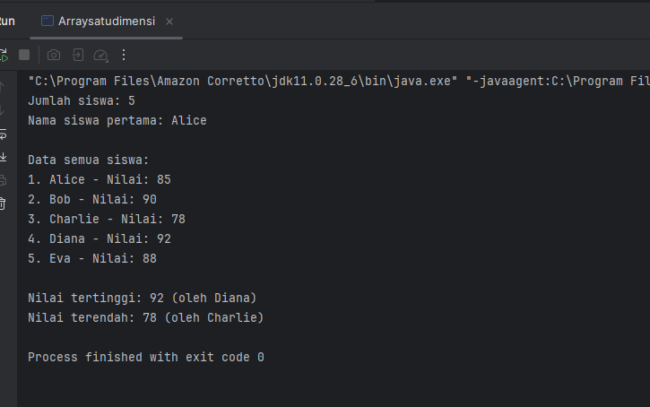
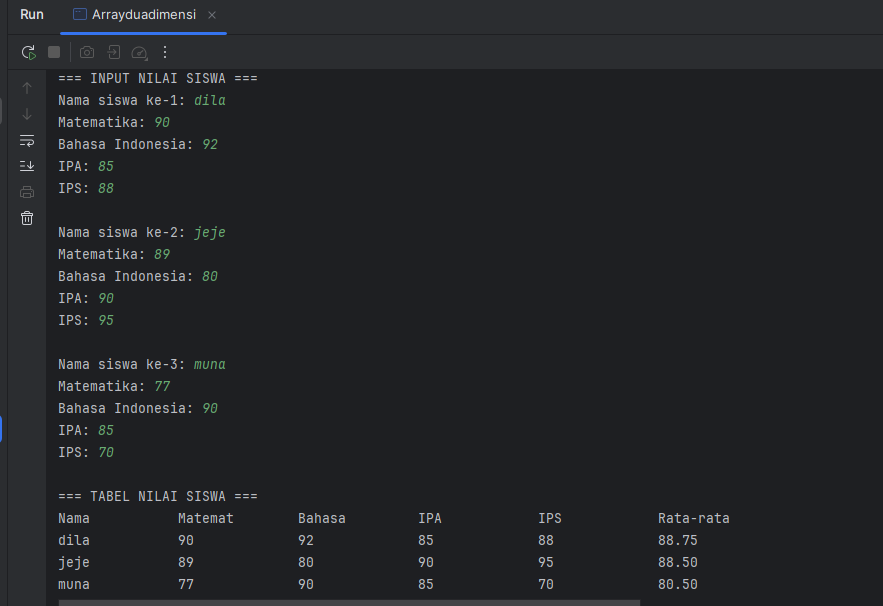
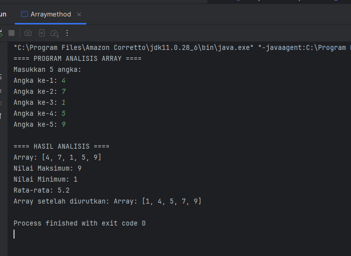
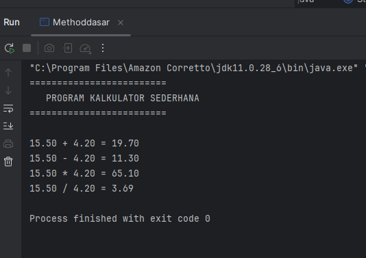
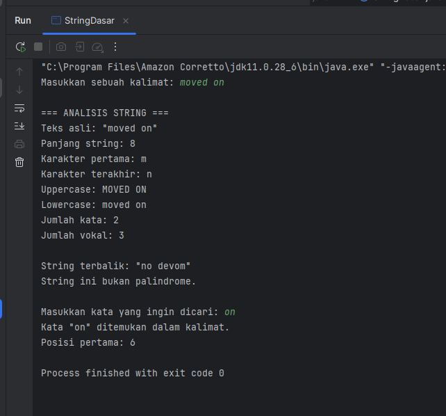
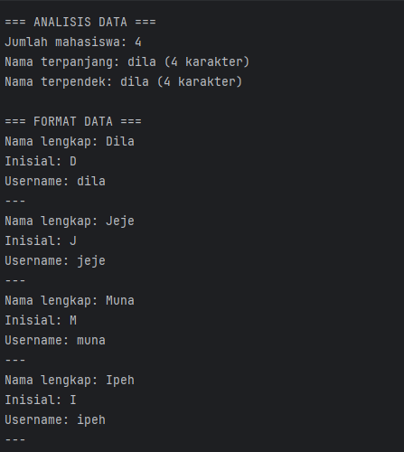

# Laporan Modul 3: Dasar Pemrograman Java
Mata Kuliah: Praktikum Pemrograman Berorientasi Objek   
Nama: Nurul Fadila
NIM: 2024573010026
Kelas: TI 2A

---

## 1. Abstrak
---
Pemrograman Berorientasi Objek (PBO) merupakan paradigma pemrograman yang berfokus pada objek sebagai elemen utama dalam pengembangan perangkat lunak. Setiap objek memiliki atribut (data) dan metode (perilaku) yang saling berinteraksi untuk membentuk sistem yang kompleks namun terstruktur. Konsep utama dalam PBO meliputi enkapsulasi, pewarisan, polimorfisme, dan abstraksi, yang bertujuan untuk meningkatkan efisiensi, modularitas, serta kemudahan dalam pengembangan dan pemeliharaan program. Bahasa Java menjadi salah satu bahasa pemrograman yang paling banyak digunakan untuk menerapkan konsep PBO karena bersifat portable, aman, dan berbasis objek secara penuh.

Dalam pembelajaran dasar pemrograman Java, mahasiswa diperkenalkan dengan struktur dasar program, seperti deklarasi variabel, tipe data, operator, percabangan, perulangan, dan fungsi. Setelah memahami dasar-dasar tersebut, konsep PBO diterapkan melalui pembuatan class, objek, konstruktor, serta penerapan konsep inheritance dan polymorphism. Melalui pemahaman ini, mahasiswa diharapkan mampu merancang program yang terstruktur, mudah dikembangkan, dan efisien.

Secara keseluruhan, kombinasi antara pemahaman dasar pemrograman Java dan konsep PBO memberikan fondasi yang kuat bagi pengembangan perangkat lunak modern, baik dalam bidang aplikasi desktop, web, maupun mobile.

## 2. Praktikum
### Praktikum 1 - Array
### 1.1 ArraySatuDimensi
##### Dasar Teori
Array adalah struktur data yang dapat menyimpan beberapa nilai dengan tipe data yang sama dalam satu variabel. Array menggunakan indeks untuk mengakses elemen-elemennya, dimulai dari indeks 0.

Karakteristik Array:
Semua elemen memiliki tipe data yang sama
Ukuran array bersifat tetap (fixed size)
Indeks dimulai dari 0
Elemen dapat diakses secara langsung menggunakan indeks
Syntax Array:

// Deklarasi array
tipeData[] namaArray = new tipeData[ukuran];

// Atau inisialisasi langsung
tipeData[] namaArray = {nilai1, nilai2, nilai3, ...};

#### Langkah Praktikum
Buat file baru dengan nama ArraySatuDimensi.java
Ketik kode berikut:

    public class Arraysatudimensi {
    public static void main(String[] args) {
    // Langkah 1: Deklarasi dan inisialisasi array
    int[] nilai = {85, 90, 78, 92, 88};
    String[] nama = {"Alice", "Bob", "Charlie", "Diana", "Eva"};

        // Langkah 2: Menampilkan panjang array
        System.out.println("Jumlah siswa: " + nilai.length);

        // Langkah 3: Mengakses elemen array
        System.out.println("Nama siswa pertama: " + nama[0]);

        // Langkah 4: Menampilkan semua data menggunakan loop
        System.out.println("\nData semua siswa:");
        for (int i = 0; i < nama.length; i++) {
            System.out.println((i + 1) + ". " + nama[i] + " - Nilai: " + nilai[i]);
        }

        // Langkah 5: Mencari nilai tertinggi dan terendah
        int nilaiTertinggi = nilai[0];
        int nilaiTerendah = nilai[0];
        String siswaTertinggi = nama[0];
        String siswaTerendah = nama[0];

        for (int i = 1; i < nilai.length; i++) {
            if (nilai[i] > nilaiTertinggi) {
                nilaiTertinggi = nilai[i];
                siswaTertinggi = nama[i];
            }
            if (nilai[i] < nilaiTerendah) {
                nilaiTerendah = nilai[i];
                siswaTerendah = nama[i];
            }
        }

        // Langkah 6: Menampilkan hasil pencarian
        System.out.println("\nNilai tertinggi: " + nilaiTertinggi + " (oleh " + siswaTertinggi + ")");
        System.out.println("Nilai terendah: " + nilaiTerendah + " (oleh " + siswaTerendah + ")");
    }
    }

3. jalankan program dan amati outputnya
4. Modifikasi kode program diatas untuk menambahkan fitur pencarian nilai tertinggi dan terendah

#### Screenshoot Hasil

#### Analisa dan Pembahasan
Analisa:
Program  ini bertujuan untuk mengelola dan menampilkan data nilai siswa menggunakan array satu dimensi di bahasa pemrograman Java. Program ini menampilkan daftar siswa beserta nilainya, kemudian mencari nilai tertinggi dan nilai terendah dari data yang ada.
Kode ini terdiri dari 6 langkah utama, yaitu: deklarasi array, menampilkan panjang array, mengakses elemen, menampilkan semua data, mencari nilai tertinggi & terendah, dan menampilkan hasil pencarian.
int[] nilai = {85, 90, 78, 92, 88};
String[] nama = {"Alice", "Bob", "Charlie", "Diana", "Eva"};
Pada bagian ini terdapat dua array:

int[] nilai menyimpan data nilai siswa (tipe data integer).

String[] nama menyimpan nama siswa (tipe data string).

Kedua array memiliki panjang yang sama yaitu 5 elemen, sehingga setiap elemen pada array nama berpasangan dengan elemen pada array nilai berdasarkan indeks yang sama (misalnya nama[0] adalah Alice dengan nilai[0] yaitu 85).

System.out.println("Jumlah siswa: " + nilai.length);
Properti .length digunakan untuk mengetahui jumlah elemen dalam array.
Output yang dihasilkan:

Jumlah siswa: 5

System.out.println("Nama siswa pertama: " + nama[0]);
Menampilkan elemen pertama dari array nama. Karena indeks array dimulai dari 0, maka nama[0] adalah "Alice".
Output:

Nama siswa pertama: Alice

for (int i = 0; i < nama.length; i++) {
System.out.println((i + 1) + ". " + nama[i] + " - Nilai: " + nilai[i]);
}
Perulangan for digunakan untuk menampilkan setiap pasangan nama dan nilai siswa secara berurutan.
Output yang dihasilkan:

Data semua siswa:
1. Alice - Nilai: 85
2. Bob - Nilai: 90
3. Charlie - Nilai: 78
4. Diana - Nilai: 92
5. Eva - Nilai: 88

int nilaiTertinggi = nilai[0];
int nilaiTerendah = nilai[0];
String siswaTertinggi = nama[0];
String siswaTerendah = nama[0];
Inisialisasi awal diambil dari elemen pertama array. Kemudian dilakukan perulangan untuk membandingkan setiap nilai:

for (int i = 1; i < nilai.length; i++) {
if (nilai[i] > nilaiTertinggi) {
nilaiTertinggi = nilai[i];
siswaTertinggi = nama[i];
}
if (nilai[i] < nilaiTerendah) {
nilaiTerendah = nilai[i];
siswaTerendah = nama[i];
}
}
Pada proses ini:

Jika ditemukan nilai lebih besar dari nilaiTertinggi, maka nilai tersebut disimpan sebagai nilai tertinggi baru.

Jika ditemukan nilai lebih kecil dari nilaiTerendah, maka nilai tersebut disimpan sebagai nilai terendah baru.

Dari data yang diberikan:

Nilai tertinggi: 92 (oleh Diana)

Nilai terendah: 78 (oleh Charlie)

System.out.println("\nNilai tertinggi: " + nilaiTertinggi + " (oleh " + siswaTertinggi + ")");
System.out.println("Nilai terendah: " + nilaiTerendah + " (oleh " + siswaTerendah + ")");
Menampilkan hasil pencarian nilai tertinggi dan terendah.
Output:

Nilai tertinggi: 92 (oleh Diana)
Nilai terendah: 78 (oleh Charlie)

Program ini sederhana namun mencerminkan konsep dasar array dan kontrol alur (looping & seleksi) dalam dasar pemrograman Java, serta berguna sebagai fondasi sebelum memahami struktur data lebih kompleks seperti array multidimensi atau koleksi (ArrayList, HashMap, dll).

### 1.2 Array Dua Dimensi
##### Dasar Teori
Array adalah struktur data yang digunakan untuk menyimpan sekumpulan data dengan tipe yang sama dalam satu variabel.
Array dua dimensi (2D array) adalah bentuk array dari array, yang dapat diibaratkan seperti tabel yang memiliki baris dan kolom.
Setiap elemen dalam array 2D memiliki dua indeks:

Indeks baris (row index)

Indeks kolom (column index)

Array dua dimensi merupakan struktur data penting dalam pemrograman yang digunakan untuk menyimpan data berbentuk tabel (baris dan kolom).
Dalam bahasa Java, array 2D sangat bermanfaat untuk:

Menyimpan data nilai siswa dalam beberapa mata pelajaran.

Menyimpan data matriks.

Mengelola data-data yang memiliki hubungan ganda (misalnya posisi koordinat x dan y).

#### Langkah Praktikum
1. Buat file Java baru

   Di dalam package tersebut, buat file dengan nama ArrayDuaDimensi.java.
2. Import library Scanner

   Tambahkan baris import java.util.Scanner; di bagian atas untuk memungkinkan input dari pengguna melalui keyboard.
3. Deklarasi kelas dan method utama
4. Deklarasi array dua dimensi dan array pendukung

    Buat array dua dimensi nilaiSiswa[3][4] untuk menyimpan nilai 3 siswa terhadap 4 mata pelajaran.

    Buat array satu dimensi namaSiswa[3] untuk menyimpan nama siswa.

    Buat array mataPelajaran untuk menampung daftar nama mata pelajaran.
5. Input data siswa dan nilai

   Gunakan perulangan for bersarang (nested loop) untuk menginput nama dan nilai siswa:
6. Menghitung rata-rata nilai setiap siswa

   Untuk setiap siswa, jumlahkan seluruh nilai kemudian bagi dengan jumlah mata pelajaran (4):
7. Jalankan program

#### Screenshoot Hasil

#### Analisa dan Pembahasan
int[][] nilaiSiswa = new int[3][4];
String[] namaSiswa = new String[3];
String[] mataPelajaran = {"Matematika", "Bahasa Indonesia", "IPA", "IPS"};
Penjelasan:

nilaiSiswa[3][4] → array dua dimensi berukuran 3 baris dan 4 kolom.

Baris (3) mewakili jumlah siswa.

Kolom (4) mewakili jumlah mata pelajaran.

namaSiswa → array 1 dimensi untuk menyimpan nama 3 siswa.

mataPelajaran → array berisi daftar 4 mata pelajaran.

System.out.println("=== INPUT NILAI SISWA ===");
for (int i = 0; i < 3; i++) {
System.out.print("Nama siswa ke-" + (i + 1) + ": ");
namaSiswa[i] = input.next();
for (int j = 0; j < 4; j++) {
System.out.print(mataPelajaran[j] + ": ");
nilaiSiswa[i][j] = input.nextInt();
}
System.out.println();
}
Fungsi bagian ini:

Menginput nama siswa dan nilai untuk setiap mata pelajaran.

Dua loop digunakan:

Loop i → untuk tiap siswa (3 siswa).

Loop j → untuk tiap mata pelajaran (4 mapel per siswa).

System.out.println("=== TABEL NILAI SISWA ===");
System.out.printf("%-15s", "Nama");
for (int i = 0; i < 4; i++) {
System.out.printf("%-15s", mataPelajaran[i].substring(0, Math.min(7, mataPelajaran[i].length())));
}
System.out.printf("%-15s\n", "Rata-rata");
Penjelasan:

printf("%-15s") digunakan agar tampilan data rata dalam kolom berlebar 15 karakter.

substring(0, Math.min(7, ...)) digunakan untuk menyingkat nama mata pelajaran agar tabel tidak terlalu panjang.
Misalnya, “Bahasa Indonesia” akan menjadi “Bahasa”.

for (int i = 0; i < 3; i++) {
System.out.printf("%-15s", namaSiswa[i]);
int total = 0;
for (int j = 0; j < 4; j++) {
System.out.printf("%-15d", nilaiSiswa[i][j]);
total += nilaiSiswa[i][j];
}
double ratarata = total / 4.0;
System.out.printf("%-15.2f\n", ratarata);
}
Penjelasan:

Loop luar (i) untuk menampilkan data setiap siswa.

Loop dalam (j) untuk menampilkan nilai tiap mata pelajaran.

Variabel total digunakan untuk menjumlahkan seluruh nilai siswa.

Setelah loop j selesai, program menghitung rata-rata:

double ratarata = total / 4.0;

Dibagi 4.0 agar hasil rata-rata berupa bilangan desimal (double).

Kemudian hasilnya ditampilkan dengan format dua angka di belakang koma (%.2f).

### Praktikum 2 - Method
### 2.1 Method Array
#### Dasar Teori
Dalam pemrograman, method dan array merupakan dua konsep dasar yang saling berkaitan dan sering digunakan bersamaan untuk memudahkan pengelolaan serta pengolahan data.

Kombinasi antara method dan array memungkinkan programmer untuk mengelola data dalam jumlah besar dengan lebih mudah. Misalnya, method dapat digunakan untuk menampilkan isi array, menghitung rata-rata nilai dari elemen array, mencari elemen tertentu, atau melakukan operasi matematika pada seluruh isi array. Dengan demikian, penggunaan method membantu menghindari pengulangan kode dan meningkatkan efisiensi program.

#### Langkah Praktikum
1. Buat file Java baru

Di dalam package tersebut, buat file dengan nama MethodDasar.java
2. Deklarasikan kelas utama dan method main()
3. Buat method tanpa parameter dan tanpa nilai kembali (void)

   Method ini berfungsi menampilkan header program.
4. Buat method void dengan parameter

   Method ini menerima beberapa parameter untuk menampilkan hasil operasi perhitungan.
5. Buat method dengan nilai kembali (return value)

   Buat beberapa method untuk operasi dasar aritmatika: penjumlahan, pengurangan, perkalian, dan pembagian.
6. Tambahkan method untuk validasi input

   Method ini memeriksa apakah angka valid (bukan NaN atau tak hingga).
7. Gunakan semua method di dalam main()

Di dalam method main(), panggil semua method yang sudah dibuat untuk dijalankan secara berurutan
8. Jalankan program

#### Screenshoot Hasil

#### Analisa dan Pembahasan
Program ini merupakan program analisis array satu dimensi yang bertujuan untuk membaca sejumlah data dari pengguna, kemudian melakukan berbagai operasi analisis seperti menampilkan isi array, mencari nilai maksimum dan minimum, menghitung rata-rata, serta mengurutkan data secara ascending (dari kecil ke besar). Program ini memanfaatkan konsep modularitas dalam pemrograman Java, yaitu dengan memecah kode ke dalam beberapa metode agar lebih terstruktur dan mudah dibaca.

Pada bagian awal, terdapat metode inputArray(int ukuran) yang berfungsi untuk menerima input dari pengguna menggunakan objek Scanner. Pengguna diminta memasukkan sejumlah angka sesuai dengan ukuran array yang ditentukan. Nilai-nilai tersebut kemudian disimpan ke dalam array bertipe int. Setelah itu, metode tampilkanArray(int[] array) digunakan untuk menampilkan elemen-elemen array dalam format [angka1, angka2, ...].

Selanjutnya, program memiliki metode cariMaksimum() dan cariMinimum() yang digunakan untuk menentukan nilai terbesar dan terkecil dalam array dengan cara membandingkan setiap elemen menggunakan struktur perulangan for. Kemudian, metode hitungRataRata() digunakan untuk menghitung rata-rata nilai array dengan menjumlahkan semua elemen dan membaginya dengan jumlah total elemen dalam array.

Program juga memiliki metode urutkanArray() yang berfungsi untuk mengurutkan elemen-elemen array menggunakan algoritma Bubble Sort, di mana elemen akan dibandingkan secara berurutan dan ditukar posisinya jika urutannya salah. Array asli disalin terlebih dahulu menggunakan clone() agar data awal tidak berubah.

Pada bagian main(), program menampilkan judul, lalu memanggil inputArray(5) untuk meminta lima angka dari pengguna. Setelah data dimasukkan, program menampilkan hasil analisis berupa seluruh elemen array, nilai maksimum, nilai minimum, rata-rata, serta hasil pengurutan array.

Secara keseluruhan, program ini menunjukkan penerapan konsep dasar array, perulangan, seleksi kondisi, dan modularisasi fungsi dalam Java. Struktur program yang rapi dan terpisah ke dalam beberapa metode menjadikannya mudah dipahami ser

### 2.2 Method Dasar
#### Dasar Teori
Dalam pemrograman, method (atau sering disebut fungsi) adalah suatu blok kode yang dirancang untuk menjalankan tugas tertentu dan dapat dipanggil kapan pun dibutuhkan. Method merupakan salah satu konsep penting dalam pemrograman terstruktur dan berorientasi objek karena membantu memecah program besar menjadi bagian-bagian kecil yang lebih mudah dipahami, diuji, dan digunakan kembali (reusable).

Secara umum, method berfungsi untuk mengelompokkan perintah yang memiliki tujuan sama agar tidak perlu ditulis berulang kali. Dengan cara ini, program menjadi lebih efisien, terstruktur, dan mudah dalam proses perawatan (maintenance). Setiap method memiliki nama, parameter (opsional), dan nilai kembalian (return value) tergantung dari tujuan method tersebut.

#### Langkah Praktikum
1. Buat file Java baru

Di dalam package tersebut, buat file dengan nama MethodDasar.java
2. Deklarasikan kelas utama dan method main()
3. Buat method tanpa parameter dan tanpa nilai kembali (void)

   Method ini berfungsi menampilkan header program.
4. Buat method void dengan parameter

   Method ini menerima beberapa parameter untuk menampilkan hasil operasi perhitungan.
5. Buat method dengan nilai kembali (return value)

   Buat beberapa method untuk operasi dasar aritmatika: penjumlahan, pengurangan, perkalian, dan pembagian.
6. Tambahkan method untuk validasi input

   Method ini memeriksa apakah angka valid (bukan NaN atau tak hingga).
7. Gunakan semua method di dalam main()

Di dalam method main(), panggil semua method yang sudah dibuat untuk dijalankan secara berurutan
8. Jalankan program

#### Screenshoot Hasil

#### Analisa dan Pembahasan

Program ini merupakan program kalkulator sederhana berbasis Java yang dirancang untuk melakukan empat operasi aritmetika dasar, yaitu penjumlahan, pengurangan, perkalian, dan pembagian. Program ini dibuat dengan pendekatan modularisasi, artinya setiap bagian fungsional program dikelompokkan ke dalam metode (fungsi) tersendiri agar lebih mudah dipahami, dipelihara, dan dikembangkan.

Pertama, terdapat metode tampilkanHeader() yang digunakan untuk menampilkan judul program di layar. Metode ini hanya berisi perintah System.out.println() untuk mencetak garis pembatas dan teks "PROGRAM KALKULATOR SEDERHANA". Tujuannya adalah memberi tampilan yang lebih rapi dan informatif sebelum pengguna melihat hasil perhitungan.

Selanjutnya, metode tampilkanHasil(String operasi, double a, double b, double hasil) digunakan untuk menampilkan hasil operasi aritmetika dengan format tertentu. Fungsi ini memanfaatkan System.out.printf() agar hasilnya rapi dan menampilkan angka desimal dengan dua digit di belakang koma. Misalnya, jika operasi adalah penjumlahan, maka akan muncul format seperti 15.50 + 4.20 = 19.70.

Empat metode berikutnya — tambah(), kurang(), kali(), dan bagi() — berfungsi untuk melakukan operasi matematika dasar. Masing-masing menerima dua parameter double dan mengembalikan hasil perhitungan. Pada metode bagi(), terdapat logika khusus untuk menangani pembagian dengan nol, yang biasanya menyebabkan error. Jika pengguna mencoba membagi dengan nol, maka program akan menampilkan pesan peringatan "Error: Pembagian dengan nol!" dan mengembalikan nilai Double.NaN (Not a Number) sebagai tanda bahwa hasilnya tidak valid.

Selain itu, terdapat metode validasiAngka(double angka) yang digunakan untuk memeriksa apakah nilai yang dimasukkan valid — bukan angka yang tidak terdefinisi (NaN) atau tak terhingga (Infinity). Fungsi ini penting untuk memastikan perhitungan yang dilakukan benar-benar menggunakan angka yang sah.

Pada bagian main(), program dimulai dengan memanggil tampilkanHeader() untuk menampilkan judul, kemudian mendeklarasikan dua variabel x dan y dengan nilai masing-masing 15.5 dan 4.2. Setelah itu, dilakukan pengecekan menggunakan validasiAngka() untuk memastikan kedua angka tersebut valid. Jika valid, maka program menjalankan keempat operasi matematika menggunakan metode yang telah dibuat sebelumnya dan menampilkan hasilnya dengan memanggil tampilkanHasil().

Secara keseluruhan, program ini menggambarkan penerapan konsep dasar pemrograman berorientasi objek (PBO) seperti modularitas, pemanggilan metode, parameter, dan pengembalian nilai dalam Java. Selain itu, program juga menunjukkan penanganan kesalahan sederhana (error handling) pada operasi pembagian, sehingga program lebih aman dan tidak mudah crash. Program ini cocok sebagai contoh awal untuk memahami bagaimana membuat kalkulator sederhana dengan struktur kode yang efisien dan mudah dibac

### Praktikum 3 - String
### 3.1 String Dasar
#### Dasar Teori
Dalam pemrograman, string merupakan salah satu tipe data yang digunakan untuk menyimpan kumpulan karakter atau teks, seperti huruf, angka, dan simbol. String biasanya digunakan untuk menampilkan pesan, menyimpan nama, kalimat, maupun data yang berbentuk teks. Berbeda dengan tipe data numerik seperti int atau double, string tidak digunakan untuk perhitungan aritmatika, melainkan untuk pengolahan kata dan kalimat.

Dalam bahasa pemrograman Java, string termasuk dalam kelas (class) bawaan yang bernama String, bukan tipe data primitif. Artinya, setiap string di Java adalah sebuah objek dari kelas String. Karena bersifat objek, string memiliki berbagai method (fungsi bawaan) yang dapat digunakan untuk memanipulasi teks, seperti menghitung panjang string, mengubah huruf besar atau kecil, mengambil sebagian teks, membandingkan isi string, dan lain-lain.
#### Langkah Praktikum
1. Buat file Java baru

   Buat file bernama StringDasar.java di dalam package tersebut.
2. Import library Scanner

   Tambahkan library berikut di bagian atas program untuk menerima input dari pengguna
3. Buat method analisisString()

   Method ini berfungsi untuk menampilkan informasi dasar dari string, seperti panjang karakter, huruf pertama, huruf terakhir, huruf besar, huruf kecil, jumlah kata, dan jumlah huruf vokal.
4. Buat method hitungVokal()

   Method ini menghitung jumlah huruf vokal (a, i, u, e, o) dari sebuah kalimat.
5. Buat method reverseString()

   Method ini digunakan untuk membalik urutan karakter dalam string.
6. Buat method isPalindrome()

   Method ini digunakan untuk mengecek apakah sebuah kalimat merupakan palindrome (dibaca sama dari depan maupun belakang).
7. Tulis method main() untuk menjalankan semua fungsi
8. Jalankan program

#### Screenshoot Hasil

#### Analisa dan Pembahasan
Program ini merupakan program analisis string dalam Java yang dirancang untuk melakukan berbagai operasi terhadap sebuah teks atau kalimat yang dimasukkan oleh pengguna. Program ini menggabungkan banyak konsep penting dalam pemrosesan string seperti penghitungan panjang teks, pencarian karakter, penghitungan jumlah kata dan huruf vokal, pembalikan string (reverse), deteksi palindrome, serta pencarian substring dalam teks. Struktur kode dibuat secara modular dengan memanfaatkan beberapa metode agar lebih terorganisir dan mudah dipahami.

Pada bagian main(), program dimulai dengan meminta pengguna memasukkan sebuah kalimat melalui Scanner. Setelah itu, program memanggil metode analisisString(kalimat) untuk menampilkan berbagai informasi dasar mengenai teks tersebut. Dalam metode ini, ditampilkan hasil seperti:

Teks asli,

Panjang string menggunakan teks.length(),

Karakter pertama dan terakhir dengan teks.charAt(0) dan teks.charAt(teks.length() - 1),

Versi huruf besar (toUpperCase()) dan huruf kecil (toLowerCase()).

Selanjutnya, program menghitung jumlah kata dalam kalimat dengan memanfaatkan split("\\s+"), yang memecah string berdasarkan satu atau lebih spasi. Metode ini memastikan bahwa kalimat dengan banyak spasi tetap dihitung dengan benar. Program kemudian memanggil metode hitungVokal(teks) untuk menghitung jumlah huruf vokal. Dalam metode ini, program memeriksa setiap karakter dalam teks dan mengecek apakah karakter tersebut termasuk dalam kumpulan "aeiouAEIOU". Jika iya, nilai penghitung (count) akan bertambah satu.

Selain analisis dasar, program juga memiliki metode tambahan untuk manipulasi string:

reverseString(String teks) digunakan untuk membalik urutan karakter dalam teks menggunakan StringBuilder dan metode .reverse(). Misalnya, input “Java” akan menghasilkan “avaJ”.

isPalindrome(String teks) digunakan untuk mengecek apakah teks merupakan palindrome, yaitu teks yang dibaca sama dari depan maupun belakang (contohnya “level” atau “madam”). Metode ini terlebih dahulu membersihkan teks dari spasi dan simbol, kemudian mengubah semuanya menjadi huruf kecil agar perbandingan adil. Setelah itu, teks dibandingkan dengan versi terbaliknya untuk menentukan apakah keduanya sama.

Setelah analisis selesai, hasil string terbalik ditampilkan dengan reverseString(kalimat), kemudian program memeriksa apakah teks termasuk palindrome atau tidak. Jika palindrome, maka akan muncul pesan "String ini adalah palindrome!", sebaliknya "String ini bukan palindrome."

Bagian terakhir dari program adalah pencarian substring. Pengguna diminta memasukkan sebuah kata yang ingin dicari dalam kalimat sebelumnya. Dengan menggunakan toLowerCase() dan contains(), program memeriksa apakah kata tersebut terdapat dalam kalimat tanpa memperhatikan perbedaan huruf besar dan kecil. Jika ditemukan, program juga menampilkan posisi pertama kemunculan kata tersebut dengan indexOf().

Secara keseluruhan, program ini memperlihatkan penerapan lengkap konsep manipulasi string dan kontrol alur dalam Java, seperti penggunaan loop, kondisional, regex sederhana, serta metode dengan parameter dan return value. Program ini juga memperkenalkan konsep pemrosesan teks yang bersih dan efisien, sehingga cocok digunakan untuk latihan dasar analisis teks atau pengembangan aplikasi berbasis pemrosesan bahasa sederhana.

### 3.2 Text Processing
#### Dasar Teori
Text Processing atau pemrosesan teks adalah suatu teknik dalam pemrograman yang digunakan untuk membaca, menganalisis, memanipulasi, dan mengolah data berbentuk teks. Dalam dunia komputer, sebagian besar informasi disimpan dalam bentuk teks — seperti dokumen, pesan, data log, atau masukan pengguna — sehingga kemampuan untuk mengolah teks menjadi hal yang sangat penting.

Dalam pemrograman, pemrosesan teks biasanya melibatkan operasi seperti pencarian kata atau karakter, penggantian teks, penghitungan jumlah kata, pemisahan kalimat, penghapusan tanda baca, hingga pemeriksaan pola tertentu menggunakan regular expression (regex). Dengan text processing, program dapat mengambil informasi penting dari teks mentah dan mengubahnya menjadi data yang lebih terstruktur dan mudah dianalisis.
#### Langkah Praktikum
1. Buat file Java baru

   Di dalam package tersebut, buat file baru dengan nama TextProcessing.java.
2. Import library Scanner

   Tambahkan baris berikut di bagian atas kode untuk menerima input dari pengguna:
3. Buat method prosesDataMahasiswa()
4. Analisis nama terpanjang dan terpendek

   Gunakan perulangan for untuk mencari nama dengan jumlah karakter paling banyak dan paling sedikit
5. Buat method formatTitleCase()

   Method ini mengubah setiap nama menjadi format huruf besar di awal kata.
6. Buat method buatInisial()

   Method ini mengambil huruf pertama dari setiap kata dalam nama untuk dijadikan inisial.
7. Buat method buatUsername()

   Method ini membuat username berdasarkan kata pertama dari nama mahasiswa.
8. Panggil semua method di dalam main()

   Program meminta pengguna memasukkan daftar nama yang dipisahkan dengan koma, lalu memproses data menggunakan method-method di atas.
9. Jalankan program

#### Screenshoot Hasil

#### Analisa dan Pembahasan
Program di atas merupakan program Java untuk mengolah data nama mahasiswa yang dimasukkan pengguna dalam satu baris teks, dengan setiap nama dipisahkan oleh koma (,). Program ini menampilkan berbagai hasil analisis seperti jumlah mahasiswa, nama terpanjang dan terpendek, serta memformat nama menjadi Title Case, membuat inisial, dan menghasilkan username otomatis. Program ini sangat baik untuk memperkenalkan konsep manipulasi string, penggunaan array, dan fungsi (method) dalam Java.

Pada bagian main(), program dimulai dengan menampilkan contoh format input agar pengguna tahu cara memasukkan data, misalnya:

Alice Johnson, Bob Smith, CHARLIE BROWN

Kemudian, program membaca input tersebut menggunakan Scanner dan memanggil method prosesDataMahasiswa(dataInput) untuk memproses data yang dimasukkan.

Di dalam method prosesDataMahasiswa(), langkah pertama adalah memisahkan data nama berdasarkan tanda koma menggunakan data.split(","). Hasilnya disimpan dalam array dataMahasiswa. Lalu, setiap elemen dipangkas menggunakan trim() untuk menghapus spasi berlebih. Setelah itu, program menampilkan daftar nama dengan nomor urut.

Selanjutnya, program melakukan analisis sederhana terhadap data nama, yaitu:

Menghitung jumlah mahasiswa dengan dataMahasiswa.length.

Menemukan nama terpanjang dan terpendek dengan membandingkan panjang setiap string menggunakan nama.length(). Dua variabel (namaTerpanjang dan namaTerpendek) digunakan untuk menyimpan hasil perbandingan.
Setelah selesai, program menampilkan hasil analisis berupa nama terpanjang, terpendek, dan jumlah karakter dari masing-masing nama.

Pada bagian berikutnya (=== FORMAT DATA ===), program memformat setiap nama mahasiswa agar terlihat rapi dan konsisten. Proses ini menggunakan beberapa method pendukung:

formatTitleCase(String teks): berfungsi mengubah semua huruf menjadi huruf kecil terlebih dahulu, lalu menjadikan huruf pertama dari setiap kata menjadi huruf besar. Misalnya "ALICE JOHNSON" menjadi "Alice Johnson". Proses ini dilakukan dengan memecah string berdasarkan spasi, lalu membangun kembali string dengan StringBuilder.

buatInisial(String nama): menghasilkan inisial dari nama mahasiswa dengan mengambil huruf pertama dari setiap kata dan mengubahnya menjadi huruf besar. Contoh: "Alice Johnson" menghasilkan "AJ".

buatUsername(String nama): membuat username sederhana berdasarkan kata pertama dari nama lengkap, dikonversi ke huruf kecil. Misalnya "Alice Johnson" menghasilkan "alice".

Ketiga metode ini kemudian dipanggil dalam loop untuk setiap nama dalam array dataMahasiswa, dan hasilnya ditampilkan dalam format:

Nama lengkap: Alice Johnson  
Inisial: AJ  
Username: alice
---

Secara keseluruhan, program ini menampilkan penerapan konsep-konsep dasar pemrograman Java seperti:

Manipulasi string (split, trim, substring, toLowerCase, toUpperCase)

Perulangan (for dan enhanced for)

Array satu dimensi

Pemanggilan dan pembuatan method dengan parameter dan return value

Selain itu, struktur program yang modular menjadikannya mudah dikembangkan — misalnya, dapat ditambahkan fitur penyimpanan data ke file atau pencarian nama mahasiswa tertentu. Program ini adalah contoh yang sangat baik untuk latihan pengolahan data teks dan string dalam Java secara efisien dan terstruktur.

## 3. Kesimpulan
Berdasarkan hasil praktikum yang telah dilakukan dari materi Array, Method, hingga String, dapat disimpulkan bahwa ketiga konsep tersebut merupakan dasar utama dalam pemrograman Java yang saling berkaitan dan membentuk pondasi logika pemrograman yang kuat. Melalui materi Array, mahasiswa memahami bagaimana cara menyimpan dan mengelola sekumpulan data dengan tipe yang sama secara efisien. Array memungkinkan data diakses dan dimodifikasi menggunakan indeks, sehingga sangat berguna dalam pengolahan data berjumlah banyak, seperti daftar nilai, data mahasiswa, atau elemen numerik lainnya.
Selanjutnya, pada materi Method, mahasiswa belajar bagaimana memecah program menjadi bagian-bagian kecil yang disebut fungsi atau prosedur. Penggunaan method menjadikan kode lebih terstruktur, mudah dibaca, dan dapat digunakan kembali tanpa perlu menulis ulang logika yang sama. Method juga mendukung penggunaan parameter dan nilai kembalian (return value), sehingga logika program dapat dikembangkan secara modular dan fleksibel. Dengan memahami konsep method, mahasiswa dapat membangun program yang efisien dan mudah dikelola sesuai prinsip pemrograman terstruktur maupun berorientasi objek (OOP).
Kemudian pada materi String, mahasiswa mempelajari cara mengolah dan memanipulasi data teks menggunakan kelas String serta berbagai method bawaannya. Melalui latihan seperti menghitung panjang teks, mengubah huruf besar-kecil, membalik string, menghitung huruf vokal, memeriksa palindrome, dan mencari kata dalam kalimat, mahasiswa memahami bahwa Java menyediakan banyak fasilitas untuk bekerja dengan data teks secara efisien. Selain itu, konsep immutability pada String memberikan pemahaman penting tentang cara kerja memori dan pengelolaan objek di Java.
Secara keseluruhan, ketiga materi ini mengajarkan prinsip penting dalam pemrograman yaitu pengelolaan data, modularisasi kode, dan manipulasi informasi. Dengan menguasai Array, Method, dan String, mahasiswa memiliki bekal yang kuat untuk melanjutkan ke tingkat pemrograman yang lebih kompleks seperti penggunaan kelas dan objek, struktur data lanjutan, serta pengembangan aplikasi berbasis data. Praktikum ini juga menumbuhkan kemampuan analitis dan logis dalam menyelesaikan masalah secara sistematis dengan menggunakan bahasa pemrograman Java.

---
## 4.Referensi
Modul 3 - Dasar Pemrograman Java Lanjutan (https://hackmd.io/@mohdrzu/BJBWepc3xg#Modul-3---Dasar-Pemrograman-Java-Lanjutan)