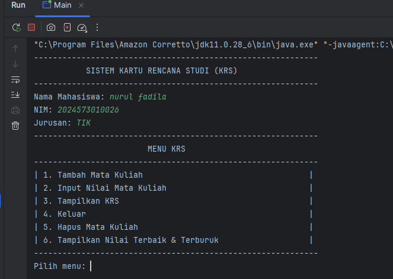

# Laporan Modul 4: Pengenalan Object Oriented Programming
**Mata Kuliah:** Praktikum Pemrograman Berorientasi Objek   
**Nama:** Nurul Fadila  
**NIM:** 2024573010026  
**Kelas:** TI 2A

---

## 1. Abstrak
Pengenalan Pemrograman Berbasis Objek (OOP) adalah langkah awal dalam mempelajari ide-ide dasar pemrograman yang berfokus pada objek, yang merupakan fondasi untuk pengembangan perangkat lunak masa kini. Dokumen ini menjelaskan elemen-elemen utama OOP, yang mencakup pengenkapsulan, pewarisan, polymorphism, dan abstraksi. Sasaran dari kegiatan ini adalah untuk memahami penerapan konsep-konsep tersebut di dalam berbagai bahasa pemrograman, khususnya Java, serta bagaimana OOP mendukung pembuatan program yang lebih terorganisir, efisien, dan gampang untuk ditingkatkan.

---

## 2. Praktikum
### Praktikum - Dasar Class dan Object
#### Dasar Teori
kelas adalah konsep abstrak yang mendefinisikan set atribut dan metode yang akan dimiliki oleh object. Kelas menyediakan struktur atau template yang menentukan bagaimana sebuah object harus dibuat. Kelas akan menentukan jenis atribut dan metode apa yang akan dimiliki oleh object, tetapi tidak menentukan nilai dari atribut itu sendiri untuk object tertentu.

Object adalah inti dari pemrograman berorientasi objek. Setiap object memiliki dua karakteristik utama, yaitu:

Object, dalam konteks pemrograman OOP, adalah sebuah entitas yang memiliki karakteristik dan perilaku. Kelas, di sisi lain, merupakan blueprint atau cetakan untuk membuat object. Kalau kamu bandingkan dengan dunia nyata, kamu bisa menganggap kelas sebagai rencana desain bangunan, sedangkan object adalah bangunan yang sesungguhnya telah dibangun berdasarkan desain tersebut.
#### Langkah Praktikum
1. Buat class baru bernama Mahasiswa
2. Buat class Mahasiswa dan isikan kode berikut:

    package MODUL_4;

    public class Mahasiswa {
    private String nama;
    private String nim;
    private String jurusan;

    public Mahasiswa (String nama, String nim, String jurusan, double ipk) {
        this.nama = nama;
        this.nim = nim;
        this.jurusan = jurusan;
    }
    public String getNama() {
        return nama;
    }
    public String getNim (){
        return nim;
    }
    public String getJurusan () {
        return jurusan;
    }
    }

#### Analisa dan Pembahasan
Kode di atas mendefinisikan sebuah class bernama Mahasiswa yang merepresentasikan objek mahasiswa dengan tiga atribut utama:

nama → menyimpan nama mahasiswa (tipe data String)

nim → menyimpan Nomor Induk Mahasiswa (tipe data String)

jurusan → menyimpan jurusan mahasiswa (tipe data String)

Selain itu, terdapat sebuah constructor dan beberapa method accessor (getter).

Pembahasan

Deklarasi Kelas dan Atribut

public class Mahasiswa {
private String nama;
private String nim;
private String jurusan;
}

Atribut nama, nim, dan jurusan dideklarasikan dengan akses private, artinya hanya dapat diakses dari dalam kelas itu sendiri.

Ini menunjukkan penerapan konsep Encapsulation dalam OOP, di mana data objek dilindungi dari akses langsung oleh kelas lain.

Constructor

public Mahasiswa (String nama, String nim, String jurusan, double ipk) {
this.nama = nama;
this.nim = nim;
this.jurusan = jurusan;
}

Constructor digunakan untuk menginisialisasi objek Mahasiswa ketika dibuat.

Parameter ipk sebenarnya tidak digunakan di dalam constructor, sehingga bagian ini tampak kurang efektif atau belum lengkap. Jika memang IPK ingin disimpan, seharusnya ada atribut private double ipk; dan baris this.ipk = ipk;.

Hal ini menunjukkan bahwa mungkin kode ini masih dalam tahap pengembangan atau ada kesalahan kecil dalam perancangan.

Getter Methods

public String getNama() { return nama; }
public String getNim() { return nim; }
public String getJurusan() { return jurusan; }

Ketiga method ini adalah getter, digunakan untuk mengambil nilai atribut dari luar kelas.

Dengan cara ini, data tetap terlindungi karena tidak bisa diubah langsung oleh objek lain, tetapi masih bisa diakses untuk ditampilkan atau digunakan.

Konsep OOP yang Diterapkan

1. Encapsulation: data disembunyikan menggunakan private, dan diakses dengan getter.

2. Constructor: digunakan untuk memberikan nilai awal pada objek.

Belum ada penerapan Inheritance, Polymorphism, atau Abstraction, karena ini masih kelas dasar (simple class).

Contoh Penggunaan

    public class Main {
    public static void main(String[] args) {
    Mahasiswa mhs1 = new Mahasiswa("Dila", "23123456", "Teknologi Informasi", 3.75);
    System.out.println("Nama: " + mhs1.getNama());
    System.out.println("NIM: " + mhs1.getNim());
    System.out.println("Jurusan: " + mhs1.getJurusan());
    }
    }

3. Buat class Matakuliah dan isikan kode berikut:

        public class Matakuliah {
        private String kode;
        private String nama;
        private int sks;
        private double nilai;

        public Matakuliah (String kode, String nama, int sks) {
            this.kode = kode;
            this.nama = nama;
            this.sks = sks;
            this.nilai = 0.0;
        }
        public String getKode () {
            return kode;
         }
         public String getNama () {
            return nama;
         }
         public int getSks () {
            return sks;
         }
        public double getNilai () {
         return nilai;
        }

        public void setNilai (double nilai) {
            if (nilai > 0.0 && nilai < 100.0) {
                this.nilai = nilai;
        } else {
            System.out.println("Nilai harus antara 0-100");
        }
        }

        public String getNilaiHuruf () {
            if (nilai >85 ) return "A";
            else if (nilai >80) return "A-";
            else if (nilai >75) return "B";
            else if (nilai >70) return "B-";
            else if (nilai >65) return "C+";
            else if (nilai >60) return "C";
            else if (nilai >55) return "C-";
            else if (nilai >50) return "D";
            else return "E";

         }
        public double getBobotNilai() {
        String huruf = getNilaiHuruf();
        switch (huruf) {
        case "A" :  return 4.0;
        case "A-" :  return 3.7;
        case "B+" :  return 3.3;
        case "B" :  return 3.0;
        case "B-" :  return 2.7;
        case "C+" :  return 2.3;
        case "C" :  return 2.0;
        case "D" :  return 1.0;
        default : return 0.0;

         }
        }
        public void tampilkanInfo() {
        System.out.printf("%-10s %-30s %d SKS | Nilai: %.2s (%s)\n",
        kode, nama, sks, nilai, getNilaiHuruf());

        }
        }
#### Analisa dan Pembahasan

Analisis Kode Matakuliah
Kelas Matakuliah berada dalam paket MODUL_4 dan merepresentasikan objek mata kuliah yang memiliki atribut kode, nama, jumlah SKS, serta nilai mahasiswa pada mata kuliah tersebut.
Kelas ini menerapkan prinsip encapsulation dan data validation, serta memiliki fungsi untuk mengonversi nilai angka ke nilai huruf dan bobot nilai.

1. Deklarasi Atribut
   private String kode;
   private String nama;
   private int sks;
   private double nilai;

Atribut diset sebagai private agar tidak bisa diakses langsung dari luar kelas.

Ini menerapkan encapsulation, salah satu pilar utama OOP.

nilai default-nya akan diatur di constructor menjadi 0.0.

2. Constructor
   public Matakuliah (String kode, String nama, int sks) {
   this.kode = kode;
   this.nama = nama;
   this.sks = sks;
   this.nilai = 0.0;
   }

Constructor digunakan untuk menginisialisasi objek Matakuliah baru.

Parameter wajib diisi: kode, nama, dan sks.

nilai diinisialisasi otomatis menjadi 0.0, artinya nilai awal mahasiswa untuk mata kuliah ini adalah 0 sebelum diatur melalui setNilai().

3. Getter Methods
   public String getKode() { return kode; }
   public String getNama() { return nama; }
   public int getSks() { return sks; }
   public double getNilai() { return nilai; }

Keempat method ini digunakan untuk mengambil data atribut (akses tidak langsung) dari luar kelas.

Menerapkan konsep data hiding: atribut tetap aman, tapi masih bisa diakses lewat fungsi publik.

4. Setter Method dengan Validasi
   public void setNilai (double nilai) {
   if (nilai > 0.0 && nilai < 100.0) {
   this.nilai = nilai;
   } else {
   System.out.println("Nilai harus antara 0-100");
   }
   }

Method ini berfungsi untuk mengatur nilai angka mahasiswa.

Hanya menerima nilai antara 0 hingga 100, jika di luar batas, maka akan muncul pesan error.

Ini contoh penerapan data validation untuk mencegah input yang tidak valid.

5. Konversi Nilai Angka → Nilai Huruf
   public String getNilaiHuruf() {
   if (nilai > 85) return "A";
   else if (nilai > 80) return "A-";
   else if (nilai > 75) return "B";
   else if (nilai > 70) return "B-";
   else if (nilai > 65) return "C+";
   else if (nilai > 60) return "C";
   else if (nilai > 55) return "C-";
   else if (nilai > 50) return "D";
   else return "E";
   }

Fungsi ini mengubah nilai angka menjadi huruf berdasarkan rentang nilai tertentu.

Misalnya:

90 → “A”

77 → “B”

59 → “C-”

Berguna untuk menampilkan hasil akademik sesuai standar penilaian universitas.

6. Konversi Nilai Huruf → Bobot Nilai (SKS)
   public double getBobotNilai() {
   String huruf = getNilaiHuruf();
   switch (huruf) {
   case "A": return 4.0;
   case "A-": return 3.7;
   case "B+": return 3.3;
   case "B": return 3.0;
   case "B-": return 2.7;
   case "C+": return 2.3;
   case "C": return 2.0;
   case "D": return 1.0;
   default: return 0.0;
   }
   }

Method ini memberikan konversi bobot nilai numerik sesuai dengan nilai huruf.

Nilai bobot ini biasanya digunakan dalam perhitungan IPK (Indeks Prestasi Kumulatif).

Misalnya, jika nilai huruf adalah “A”, maka bobotnya 4.0.

7. Menampilkan Informasi Mata Kuliah
   public void tampilkanInfo() {
   System.out.printf("%-10s %-30s %d SKS | Nilai: %.2s (%s)\n",
   kode, nama, sks, nilai, getNilaiHuruf());
   }

Method ini menampilkan data mata kuliah dalam format yang rapi di konsol.

Menggunakan System.out.printf() agar kolom rata dan mudah dibaca.

Namun, ada sedikit kesalahan di format:

%.2s seharusnya %.2f karena nilai adalah tipe double, bukan String.

Jika tidak diperbaiki, output bisa salah atau muncul error.

Kelebihan Kode

Menerapkan prinsip Encapsulation dengan baik.

Memiliki validasi input agar data tetap konsisten.

Mampu mengonversi nilai ke bentuk huruf dan bobot otomatis.

Struktur rapi dan mudah dibaca.

Kekurangan / Hal yang Bisa Diperbaiki

Format di tampilkanInfo() perlu diperbaiki menjadi:

System.out.printf("%-10s %-30s %d SKS | Nilai: %.2f (%s)\n",
kode, nama, sks, nilai, getNilaiHuruf());

Rentang nilai pada getNilaiHuruf() bisa diperluas untuk menyertakan nilai batas bawah (misalnya >= bukan hanya >).

Bisa ditambahkan method setter untuk atribut lain seperti nama atau kode jika diperlukan.

4. Buat class RencanaKartuStudi dan isikan kode berikut:

    public class Karturencanastudi {
    private Mahasiswa mahasiswa;
    private Matakuliah[] daftarMatakuliah;
    private int jumlahMatkul;
    private int maxMatkul;
    private final int BATAS_SKS = 24;

    public Karturencanastudi (Mahasiswa mahasiswa, int maxMatkul) {
        this.mahasiswa = mahasiswa;
        this.maxMatkul = maxMatkul;
        this.daftarMatakuliah = new Matakuliah[maxMatkul];
        this.jumlahMatkul = 0;
    }

    public void tambahMatakuliah(Matakuliah matkul) {
        int totalBaru = getTotalSKS() + matkul.getSks();

        if (jumlahMatkul >= maxMatkul) {
            System.out.println("KRS sudah penuh! Maksimal " + maxMatkul + " mata kuliah.");
        } else if (totalBaru > BATAS_SKS) {
            System.out.println(" Gagal menambah. Total SKS melebihi batas " + BATAS_SKS + ".");
        } else {
            daftarMatakuliah[jumlahMatkul] = matkul;
            jumlahMatkul++;
            System.out.println(" Mata kuliah " + matkul.getNama() + " berhasil ditambahkan.");
        }
    }

    public void hapusMatakuliah(String kode) {
        boolean ditemukan = false;
        for (int i = 0; i < jumlahMatkul; i++) {
            if (daftarMatakuliah[i].getKode().equalsIgnoreCase(kode)) {
                ditemukan = true;
                System.out.println(" Mata kuliah " + daftarMatakuliah[i].getNama() + " dihapus dari KRS.");
                // Geser elemen ke kiri untuk menutup celah
                for (int j = i; j < jumlahMatkul - 1; j++) {
                    daftarMatakuliah[j] = daftarMatakuliah[j + 1];
                }
                daftarMatakuliah[jumlahMatkul - 1] = null;
                jumlahMatkul--;
                break;
            }
        }
        if (!ditemukan) {
            System.out.println(" Mata kuliah dengan kode " + kode + " tidak ditemukan.");
        }
    }

    public int getTotalSKS() {
        int total = 0;
        for (int i = 0; i < jumlahMatkul; i++) {
            total += daftarMatakuliah[i].getSks();
        }
        return total;
    }

    public double hitungIPS() {
        double totalBobot = 0.0;
        double totalSKS = getTotalSKS();

        if (jumlahMatkul == 0) return 0.0;

        for (int i = 0; i < jumlahMatkul; i++) {
            totalBobot += daftarMatakuliah[i].getBobotNilai() * daftarMatakuliah[i].getSks();
        }

        return totalSKS > 0 ? totalBobot / totalSKS : 0.0;
    }

    public void tampilkanKRS() {
        System.out.println("============================================");
        System.out.println("           KARTU RENCANA STUDI (KRS)");
        System.out.println("============================================");
        System.out.println("NIM   : " + mahasiswa.getNim());
        System.out.println("Nama  : " + mahasiswa.getNama());
        System.out.println("Prodi : " + mahasiswa.getJurusan());
        System.out.println("--------------------------------------------");
        System.out.printf("%-10s %-30s %s\n", "Kode", "Nama Mata Kuliah", "SKS NILAI");
        System.out.println("--------------------------------------------");

        for (int i = 0; i < jumlahMatkul; i++) {
            daftarMatakuliah[i].tampilkanInfo();
        }

        System.out.println("--------------------------------------------");
        System.out.println("Total SKS: " + getTotalSKS());
        System.out.printf("IPS Semester Ini: %.2f\n", hitungIPS());
        System.out.println("============================================\n");
    }

    public Matakuliah cariMatakuliah(String kode) {
        for (int i = 0; i < jumlahMatkul; i++) {
            if (daftarMatakuliah[i].getKode().equalsIgnoreCase(kode)) {
                return daftarMatakuliah[i];
            }
        }
        return null;
    }

    public void tampilkanNilaiTerbaik() {
        if (jumlahMatkul == 0) {
            System.out.println("Belum ada mata kuliah dalam KRS.");
            return;
        }

        Matakuliah terbaik = daftarMatakuliah[0];
        for (int i = 1; i < jumlahMatkul; i++) {
            if (daftarMatakuliah[i].getNilai() > terbaik.getNilai()) {
                terbaik = daftarMatakuliah[i];
            }
        }
        System.out.println(" Mata kuliah dengan nilai terbaik: " + terbaik.getNama() +
                " (" + terbaik.getNilai() + " - " + terbaik.getNilaiHuruf() + ")");
    }

    public void tampilkanNilaiTerburuk() {
        if (jumlahMatkul == 0) {
            System.out.println("Belum ada mata kuliah dalam KRS.");
            return;
        }

        Matakuliah terburuk = daftarMatakuliah[0];
        for (int i = 1; i < jumlahMatkul; i++) {
            if (daftarMatakuliah[i].getNilai() < terburuk.getNilai()) {
                terburuk = daftarMatakuliah[i];
            }
        }
        System.out.println(" Mata kuliah dengan nilai terburuk: " + terburuk.getNama() +
                " (" + terburuk.getNilai() + " - " + terburuk.getNilaiHuruf()+")");
        }

    }

#### Analisa dan Pembahasan
Kelas Karturencanastudi dirancang untuk mengelola data Kartu Rencana Studi (KRS) seorang mahasiswa. Di dalamnya terdapat proses untuk menambah, menghapus, menampilkan, dan menghitung informasi terkait mata kuliah yang diambil oleh mahasiswa pada satu semester.
Kelas ini juga menerapkan prinsip Object-Oriented Programming (OOP) seperti encapsulation dan composition.

Analisa Bagian Kode

Deklarasi Atribut

private Mahasiswa mahasiswa;
private Matakuliah[] daftarMatakuliah;
private int jumlahMatkul;
private int maxMatkul;
private final int BATAS_SKS = 24;

Atribut di atas digunakan untuk menyimpan data mahasiswa, daftar mata kuliah yang diambil, jumlah mata kuliah yang sudah dimasukkan, serta batas maksimal SKS.

BATAS_SKS dibuat final karena nilainya tetap dan tidak boleh diubah (maksimal 24 SKS per semester).

Konstruktor

public Karturencanastudi (Mahasiswa mahasiswa, int maxMatkul) {
this.mahasiswa = mahasiswa;
this.maxMatkul = maxMatkul;
this.daftarMatakuliah = new Matakuliah[maxMatkul];
this.jumlahMatkul = 0;
}

Konstruktor ini berfungsi untuk menginisialisasi objek KRS dengan data mahasiswa yang bersangkutan, kapasitas maksimum mata kuliah, serta membuat array kosong untuk menampung daftar mata kuliah.

Metode tambahMatakuliah()

public void tambahMatakuliah(Matakuliah matkul) { ... }

Digunakan untuk menambah mata kuliah ke dalam KRS.

Sebelum menambah, program memeriksa dua kondisi:

Apakah jumlah mata kuliah sudah mencapai batas maksimum (maxMatkul).

Apakah total SKS setelah penambahan melebihi BATAS_SKS (24 SKS).

Jika tidak melebihi batas, mata kuliah dimasukkan ke array, dan jumlah mata kuliah (jumlahMatkul) bertambah satu.

Metode ini menjaga agar mahasiswa tidak mengambil mata kuliah melebihi batas yang diperbolehkan.

Metode hapusMatakuliah()

public void hapusMatakuliah(String kode) { ... }

Berfungsi untuk menghapus mata kuliah berdasarkan kode mata kuliah.

Program akan mencari kode yang cocok, lalu menghapusnya dengan cara menggeser elemen-elemen array agar tidak ada data kosong di tengah.

Jika mata kuliah tidak ditemukan, program menampilkan pesan kesalahan.

Teknik penggeseran ini menjaga agar data tetap tersusun rapat dan rapi di array.

Metode getTotalSKS()

public int getTotalSKS() { ... }

Menghitung jumlah SKS dari semua mata kuliah yang sudah dimasukkan ke KRS.

Hasilnya digunakan pada beberapa metode lain seperti tambahMatakuliah() dan hitungIPS().

Metode hitungIPS()

public double hitungIPS() { ... }

Menghitung Indeks Prestasi Semester (IPS) berdasarkan nilai setiap mata kuliah.

Rumusnya:

𝐼
𝑃
𝑆
=
∑
(
𝑏
𝑜
𝑏
𝑜
𝑡
×
𝑠
𝑘
𝑠
)
total sks
IPS=
total sks
∑(bobot×sks)
​

Metode ini memanfaatkan bobot nilai (misalnya A=4, B=3, dst.) dikalikan dengan SKS untuk tiap mata kuliah.

Jika belum ada mata kuliah yang diambil (jumlahMatkul == 0), maka hasilnya 0.0.

Metode tampilkanKRS()

public void tampilkanKRS() { ... }

Menampilkan seluruh data KRS ke layar (console).

Menampilkan identitas mahasiswa, daftar mata kuliah, total SKS, dan nilai IPS.

Data mata kuliah dicetak dengan memanggil metode tampilkanInfo() dari kelas Matakuliah.

Fungsinya sebagai output display untuk melihat data KRS mahasiswa secara lengkap.

Metode cariMatakuliah()

public Matakuliah cariMatakuliah(String kode) { ... }

Mencari dan mengembalikan objek Matakuliah berdasarkan kode yang dimasukkan.

Jika tidak ditemukan, metode ini mengembalikan null.

Metode ini berguna jika program ingin melakukan operasi tertentu pada mata kuliah tertentu (misalnya mengubah nilai).

Metode tampilkanNilaiTerbaik() dan tampilkanNilaiTerburuk()

public void tampilkanNilaiTerbaik() { ... }
public void tampilkanNilaiTerburuk() { ... }

tampilkanNilaiTerbaik() mencari dan menampilkan mata kuliah dengan nilai tertinggi.

tampilkanNilaiTerburuk() mencari dan menampilkan mata kuliah dengan nilai terendah.

Kedua metode ini berfungsi untuk memberikan evaluasi terhadap performa mahasiswa di tiap mata kuliah.

5. Buat class Main untuk menguji:
            
        import java.util.Scanner;

        public class Main {
        public static void main (String[] args) {
        Scanner input = new Scanner(System.in);

            System.out.println("------------------------------------------------------------");
            System.out.println("           SISTEM KARTU RENCANA STUDI (KRS)                ");
            System.out.println("------------------------------------------------------------");

            System.out.print("Nama Mahasiswa: ");
            String nama = input.nextLine();

            System.out.print("NIM: ");
            String nim = input.nextLine();

            System.out.print("Jurusan: ");
            String jurusan = input.nextLine();

            Mahasiswa mhs = new Mahasiswa(nama, nim, jurusan, 0.0);

            Karturencanastudi krs = new Karturencanastudi(mhs, 10);

            // Menu KRS
            boolean running = true;

            while (running) {
                System.out.println("------------------------------------------------------------");
                System.out.println("                        MENU KRS                            ");
                System.out.println("------------------------------------------------------------");
                System.out.println("| 1. Tambah Mata Kuliah                                   |");
                System.out.println("| 2. Input Nilai Mata Kuliah                              |");
                System.out.println("| 3. Tampilkan KRS                                        |");
                System.out.println("| 4. Keluar                                               |");
                System.out.println("| 5. Hapus Mata Kuliah                                    |");
                System.out.println("| 6. Tampilkan Nilai Terbaik & Terburuk                   |");
                System.out.println("------------------------------------------------------------");
                System.out.print("Pilih menu: ");

                int pilihan = input.nextInt();
                input.nextLine(); // consume newline

                switch (pilihan) {
                    case 1:

                        System.out.println("\nTAMBAH MATA KULIAH");
                        System.out.println("--------------------");
                        System.out.print("Kode Mata Kuliah: ");
                        String kode = input.nextLine();

                        System.out.print("Nama Mata Kuliah: ");
                        String namaMK = input.nextLine();
                        System.out.print("Jumlah SKS: ");
                        int sks = input.nextInt();
                        input.nextLine();

                        Matakuliah mk = new Matakuliah(kode, namaMK, sks);
                        krs.tambahMatakuliah(mk);
                        break;

                    case 2:
                        // Input nilai
                        System.out.println("\nINPUT NILAI");
                        System.out.println("--------------------");
                        System.out.print("Kode Mata Kuliah: ");
                        String kodeCari = input.nextLine();

                        Matakuliah mkCari = krs.cariMatakuliah(kodeCari);
                        if (mkCari != null) {
                            System.out.print("Nilai (0-100): ");
                            double nilai = input.nextDouble();
                            mkCari.setNilai(nilai);
                            System.out.println("Nilai berhasil diinput!");
                        } else {
                            System.out.println("Mata kuliah tidak ditemukan!");
                        }
                        break;
                    case 3:
                        // Tampilkan KRS
                        krs.tampilkanKRS();
                        break;

                    case 4:
                        // Keluar
                        System.out.println("Terima kasih!");
                        running = false;
                        break;

                    case 5:
                        System.out.print("Masukkan kode mata kuliah yang ingin dihapus: ");
                        String kodeHapus = input.nextLine();
                        krs.hapusMatakuliah(kodeHapus);
                        break;

                    case 6:
                        krs.tampilkanNilaiTerbaik();
                        krs.tampilkanNilaiTerburuk();
                        break;

                    default:
                        System.out.println("Pilihan tidak valid!");
                }
            }
        }

        }

#### Analisa dan Pembahasan
Kode ini merupakan program utama (class Main) yang menjalankan sistem input dan pengelolaan Kartu Rencana Studi (KRS) mahasiswa secara interaktif di console.
Pengguna (mahasiswa) dapat:

Menambahkan mata kuliah

Menghapus mata kuliah

Menginput nilai

Melihat daftar KRS

Melihat nilai terbaik dan terburuk

Menghitung IPS secara otomatis

🧩 Analisa Struktur Program
1. Bagian Import
   import java.util.Scanner;

Mengimpor kelas Scanner dari package java.util.

Scanner digunakan untuk membaca input dari pengguna (keyboard).

2. Deklarasi Kelas Utama
   public class Main {
   public static void main (String[] args) {

Kelas Main berisi metode main(), yang merupakan titik awal eksekusi program.

Semua logika interaksi dengan pengguna berada di dalam metode ini.

3. Input Data Mahasiswa
   System.out.print("Nama Mahasiswa: ");
   String nama = input.nextLine();

System.out.print("NIM: ");
String nim = input.nextLine();

System.out.print("Jurusan: ");
String jurusan = input.nextLine();

Mahasiswa mhs = new Mahasiswa(nama, nim, jurusan, 0.0);

Penjelasan:

Program meminta pengguna memasukkan nama, NIM, dan jurusan.

Data ini disimpan dalam objek Mahasiswa.

Argumen 0.0 kemungkinan mewakili IPS awal mahasiswa yang belum memiliki nilai.

4. Membuat Objek KRS
   Karturencanastudi krs = new Karturencanastudi(mhs, 10);

Membuat objek KRS untuk mahasiswa yang telah diinput.

Parameter 10 berarti maksimal mahasiswa dapat mengambil 10 mata kuliah.

KRS ini berhubungan langsung dengan objek Mahasiswa.

5. Menu Interaktif
   boolean running = true;

while (running) {
System.out.println("------------------------------------------------------------");
System.out.println("                        MENU KRS                            ");
...
}

Program berjalan dalam loop while selama variabel running bernilai true.

Artinya, menu KRS akan terus ditampilkan sampai pengguna memilih opsi Keluar.

Analisa Setiap Menu
Menu 1 – Tambah Mata Kuliah
System.out.print("Kode Mata Kuliah: ");
String kode = input.nextLine();
System.out.print("Nama Mata Kuliah: ");
String namaMK = input.nextLine();
System.out.print("Jumlah SKS: ");
int sks = input.nextInt();

Matakuliah mk = new Matakuliah(kode, namaMK, sks);
krs.tambahMatakuliah(mk);

Fungsi:

Pengguna dapat menambahkan mata kuliah baru ke dalam KRS.

Setiap mata kuliah dibuat sebagai objek Matakuliah.

Program kemudian memanggil metode tambahMatakuliah() dari kelas KRS untuk memproses penambahan tersebut.

Catatan:
Metode ini akan otomatis mengecek apakah total SKS melebihi batas (24 SKS) atau apakah daftar mata kuliah sudah penuh.

Menu 2 – Input Nilai Mata Kuliah
System.out.print("Kode Mata Kuliah: ");
String kodeCari = input.nextLine();

Matakuliah mkCari = krs.cariMatakuliah(kodeCari);
if (mkCari != null) {
System.out.print("Nilai (0-100): ");
double nilai = input.nextDouble();
mkCari.setNilai(nilai);
System.out.println("Nilai berhasil diinput!");
} else {
System.out.println("Mata kuliah tidak ditemukan!");
}

Fungsi:

Mencari mata kuliah berdasarkan kode.

Jika ditemukan, pengguna dapat memasukkan nilai (0–100).

Nilai ini kemudian disimpan ke objek Matakuliah melalui metode setNilai().

Keterkaitan:

Nilai yang dimasukkan akan mempengaruhi perhitungan IPS dalam Karturencanastudi.

Menu 3 – Tampilkan KRS
krs.tampilkanKRS();

Fungsi:

Menampilkan daftar lengkap mata kuliah yang telah diambil mahasiswa.

Informasi yang ditampilkan meliputi:

Kode dan nama mata kuliah

Jumlah SKS

Nilai dan huruf nilai

Total SKS dan IPS semester

Menu 4 – Keluar
System.out.println("Terima kasih!");
running = false;

Mengakhiri loop while dan keluar dari program.

Menu 5 – Hapus Mata Kuliah
System.out.print("Masukkan kode mata kuliah yang ingin dihapus: ");
String kodeHapus = input.nextLine();
krs.hapusMatakuliah(kodeHapus);

Fungsi:

Menghapus mata kuliah dari daftar berdasarkan kode yang dimasukkan.

Pemanggilan metode hapusMatakuliah() dari kelas KRS akan memproses penghapusan dan menata ulang array agar tetap rapat.

Menu 6 – Tampilkan Nilai Terbaik & Terburuk
krs.tampilkanNilaiTerbaik();
krs.tampilkanNilaiTerburuk();

Fungsi:

Menampilkan dua informasi:

Mata kuliah dengan nilai tertinggi.

Mata kuliah dengan nilai terendah.

Digunakan sebagai fitur evaluasi sederhana terhadap performa mahasiswa.

#### Screenshoot Hasil

## Kesimpulan
konsep OOP merupakan pendekatan pemrograman yang berorientasi pada objek sebagai komponen utama dalam membangun sebuah program. Setiap objek memiliki atribut (data) dan method (perilaku) yang merepresentasikan karakteristik dan fungsinya.

Melalui praktikum ini, mahasiswa memahami dasar-dasar OOP seperti class, object, atribut, dan method, serta cara mengimplementasikannya dalam bahasa pemrograman Java. Pendekatan OOP membuat program menjadi lebih terstruktur, modular, mudah dikembangkan, dan dipelihara dibandingkan dengan pemrograman prosedural.

Secara keseluruhan, praktikum ini memberikan pemahaman dasar bahwa OOP membantu pengembang untuk membangun aplikasi yang lebih efisien dan fleksibel dengan menerapkan prinsip-prinsip seperti encapsulation, inheritance, polymorphism, dan abstraction.

## Referensi
Modul 4: Pengenalan Object Oriented Programming (https://hackmd.io/@mohdrzu/Syf7Kah3ee)