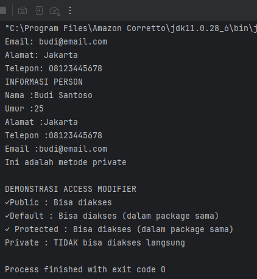
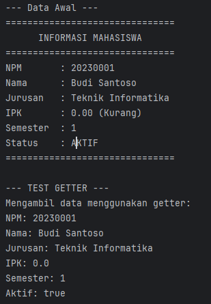
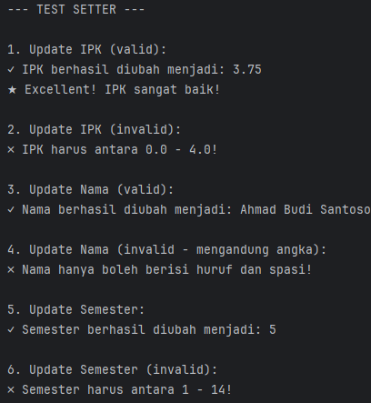
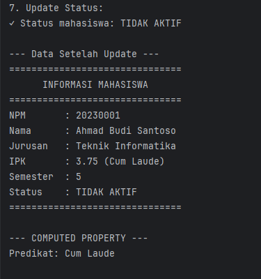
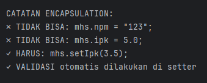
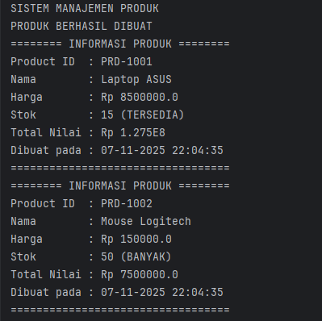
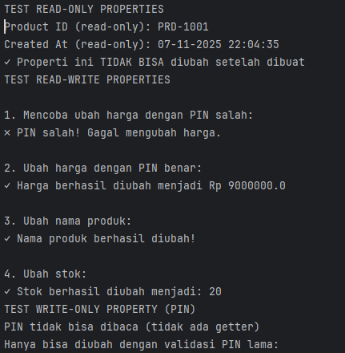
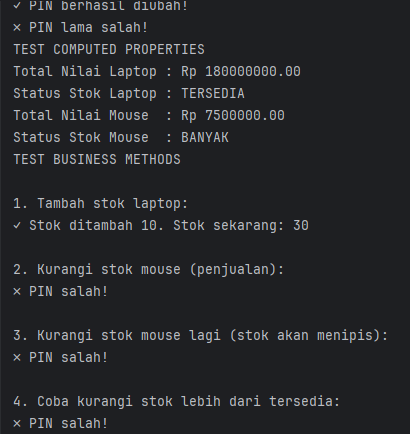
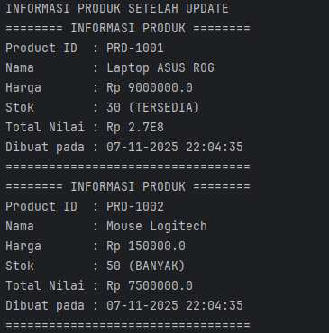
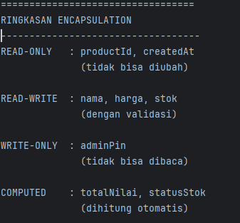

# Laporan Modul 5: Enkapsulasi
**Mata Kuliah:** Praktikum Pemrograman Berorientasi Objek   
**Nama:** [Nurul Fadila] 
**NIM:** [2024573010026]  
**Kelas:** [TI 2A]

---

## 1. Abstrak
Encapsulation (Enkapsulasi) adalah salah satu prinsip fundamental dalam Object-Oriented Programming (OOP) yang membungkus data (attributes) dan method yang bekerja pada data tersebut dalam satu unit (class), serta menyembunyikan detail implementasi internal dari dunia luar.

Tujuan Encapsulation
Data Protection - Melindungi data dari akses dan modifikasi yang tidak sah.
Data Validation - Memastikan data yang masuk valid sebelum disimpan.
Flexibility - Mudah mengubah implementasi internal tanpa mempengaruhi kode luar.
Maintainability - Kode lebih mudah dipelihara dan di-debug.
Modularity - Membuat kode lebih modular dan terorganisir

Cara Implementasi
Deklarasikan attributes sebagai private.
Buat getter methods untuk membaca nilai attributes.
Buat setter methods untuk mengubah nilai attributes dengan validasi.
Tambahkan business logic di dalam class.
---
## 2. Praktikum
### Praktikum 1 - Memahami Access Modifier
#### Dasar Teori
Access Modifier (modifier akses) adalah kata kunci dalam pemrograman yang digunakan untuk menentukan tingkat akses atau jangkauan suatu kelas, atribut (variabel), metode, atau konstruktor. Dengan kata lain, access modifier mengatur siapa saja yang dapat melihat dan menggunakan suatu elemen di dalam program.

Access modifier penting untuk:

Menerapkan enkapsulasi (penggungkapan data dalam OOP)

Melindungi data agar tidak mudah diubah sembarangan

Mengatur struktur dan hubungan antar kelas

Penjelasan Singkat Setiap Modifier

1. private

Hanya dapat diakses di dalam kelas itu sendiri.

Biasanya digunakan untuk data yang harus dilindungi.

2. default (tanpa menulis modifier)

Dapat diakses dalam satu paket yang sama, tetapi tidak di luar paket.

3. protected

Dapat diakses dalam kelas yang sama, paket yang sama, dan subclass, bahkan bila subclass berada di paket yang berbeda.

Cocok digunakan untuk memberi akses hanya pada kelas turunan.

4. public

Dapat diakses dari mana saja.

Digunakan untuk elemen yang memang harus digunakan secara luas.
#### Langkah Praktikum
1. Buat sebuah package baru di dalam package modul_5 dengan nama praktikum_1
   2. Buat class baru bernama Person dengan berbagai access modifier
   
            public class Person {
            private String nama;
            private int umur;

            String alamat;

            protected String telepon;

            public String email;

            public Person (String nama, int umur) {
            this.nama = nama;
            this.umur = umur;
             }

    public void tampilkaninfo() {
        System.out.println("INFORMASI PERSON");
        System.out.println("Nama :" + nama);
        System.out.println("Umur :"+ umur);
        System.out.println("Alamat :" + alamat);
        System.out.println("Telepon :" + telepon);
        System.out.println("Email :" + email);
    }

    private void metodePribadi () {
    System.out.println("Ini adalah metode private");
    }

    protected void metodeProtected () {
    System.out.println("Ini adalah metode protected");
    }
    public void panggilMetodePribadi () {
    metodePribadi () ;
    }
    }

3. Buat class AccessModifierTest untuk testing:

         public class AccessModifierTest {
        public static void main (String [] args) {
        Person person = new Person ("Budi Santoso", 25);

        person.email = "budi@email.com";
        System.out.println("Email: " + person.email);

        person.alamat = "Jakarta";
        System.out.println("Alamat: " + person.alamat);

        person.telepon = "08123445678";
        System.out.println("Telepon: " + person.telepon);

        person.tampilkaninfo();

        person.panggilMetodePribadi();

        System.out.println("\nDEMONSTRASI ACCESS MODIFIER");
        System.out.println("✓Public : Bisa diakses");
        System.out.println("✓Default : Bisa diakses (dalam package sama)");
        System.out.println("✓ Protected : Bisa diakses (dalam package sama)");
        System.out.println("Private : TIDAK bisa diakses langsung");
        }
        }

#### Screenshoot Hasil

#### Analisa dan Pembahasan
Program di atas terdiri dari dua kelas, yaitu AccessModifierTest dan Person. Tujuan utama program ini adalah menunjukkan bagaimana penggunaan access modifier (public, private, default, dan protected) mempengaruhi akses terhadap atribut dan metode di dalam kelas. Kelas Person berperan sebagai objek yang memiliki data pribadi, sedangkan kelas AccessModifierTest digunakan untuk menguji dan menampilkan bagaimana data tersebut dapat diakses sesuai dengan tingkat akses yang diberikan.

Dalam kelas Person, terdapat beberapa atribut yang menggunakan access modifier berbeda. Atribut nama dan umur menggunakan modifier private, yang artinya kedua atribut tersebut hanya dapat diakses dari dalam kelas Person saja. Hal ini bertujuan untuk menjaga keamanan data agar tidak dapat diubah secara bebas dari luar kelas. Kemudian terdapat atribut alamat yang menggunakan modifier default (tanpa kata kunci). Atribut ini hanya dapat diakses oleh kelas lain yang berada dalam paket yang sama, sehingga aksesnya lebih terbatas dibandingkan public, namun lebih terbuka daripada private.

Selanjutnya, atribut telepon menggunakan modifier protected. Atribut ini dapat diakses oleh kelas dalam paket yang sama serta dapat diakses oleh subclass meskipun berada di paket berbeda. Penggunaan protected memberikan fleksibilitas terutama ketika konsep turunan (inheritance) diterapkan. Sementara itu, atribut email menggunakan modifier public, sehingga dapat diakses secara bebas dari mana saja, termasuk dari kelas AccessModifierTest. Pemilihan public digunakan ketika atribut atau metode memang sengaja ingin dibagikan agar bisa digunakan secara luas.

Program juga memperlihatkan bagaimana mengakses metode dengan akses berbeda. Metode metodePribadi() bersifat private sehingga tidak bisa dipanggil dari luar kelas Person. Untuk tetap dapat menjalankannya, disediakan metode panggilMetodePribadi() yang bersifat public dan bertugas memanggil metode private tersebut dari dalam kelas. Hal ini merupakan contoh penerapan enkapsulasi, yaitu memberikan akses ke data atau fungsi tertentu dengan kontrol yang baik melalui metode perantara. Dengan cara ini, keamanan dan konsistensi data tetap terjaga.

Dari hasil pengujian di kelas AccessModifierTest, terlihat bahwa atribut email, alamat, dan telepon dapat diakses dan dimodifikasi karena masing-masing menggunakan modifier public, default, dan protected, serta berada dalam paket yang sama. Sementara itu, atribut nama dan umur tidak dapat diakses langsung karena bersifat private. Untuk menampilkan nilainya, digunakan metode public tampilkaninfo(). Program ini memberikan gambaran jelas bahwa access modifier memiliki peran penting dalam mengatur akses data, menjaga keamanan objek, dan mendukung prinsip dasar dalam pemrograman berorientasi objek.

### Praktikum 2 - Getter dan Setter
#### Dasar Teori
alam pemrograman berorientasi objek (Object-Oriented Programming/OOP), konsep Getter dan Setter digunakan untuk mengakses dan mengubah nilai atribut (data) yang bersifat private di dalam suatu kelas. Ketika sebuah atribut diberi akses private, atribut tersebut tidak dapat diakses langsung dari luar kelas. Hal ini dilakukan untuk menjaga keamanan (encapsulation) sehingga data tidak mudah dimodifikasi sembarangan. Oleh karena itu, diperlukan metode khusus untuk memberikan akses dengan cara yang terkontrol, yaitu melalui Getter dan Setter.

Getter adalah metode (fungsi) yang digunakan untuk mengambil atau membaca nilai dari suatu atribut private. Metode ini biasanya mengembalikan nilai dari atribut tersebut. Penamaan getter biasanya diawali dengan kata get diikuti dengan nama atribut, contohnya getNama(), yang berfungsi mengembalikan nilai atribut nama. Getter memastikan bahwa atribut dapat dibaca tanpa harus membuka akses langsung terhadap variabelnya.

Sementara itu, Setter adalah metode yang digunakan untuk mengubah atau menetapkan nilai baru pada atribut private. Metode ini biasanya memiliki parameter yang digunakan untuk mengisi nilai ke dalam atribut. Penamaan setter diawali dengan kata set diikuti nama atribut, contohnya setNama(String nama). Selain menetapkan nilai, metode setter juga dapat menyertakan validasi, misalnya memastikan bahwa nilai yang diberikan sesuai kondisi tertentu (contoh: umur harus bernilai positif). Dengan demikian, setter berperan dalam mengontrol dan menjaga konsistensi data.

Melalui penggunaan Getter dan Setter, prinsip enkapsulasi dalam OOP dapat diterapkan dengan baik.
#### Langkah Praktikum
1. Buat sebuah package baru di dalam package modul_5 dengan nama praktikum_2
   2. Buat class Mahasiswa dengan getter dan setter lengkap
      
            public class Mahasiswa {
             // Private attributes
              private String npm;
              private String nama;
                 private String jurusan;
                    private double ipk;
                     private int semester;
                        private boolean aktif;

           // Constructor
           public Mahasiswa(String npm, String nama, String jurusan) {
               this.npm = npm;
               this.nama = nama;
               this.jurusan = jurusan;
               this.ipk = 0.0;
               this.semester = 1;
               this.aktif = true;
           }

           // GETTER METHODS
           public String getNpm() {
               return npm;
           }

           public String getNama() {
               return nama;
           }
            public String getJurusan() {
            return jurusan;
             }

            public double getIpk() {
             return ipk;
            }

            public int getSemester() {
            return semester;
             }

            // Boolean getter menggunakan 'is' prefix
             public boolean isAktif() {
             return aktif;
             }

            // SETTER METHODS DENGAN VALIDASI

            // NPM: Read-only (tidak ada setter)
             // Alasan: NPM tidak boleh diubah setelah dibuat
            public void setNama(String nama) {
             // Validasi: Nama tidak boleh kosong
            if (nama == null || nama.trim().isEmpty()) {
            System.out.println("✗ Nama tidak boleh kosong!");
             return;
             }
             // Validasi: Nama hanya huruf dan spasi
             if (!nama.matches("[a-zA-Z ]+")) {
            System.out.println("✗ Nama hanya boleh berisi huruf dan spasi!");
            return;
                }

           this.nama = nama;
           System.out.println("✓ Nama berhasil diubah menjadi: " + nama);
            }

            public void setJurusan(String jurusan) {
            if (jurusan == null || jurusan.trim().isEmpty()) {
             System.out.println("✗ Jurusan tidak boleh kosong!");
             return;
             }

           this.jurusan = jurusan;
           System.out.println("✓ Jurusan berhasil diubah menjadi: " + jurusan);
             }

            public void setIpk(double ipk) {
             // Validasi: IPK antara 0.0 - 4.0
            if (ipk < 0.0 || ipk > 4.0) {
             System.out.println("✗ IPK harus antara 0.0 - 4.0!");
             return;
             }
             this.ipk = ipk;
             System.out.printf("✓ IPK berhasil diubah menjadi: %.2f\n", ipk);

           // Cek status akademik berdasarkan IPK
           cekStatusAkademik();
            }

            public void setSemester(int semester) {
            // Validasi: Semester antara 1 - 14
                 if (semester < 1 || semester > 14) {
            System.out.println("✗ Semester harus antara 1 - 14!");
             return;
            }

           this.semester = semester;
           System.out.println("✓ Semester berhasil diubah menjadi: " + semester);
             }

            public void setAktif(boolean aktif) {
            this.aktif = aktif;
            String status = aktif ? "AKTIF" : "TIDAK AKTIF";
            System.out.println("✓ Status mahasiswa: " + status);
            }
            // HELPER METHODS (PRIVATE)
             private void cekStatusAkademik() {
             if (ipk < 2.0) {
             System.out.println("⚠ Peringatan: IPK di bawah standar!");
            } else if (ipk > 3.5) {
             System.out.println("★ Excellent! IPK sangat baik!");
             }
             }

            // PUBLIC METHODS
            public String getPredikat() {
            if (ipk >= 3.5) return "Cum Laude";
            else if (ipk >= 3.0) return "Sangat Baik";
            else if (ipk >= 2.5) return "Baik";
            else if (ipk >= 2.0) return "Cukup";
             else return "Kurang";
             }

            public void tampilkanInfo() {
            System.out.println("===============================");
             System.out.println("      INFORMASI MAHASISWA      ");
             System.out.println("===============================");
             System.out.println("NPM       : " + npm);
            System.out.println("Nama      : " + nama);
            System.out.println("Jurusan   : " + jurusan);
            System.out.printf("IPK       : %.2f (%s)\n", ipk, getPredikat());
            System.out.println("Semester  : " + semester);
            System.out.println("Status    : " + (aktif ? "AKTIF" : "TIDAK AKTIF"));
            System.out.println("===============================");
                }
            }

      3. Buat class GetterSetterTest:
   
             public class GetterSetterTest {
             public static void main(String[] args) {
                System.out.println("TEST GETTER DAN SETTER\n");

                // Membuat object mahasiswa
                Mahasiswa mhs = new Mahasiswa("20230001", "Budi Santoso", "Teknik Informatika");

                System.out.println("--- Data Awal ---");
                 mhs.tampilkanInfo();

                // Test GETTER
                System.out.println("\n--- TEST GETTER ---");
                System.out.println("Mengambil data menggunakan getter:");
                System.out.println("NPM: " + mhs.getNpm());
                System.out.println("Nama: " + mhs.getNama());
                System.out.println("Jurusan: " + mhs.getJurusan());
                System.out.println("IPK: " + mhs.getIpk());
                System.out.println("Semester: " + mhs.getSemester());
                System.out.println("Aktif: " + mhs.isAktif());

                // Test SETTER dengan validasi
                System.out.println("\n--- TEST SETTER ---");

                // Test 1: Update IPK valid
                System.out.println("\n1. Update IPK (valid):");
                mhs.setIpk(3.75);
                // Test 2: Update IPK invalid
                System.out.println("\n2. Update IPK (invalid):");
                mhs.setIpk(5.0); // Akan ditolak

                // Test 3: Update nama valid
                System.out.println("\n3. Update Nama (valid):");
                mhs.setNama("Ahmad Budi Santoso");

                // Test 4: Update nama invalid
                System.out.println("\n4. Update Nama (invalid - mengandung angka):");
                mhs.setNama("Budi1123"); // Akan ditolak

                // Test 5: Update semester
                System.out.println("\n5. Update Semester:");
                mhs.setSemester(5);

                 // Test 6: Update semester invalid
                System.out.println("\n6. Update Semester (invalid):");
                mhs.setSemester(20); // Akan ditolak

                // Test 7: Update status
                System.out.println("\n7. Update Status:");
                mhs.setAktif(false);

                // Tampilkan data akhir
                System.out.println("\n--- Data Setelah Update ---");
                mhs.tampilkanInfo();
                // Demonstrasi computed property
                 System.out.println("\n--- COMPUTED PROPERTY ---");
                System.out.println("Predikat: " + mhs.getPredikat());

                // Tidak bisa akses langsung (akan error)
                System.out.println("\nCATATAN ENCAPSULATION:");
                System.out.println("✗ TIDAK BISA: mhs.npm = \"123\";");
                System.out.println("✗ TIDAK BISA: mhs.ipk = 5.0;");
                System.out.println("✓ HARUS: mhs.setIpk(3.5);");
                System.out.println("✓ VALIDASI otomatis dilakukan di setter");
                }
                }
      4. Jalankan program dan amati:
        - Getter berfungsi untuk membaca data
        - Setter melakukan validasi sebelum mengubah data
        - Beberapa attribute bersifat read-only (tidak ada setter)

#### Screenshoot Hasil

#### Analisa dan Pembahasan
Program ini terdiri dari dua kelas, yaitu kelas Mahasiswa dan kelas GetterSetterTest. Kelas Mahasiswa berfungsi untuk merepresentasikan data seorang mahasiswa dengan menggunakan konsep enkapsulasi, yaitu menyembunyikan atribut-atribut data menggunakan modifier private agar tidak dapat diakses atau diubah secara bebas dari luar kelas. Sementara itu, kelas GetterSetterTest digunakan untuk menguji penggunaan getter dan setter dalam mengambil dan mengubah data mahasiswa secara terkontrol.

Pada kelas Mahasiswa, seluruh atribut seperti npm, nama, jurusan, ipk, semester, dan aktif dideklarasikan sebagai private. Hal ini bertujuan untuk menjaga keamanan data agar tidak dapat dimodifikasi secara langsung dari luar kelas. Untuk memberikan akses terbatas terhadap data tersebut, disediakan metode getter seperti getNama(), getIpk(), dan isAktif() yang hanya mengembalikan nilai atribut tanpa mengubahnya. Getter dengan awalan is digunakan khusus untuk atribut bertipe boolean sebagai bentuk penulisan standar dalam OOP.

Sementara itu, metode setter seperti setNama(), setJurusan(), setSemester(), dan setIpk() digunakan untuk mengubah nilai atribut. Keunggulan setter dalam kode ini adalah terdapat validasi yang memastikan nilai yang diinput sesuai dengan aturan logis. Misalnya, setter setNama() memeriksa agar nama tidak kosong dan hanya mengandung huruf dan spasi. Setter setIpk() memastikan nilai IPK berada dalam rentang 0.0 sampai 4.0 dan juga memanggil metode cekStatusAkademik() secara otomatis untuk memberikan peringatan apabila IPK rendah atau mengapresiasi jika IPK tinggi. Selain itu, atribut npm tidak memiliki setter karena dianggap sebagai data tetap yang tidak boleh diubah setelah objek dibuat, sehingga menjadi read-only.

Pada kelas GetterSetterTest, dilakukan pengujian untuk memastikan fungsi getter dan setter berjalan sesuai konsep enkapsulasi. Data mahasiswa ditampilkan terlebih dahulu, kemudian dilakukan pengambilan nilai menggunakan getter sebagai bentuk akses data yang aman. Setelah itu, setter diuji dengan berbagai input yang valid dan tidak valid untuk melihat bagaimana validasi mencegah kesalahan input pengguna. Contohnya, percobaan memasukkan IPK lebih dari 4.0 ditolak dengan pesan error, dan pemberian nama yang mengandung angka juga ditolak. Setelah beberapa perubahan data berhasil dilakukan, informasi mahasiswa kembali ditampilkan untuk menunjukkan perubahan yang terjadi.

Dari pengujian tersebut, dapat dilihat bahwa penggunaan getter dan setter sangat efektif untuk mengontrol akses data, menjaga konsistensi nilai, dan melindungi objek dari perubahan sembarangan. Selain itu, adanya metode getPredikat() menunjukkan penggunaan computed property, yaitu nilai yang dihitung berdasarkan atribut lain (IPK), bukan disimpan secara langsung. Ini merupakan penerapan prinsip desain kelas yang baik dalam OOP. Secara keseluruhan, kode ini berhasil menunjukkan manfaat penting enkapsulasi, validasi input, serta pengaturan akses data melalui getter dan setter dalam pemrograman berorientasi objek.

### Praktikum 2 - Read-Only dan Write-Only Properties
#### Dasar Teori
Dalam OOP (Object-Oriented Programming), enkapsulasi berarti menyembunyikan data (atribut) di dalam kelas dan mengontrol cara data tersebut diakses dari luar. Data biasanya dibuat private, lalu diakses melalui getter dan setter.
Dari pengaturan getter dan setter inilah muncul konsep read-only dan write-only properties.
Read-Only Property adalah atribut objek yang hanya dapat dibaca tetapi tidak dapat diubah dari luar kelas.

Cara Penerapan:

Atribut dibuat private

Hanya diberikan getter

Tidak diberikan setter

Tujuan:

Menjaga nilai agar tetap konstan atau tidak berubah setelah objek dibuat.
Digunakan untuk data penting seperti: NPM, ID, tanggal lahir, nomor seri, dll.

Write-Only Property adalah atribut yang dapat diubah tetapi tidak dapat dibaca dari luar kelas.

Cara Penerapan:

Atribut dibuat private

Hanya diberikan setter

Tidak diberikan getter

Tujuan:

Digunakan ketika data bersifat sensitif dan tidak boleh ditampilkan sembarangan.

Contoh: Password, data keamanan, PIN, token, informasi enkripsi.
Kedua konsep ini adalah penerapan langsung dari enkapsulasi, yaitu membatasi akses terhadap data untuk:

Melindungi konsistensi data

Menjaga keamanan

Mencegah penyalahgunaan nilai atribut

Dengan demikian, programmer dapat mengontrol sepenuhnya siapa yang boleh membaca dan siapa yang boleh mengubah data dalam objek.

#### Langkah Praktikum
1. Buat sebuah package baru di dalam package modul_5 dengan nama praktikum_3
   2. Buat class Product dengan berbagai jenis properties:
   
            import java.time.LocalDateTime;
            import java.time.format.DateTimeFormatter;

            public class Product {
             // Read-only (hanya getter)
            private final String productId;

private final LocalDateTime createdAt;

    // Read-write (getter dan setter)
    private String nama;
    private double harga;
    private int stok;

    // Write-only (hanya setter) - untuk password/PIN
    private String adminPin;

    // Computed property (tidak ada atribut, hanya getter)
    // Total nilai = harga * stok

    // Counter untuk ID otomatis
    private static int counter = 1000;

    // CONSTRUCTOR
    public Product(String nama, double harga, int stok, String adminPin) {
        this.productId = generateProductId();
        this.createdAt = LocalDateTime.now();
        this.nama = nama;
        this.harga = harga;
        this.stok = stok;
        this.adminPin = adminPin;
    }
    // PRIVATE HELPER METHODS
    private String generateProductId() {
        counter++;
        return "PRD-" + counter;
    }

    private boolean validatePin(String inputPin) {
        return this.adminPin.equals(inputPin);
    }

    // READ-ONLY PROPERTIES (hanya getter)
    public String getProductId() {
        return productId;
    }

    public String getCreatedAt() {
        DateTimeFormatter formatter = DateTimeFormatter.ofPattern("dd-MM-yyyy HH:mm:ss");
        return createdAt.format(formatter);
    }

    // READ-WRITE PROPERTIES (getter dan setter)
    public String getNama() {
        return nama;
    }
    public void setNama(String nama, String pin) {
        if (!validatePin(pin)) {
            System.out.println("✗ PIN salah! Gagal mengubah nama.");
            return;
        }

        if (nama == null || nama.trim().isEmpty()) {
            System.out.println("✗ Nama produk tidak boleh kosong!");
            return;
        }

        this.nama = nama;
        System.out.println("✓ Nama produk berhasil diubah!");
    }

    public double getHarga() {
        return harga;
    }

    public void setHarga(double harga, String pin) {
        if (!validatePin(pin)) {
            System.out.println("✗ PIN salah! Gagal mengubah harga.");
            return;
        }
        if (harga < 0) {
            System.out.println("✗ Harga tidak boleh negatif!");
            return;
        }

        this.harga = harga;
        System.out.println("✓ Harga berhasil diubah menjadi Rp " + harga);
    }

    public int getStok() {
        return stok;
    }

    public void setStok(int stok, String pin) {
        if (!validatePin(pin)) {
            System.out.println("✗ PIN salah! Gagal mengubah stok.");
            return;
        }

        if (stok < 0) {
            System.out.println("✗ Stok tidak boleh negatif!");
            return;
        }

        this.stok = stok;
        System.out.println("✓ Stok berhasil diubah menjadi: " + stok);
    }
    // WRITE-ONLY PROPERTY (hanya setter)
    // Tidak ada getAdminPin() - untuk keamanan!
    public void changeAdminPin(String oldPin, String newPin) {
        if (!validatePin(oldPin)) {
            System.out.println("✗ PIN lama salah!");
            return;
        }

        if (newPin.length() < 4) {
            System.out.println("✗ PIN baru minimal 4 karakter!");
            return;
        }

        this.adminPin = newPin;
        System.out.println("✓ PIN berhasil diubah!");
    }

    // COMPUTED PROPERTIES (calculated on-the-fly)
    public double getTotalNilai() {
        return harga * stok;
    }

    public String getStatusStok() {
        if (stok == 0) return "HABIS";
        else if (stok < 10) return "MENIPIS";
        else if (stok < 50) return "TERSEDIA";
        else return "BANYAK";
    }
    // PUBLIC METHODS
    public boolean tambahStok(int jumlah, String pin) {
        if (!validatePin(pin)) {
            System.out.println("✗ PIN salah!");
            return false;
        }

        if (jumlah <= 0) {
            System.out.println("✗ Jumlah harus lebih dari 0!");
            return false;
        }

        stok += jumlah;
        System.out.printf("✓ Stok ditambah %d. Stok sekarang: %d\n", jumlah, stok);
        return true;
    }

    public boolean kurangiStok(int jumlah, String pin) {
        if (!validatePin(pin)) {
            System.out.println("✗ PIN salah!");
            return false;
        }

        if (jumlah <= 0) {
            System.out.println("✗ Stok tidak cukup!");
            return false;
        }
        if (jumlah > stok) {
            System.out.printf("✗ Stok tersisa: %d, Diminta: %d\n", stok, jumlah);
            return false;
        }

        stok -= jumlah;
        System.out.printf("✓ Stok dikurangi %d. Stok sekarang: %d\n", jumlah, stok);

        // Warning stok menipis
        if (stok < 10)
            System.out.println("⚠ Peringatan: Stok menipis!");

        return true;
    }

    public void tampilkanInfo() {
        System.out.println("======== INFORMASI PRODUK ========");
        System.out.println("Product ID  : " + productId);
        System.out.println("Nama        : " + nama);
        System.out.println("Harga       : Rp " + harga);
        System.out.println("Stok        : " + stok + " (" + getStatusStok() + ")");
        System.out.println("Total Nilai : Rp " + getTotalNilai());
        System.out.println("Dibuat pada : " + getCreatedAt());
        System.out.println("==================================");
        }
        }

3. Buat class ProductTest untuk testing:
    
        import java.util.Scanner;
        public class ProductTest {
        public static void main(String[] args) {
        Scanner input = new Scanner(System.in);

        System.out.println("SISTEM MANAJEMEN PRODUK");

        // Membuat produk dengan PIN
        Product laptop = new Product("Laptop ASUS", 8500000, 15, "1234");
        Product mouse = new Product("Mouse Logitech", 150000, 50, "1234");

        System.out.println("PRODUK BERHASIL DIBUAT");
        laptop.tampilkanInfo();
        mouse.tampilkanInfo();

        // TEST READ-ONLY PROPERTIES
        System.out.println("TEST READ-ONLY PROPERTIES");
        System.out.println("Product ID (read-only): " + laptop.getProductId());
        System.out.println("Created At (read-only): " + laptop.getCreatedAt());
        System.out.println("✓ Properti ini TIDAK BISA diubah setelah dibuat");

        // TEST READ-WRITE PROPERTIES
        System.out.println("TEST READ-WRITE PROPERTIES");

        // Test 1: Ubah harga tanpa PIN (akan gagal)
        System.out.println("\n1. Mencoba ubah harga dengan PIN salah:");
        laptop.setHarga(9000000, "0000");

        // Test 2: Ubah harga dengan PIN benar
        System.out.println("\n2. Ubah harga dengan PIN benar:");
        laptop.setHarga(9000000, "1234");
        // Test 3: Ubah nama
        System.out.println("\n3. Ubah nama produk:");
        laptop.setNama("Laptop ASUS ROG", "1234");

        // Test 4: Ubah stok
        System.out.println("\n4. Ubah stok:");
        laptop.setStok(20, "1234");

        // TEST WRITE-ONLY PROPERTY
        System.out.println("TEST WRITE-ONLY PROPERTY (PIN)");
        System.out.println("PIN tidak bisa dibaca (tidak ada getter)");
        System.out.println("Hanya bisa diubah dengan validasi PIN lama:");
        laptop.changeAdminPin("1234", "5678");
        laptop.changeAdminPin("0000", "9999"); // Akan gagal

        // TEST COMPUTED PROPERTIES
        System.out.println("TEST COMPUTED PROPERTIES");
        System.out.printf("Total Nilai Laptop : Rp %.2f\n", laptop.getTotalNilai());
        System.out.println("Status Stok Laptop : " + laptop.getStatusStok());
        System.out.printf("Total Nilai Mouse  : Rp %.2f\n", mouse.getTotalNilai());
        System.out.println("Status Stok Mouse  : " + mouse.getStatusStok());

        // TEST BUSINESS METHODS
        System.out.println("TEST BUSINESS METHODS");

        System.out.println("\n1. Tambah stok laptop:");
        laptop.tambahStok(10, "5678");

        System.out.println("\n2. Kurangi stok mouse (penjualan):");
        mouse.kurangiStok(45, "5678");

        System.out.println("\n3. Kurangi stok mouse lagi (stok akan menipis):");
        mouse.kurangiStok(4, "5678");

        System.out.println("\n4. Coba kurangi stok lebih dari tersedia:");
        mouse.kurangiStok(10, "5678");

        // TAMPILKAN INFO AKHIR
        System.out.println("INFORMASI PRODUK SETELAH UPDATE");
        laptop.tampilkanInfo();
        mouse.tampilkanInfo();

        // RINGKASAN ENCAPSULATION
        System.out.println("RINGKASAN ENCAPSULATION");
        System.out.println("-----------------------------------");
        System.out.println("READ-ONLY   : productId, createdAt ");
        System.out.println("              (tidak bisa diubah) ");
        System.out.println();
        System.out.println("READ-WRITE  : nama, harga, stok ");
        System.out.println("              (dengan validasi) ");
        System.out.println();
        System.out.println("WRITE-ONLY  : adminPin ");
        System.out.println("              (tidak bisa dibaca) ");
        System.out.println();
        System.out.println("COMPUTED    : totalNilai, statusStok ");
        System.out.println("              (dihitung otomatis) ");
        }
        }
4. Jalankan program dan amati:
   - Read-only properties tidak bisa diubah
   - Write-only properties tidak bisa dibaca
   - Computed properties dihitung on-the-fly
   - Semua perubahan data memerlukan validasi PIN

#### Screenshoot Hasil

#### Analisa dan Pembahasan
1. Deskripsi Umum Program

Program ini terdiri dari dua kelas, yaitu Product dan ProductTest. Kelas Product digunakan untuk merepresentasikan sebuah produk dengan berbagai atribut seperti nama, harga, stok, serta fitur keamanan berupa PIN administrator. Kelas ini juga menerapkan prinsip enkapsulasi (encapsulation) dalam pemrograman berorientasi objek, di mana data disembunyikan menggunakan modifier private, dan hanya dapat diakses atau diubah melalui method getter dan setter. Kelas ProductTest berfungsi sebagai kelas pengujian untuk mendemonstrasikan penggunaan berbagai method dari kelas Product dan memastikan semua fungsionalitas berjalan sesuai konsep enkapsulasi.

2. Atribut dan Enkapsulasi

Dalam kelas Product, terdapat beberapa jenis atribut yang memiliki peran berbeda. Atribut productId dan createdAt bersifat read-only, karena hanya dapat dibaca melalui getter dan tidak bisa diubah setelah objek dibuat. Atribut nama, harga, dan stok termasuk kategori read-write, yang berarti bisa dibaca dan diubah, tetapi perubahan hanya bisa dilakukan jika validasi PIN berhasil. Atribut adminPin bersifat write-only, artinya PIN hanya dapat diatur atau diubah tetapi tidak bisa dibaca untuk menjaga keamanan data. Selain itu, atribut counter digunakan sebagai penghitung statis untuk menghasilkan ID produk secara otomatis agar setiap produk memiliki ID unik.

3. Konstruktor dan Inisialisasi

Konstruktor dalam kelas Product digunakan untuk menginisialisasi nilai awal dari setiap atribut produk. Saat objek dibuat, konstruktor akan memanggil method generateProductId() untuk menghasilkan ID produk baru yang unik, serta mencatat waktu pembuatan menggunakan LocalDateTime.now(). Nilai-nilai lain seperti nama produk, harga, stok, dan PIN administrator juga diatur melalui parameter konstruktor. Dengan cara ini, setiap produk yang dibuat langsung memiliki identitas dan data awal yang lengkap.

4. Validasi dan Keamanan PIN

Salah satu fitur utama dari kelas ini adalah sistem validasi PIN melalui method validatePin(). Method ini berfungsi untuk memastikan bahwa setiap perubahan data penting seperti harga, stok, atau nama hanya dapat dilakukan oleh pihak yang memiliki PIN yang benar. Jika PIN yang dimasukkan salah, sistem akan menolak perubahan dan menampilkan pesan kesalahan. Hal ini merupakan penerapan nyata dari konsep information hiding, di mana akses terhadap data penting dibatasi demi menjaga integritas dan keamanan objek.

5. Properti Read-Only, Read-Write, dan Write-Only

Properti read-only dalam kelas ini diwakili oleh getProductId() dan getCreatedAt(), di mana pengguna hanya dapat melihat nilai ID produk dan waktu pembuatannya tanpa bisa mengubahnya. Properti read-write meliputi nama, harga, dan stok yang dapat dibaca maupun diubah, tetapi setiap perubahan harus melewati validasi PIN dan pemeriksaan logika, seperti harga tidak boleh negatif dan stok tidak boleh kosong. Sedangkan properti write-only terdapat pada adminPin, di mana hanya tersedia setter changeAdminPin() tanpa getter. Ini memastikan PIN administrator tidak bisa dibaca oleh pengguna, menjaga keamanan data secara optimal.

6. Properti Terhitung (Computed Properties)

Selain atribut biasa, kelas ini juga memiliki dua properti yang nilainya dihitung secara otomatis berdasarkan data lain. Method getTotalNilai() digunakan untuk menghitung total nilai stok produk dengan mengalikan harga satuan dan jumlah stok. Sementara itu, getStatusStok() memberikan status stok produk dengan kategori seperti “HABIS”, “MENIPIS”, “TERSEDIA”, atau “BANYAK” tergantung pada jumlah stok yang ada. Kedua properti ini tidak membutuhkan atribut khusus karena nilainya diperoleh dari hasil perhitungan saat dipanggil.

7. Metode Bisnis (Business Methods)

Metode tambahStok() dan kurangiStok() digunakan untuk melakukan operasi bisnis pada data produk. tambahStok() berfungsi menambah jumlah stok produk dengan validasi PIN dan memastikan jumlah yang dimasukkan lebih dari nol. Sementara itu, kurangiStok() digunakan untuk mengurangi stok saat terjadi penjualan, dengan pemeriksaan apakah stok mencukupi. Jika stok kurang dari 10 setelah pengurangan, sistem akan menampilkan peringatan bahwa stok menipis. Metode-metode ini menunjukkan bagaimana logika bisnis dapat diintegrasikan ke dalam kelas dengan tetap menjaga keamanan dan konsistensi data.

8. Tampilan Informasi Produk

Method tampilkanInfo() digunakan untuk menampilkan semua informasi produk dalam format yang rapi dan mudah dibaca. Informasi yang ditampilkan meliputi ID produk, nama, harga, stok beserta statusnya, total nilai produk, serta waktu pembuatan produk. Fungsi ini berguna untuk memberikan gambaran lengkap tentang kondisi terkini dari suatu produk setelah dilakukan berbagai operasi seperti perubahan harga, penambahan stok, atau pengurangan stok.

9. Pengujian Melalui Kelas ProductTest

Kelas ProductTest bertugas untuk menguji semua fitur yang terdapat pada kelas Product. Dalam metode main(), program membuat dua objek produk, yaitu Laptop ASUS dan Mouse Logitech. Selanjutnya, berbagai skenario pengujian dilakukan seperti mencoba mengubah harga dengan PIN salah (yang seharusnya gagal), mengubah nama dan stok dengan PIN benar (yang berhasil), mengubah PIN administrator, serta menambah dan mengurangi stok. Setiap pengujian akan menampilkan hasil di konsol, sehingga pengguna dapat melihat secara langsung bagaimana validasi dan logika bekerja.

---

## 3. Kesimpulan

Enkapsulasi adalah salah satu pilar utama dalam pemrograman berorientasi objek (OOP) yang bertujuan untuk melindungi data (atribut) di dalam suatu kelas agar tidak dapat diakses atau diubah secara langsung dari luar kelas. Dengan enkapsulasi, data disembunyikan (data hiding) dan hanya dapat diakses melalui method khusus seperti getter (untuk membaca data) dan setter (untuk mengubah data).

Prinsip ini membantu menjaga keamanan, konsistensi, dan keandalan data dalam program. Setiap perubahan terhadap atribut dapat dikontrol melalui validasi logika dalam setter, sehingga mencegah terjadinya kesalahan atau manipulasi yang tidak sah. Selain itu, enkapsulasi membuat kode menjadi lebih modular, mudah dipelihara, dan fleksibel karena perubahan dalam implementasi internal tidak akan memengaruhi bagian lain dari program selama antarmuka (interface) kelas tetap sama.

Dalam contoh program Product, konsep enkapsulasi diterapkan dengan baik melalui penggunaan modifier private pada atribut dan penggunaan metode public untuk mengatur akses data. Terdapat pembagian yang jelas antara properti read-only, read-write, dan write-only, serta validasi menggunakan PIN sebagai bentuk kontrol akses.

Dengan demikian, enkapsulasi tidak hanya melindungi data tetapi juga membantu membangun sistem yang aman, terstruktur, dan sesuai dengan prinsip OOP yang baik.

---

## 5. Referensi
1. modul 5 - enkapsulasi - [https://hackmd.io/@mohdrzu/B1-q0qERel?stext=3357%3A47%3A0%3A1762526243%3AAopv7s]
2. “Java Encapsulation and Getters and Setters.” W3Schools. [https://www.w3schools.com/java/java_encapsulation.asp]
---