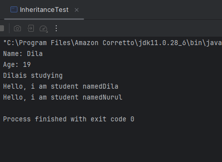
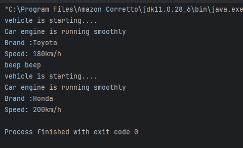
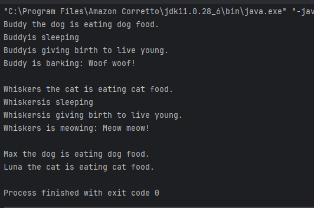
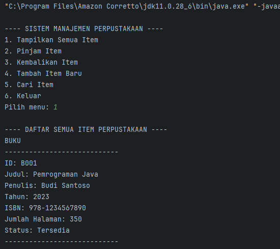

# Laporan Modul 6: Inheritance
**Mata Kuliah:** Praktikum Pemrograman Berorientasi Objek   
**Nama:** [Nurul Fadila]  
**NIM:** [2024573010026]  
**Kelas:** [TI 2A]

---

## Abstrak
Laporan ini bertujuan untuk menjelaskan konsep inheritance sebagai salah satu pilar utama dalam pemrograman berorientasi objek (Object-Oriented Programming/OOP). Inheritance memungkinkan sebuah kelas baru mewarisi atribut dan metode dari kelas lain, sehingga mendorong penggunaan ulang kode (code reusability), mempermudah pengelolaan struktur program, serta meningkatkan keteraturan dalam pengembangan perangkat lunak. Dalam laporan ini dibahas pengertian inheritance, jenis-jenisnya, serta penerapan konsep pewarisan melalui contoh kode program. Selain itu, laporan ini juga menguraikan manfaat dan masalah yang mungkin muncul dalam penerapannya, seperti kebutuhan akan desain hierarki kelas yang tepat. Melalui pembahasan ini, laporan diharapkan dapat memberikan pemahaman komprehensif mengenai bagaimana inheritance digunakan untuk membangun sistem yang lebih efisien, modular, dan mudah dikembangkan.

---
## 2. Praktikum
### Praktikum 1 - Memahami Single Inheritance
#### Dasar Teori
Single inheritance terjadi ketika sebuah class turunan hanya mewarisi dari satu class induk. Ini adalah bentuk pewarisan yang paling sederhana, di mana class turunan mendapatkan semua metode dan properti dari satu class induk saja.
#### Langkah Praktikum
1. Buat sebuah package baru di dalam package modul_6 dengan nama praktikum_1
2. Buat class Person sebagai superclass:

         public class Person {
         protected String name;
         protected int age;

         public Person (String name, int age){
         this.name = name;
         this.age = age;
         }
         public void displayInfo() {
         System.out.println("Name: " + name);
          System.out.println("Age: " + age);
         }

         public void greet () {
         System.out.println("Hello, i'm person");
         }

         }

3. Buat class Student sebagai subclass yang mewarisi Person:
   
         public class Student extends Person {
         private String studentId;

         public Student (String name, int age, String studentId) {
         super(name, age);
          this.studentId = studentId;
         }
         public void study () {
         System.out.println(name + "is studying");
          }

         @Override
         public void greet() {
         System.out.println("Hello, i am student named" + name);
         }
         }

4. Buat class InheritanceTest untuk testing:
   
          public class InheritanceTest {
          public static void main(String[] args) {
          Student student = new Student("Dila", 19, "2024573010026");

        student.displayInfo();
        student.study();
        student.greet();

        Person person = new Student("Nurul", 20, "2024573010002");
        person.greet();
          }
          }

#### Screenshoot Hasil

#### Analisa dan Pembahasan
1. Analisa dan Pembahasan Class Person (Superclass)

Kelas Person berfungsi sebagai kelas induk yang menyediakan atribut dan perilaku dasar untuk objek yang mewakili manusia.
Kelas ini memiliki dua atribut utama, yaitu name dan age, dan keduanya menggunakan protected. Ini penting karena:

Atribut dapat diakses oleh kelas itu sendiri.

Dapat diakses oleh kelas turunan (Student).

Tidak dapat diakses langsung oleh kelas lain di luar hirarki.

Atribut protected sangat umum digunakan dalam inheritance karena memudahkan subclass menggunakan data dari superclass tanpa perlu getter.

Kelas ini juga menyediakan:

Constructor, yang bertugas memberi nilai awal pada name dan age.

Method displayInfo(), yang menampilkan identitas umum seseorang.

Method greet(), yaitu metode umum untuk memberikan salam.
Method ini nantinya dapat dioverride oleh subclass agar memberikan salam yang berbeda.

Secara keseluruhan, kelas Person adalah fondasi yang baik untuk pewarisan karena berisi data dan method dasar yang berguna untuk berbagai jenis objek manusia.

2. Analisa dan Pembahasan Class Student (Subclass)

Student adalah kelas yang mewarisi Person, sehingga ia otomatis memiliki atribut name, age, dan semua method non-private dari Person.

Kelas Student menambahkan:

Atribut studentId → ciri tambahan yang tidak dimiliki Person.

Constructor yang menggunakan super() → memanggil constructor Person untuk mengisi name dan age.
Ini adalah ciri penting dalam inheritance agar superclass terinisialisasi dengan benar.

Kelas ini juga memiliki:

Method study() → perilaku yang khusus dimiliki Student.

Method greet() yang dioverride
Subclass mengubah perilaku greet() agar salamnya berbeda dari greeting milik Person.

Overriding ini menunjukkan adanya polymorphism, yaitu method yang sama tapi menghasilkan perilaku berbeda tergantung objeknya.

3. Analisa dan Pembahasan Class InheritanceTest

Kelas ini berfungsi sebagai driver class untuk melakukan pengujian inheritance.

Bagian pertama:

    Student student = new Student("Dila", 19, "2024573010026");
    student.displayInfo();
    student.study();
    student.greet();

Objek Student dibuat dan menjalankan tiga hal:

displayInfo() → milik superclass (Person), tapi datanya berasal dari Student.

study() → milik subclass.

greet() → versi override milik Student (bukan versi Person).

Ini menunjukkan bahwa subclass dapat memakai method induk dan menambahkan method baru.

Bagian kedua:

    Person person = new Student("Nurul", 20, "2024573010002");
    person.greet();

Ini adalah contoh polymorphism (upcasting):

Variabel tipe Person.

Objek sebenarnya adalah Student.

Ketika person.greet() dipanggil:

Java tidak melihat tipe variabel (Person), tetapi melihat tipe objek sebenarnya, yaitu Student.

Maka method greet() milik Student yang dipanggil, bukan milik Person.

Ini membuktikan konsep dynamic method dispatch, yaitu method yang dipilih saat runtime.

Kelas Person merupakan sebuah kelas dasar (superclass) yang dirancang untuk menggambarkan objek manusia dengan dua atribut utama, yaitu nama dan usia. Kedua atribut ini dibuat dengan akses protected, yang berarti atribut tersebut dapat digunakan di dalam kelas itu sendiri, di dalam kelas–kelas turunan (subclass), serta oleh kelas lain yang berada dalam package yang sama. Pemilihan modifier ini menunjukkan bahwa kelas tersebut memang disiapkan untuk kebutuhan inheritance, sehingga kelas turunan dapat dengan mudah mengakses dan memanfaatkan data yang ada.

Konstruktor pada kelas ini berfungsi untuk memberikan nilai awal pada setiap objek Person yang dibuat. Konstruktor menerima data nama dan usia, kemudian menyimpannya pada atribut internal kelas. Dengan cara ini, setiap objek yang dibuat akan memiliki identitas dan informasi dasar yang lengkap sejak awal. Konstruktor tersebut juga mempermudah proses pewarisan karena kelas turunan dapat memanggil konstruktor ini untuk menginisialisasi bagian yang diwarisi.

Kelas Person menyediakan dua method utama, yaitu method untuk menampilkan informasi diri dan method untuk memberikan sapaan. Method pertama menampilkan nilai atribut nama dan usia, sehingga pengguna atau program dapat mengetahui data yang tersimpan pada objek Person. Fungsi ini biasanya dijadikan dasar yang dapat diperluas oleh kelas turunan, misalnya dengan menambahkan informasi lain seperti program studi, jabatan, atau nomor identitas. Method kedua adalah method sapaan sederhana yang digunakan untuk memberikan pesan standar. Method ini juga sangat umum untuk di-override oleh kelas turunan, sehingga setiap jenis objek bisa memiliki gaya sapaan yang berbeda sesuai kebutuhan.

Secara keseluruhan, kelas Person dirancang sebagai pondasi untuk konsep pewarisan dalam pemrograman berorientasi objek. Struktur atributnya yang protected, konstruktor yang lengkap, dan method yang umum menjadikannya kelas yang ideal untuk diperluas. Kelas ini dapat digunakan untuk membuat berbagai kelas turunan seperti Student, Teacher, dan Employee, yang masing-masing dapat menambahkan atribut dan perilaku baru di atas dasar yang sudah disediakan oleh kelas Person.

### Praktikum 2 - Method Overriding dan Kata Kunci super
#### Dasar Teori
Method overriding memungkinkan subclass memberikan implementasi spesifik untuk method yang sudah didefinisikan di superclass. Kata kunci super digunakan untuk mengakses anggota superclass.

Aturan Method Overriding:
Method harus memiliki nama dan parameter yang sama
Return type harus sama atau subtype (covariant return type)
Access modifier tidak boleh lebih restriktif
Tidak bisa override method yang final atau static
Penggunaan super:
super() - Memanggil constructor superclass
super.methodName() - Memanggil method superclass
super.variableName - Mengakses variable superclass
Tujuan:
Memahami cara melakukan method overriding dan penggunaan kata kunci super.

#### Langkah Praktikum
1. Buat sebuah package baru di dalam package modul_6 dengan nama praktikum_2
2. Buat class Vehicle sebagai superclass:

         public class Vehicle {
         protected String brand;
         protected int speed;

         public Vehicle (String brand, int speed){
         this.brand = brand;
         this.speed = speed;
         }

         public void start () {
         System.out.println("vehicle is starting....");
         }
         public void displayInfo () {
         System.out.println("Brand :" + brand);
         System.out.println("Speed: " + speed + "km/h");
         }
         }

3. Buat class Car sebagai subclass yang mewarisi Vehicle:
   
          public class Car extends Vehicle {
          private int numberofDoors;

          public Car (String brand, int speed, int numberofDoors) {
          super (brand, speed);
          this.numberofDoors = numberofDoors;
          }

          @Override
          public void start() {
          super.start();
          System.out.println("Car engine is running smoothly");
          }
          public void honk () {
          System.out.println("beep beep");
          }
          }

5. Buat class OverrideTest untuk testing:
      
       public class OverrideTest {
       public static void main (String [] args) {
       Car car = new Car  ("Toyota", 180, 4);

        car.start();
        car.displayInfo();
        car.honk();

        Vehicle vehicle = new Car ("Honda", 200, 2);
        vehicle.start();
        vehicle.displayInfo();
       }
       }
#### Screenshoot Hasil

#### Analisa dan Pembahasan
1. Konsep Dasar Superclass (Vehicle)

Langkah awal praktikum adalah membuat class Vehicle yang berperan sebagai superclass.
Pada class ini terdapat atribut umum seperti brand dan speed yang diberi akses protected.
Penggunaan protected memungkinkan subclass (Car) untuk mengakses atribut tersebut secara langsung, tetapi tetap menjaga agar atribut tidak dapat diakses dari luar class.

Selain itu, superclass menyediakan konstruktor untuk menginisialisasi atribut serta dua method penting:

start() → menunjukkan bahwa kendaraan dapat dinyalakan.

displayInfo() → menampilkan informasi umum kendaraan.

Pada tahap ini, mahasiswa diperkenalkan pada prinsip bahwa sebuah superclass mendefinisikan karakteristik dasar yang dapat diwarisi oleh class lain.

2. Pembentukan Subclass Car yang Mewarisi Vehicle

Selanjutnya dibuat class Car, yang didefinisikan sebagai subclass dari Vehicle.
Class Car otomatis mewarisi seluruh atribut dan method dari Vehicle, tetapi juga menambahkan:

Atribut baru: numberOfDoors, yang merupakan ciri khas kendaraan mobil.

Sebuah method baru bernama honk(), yang merepresentasikan perilaku khusus mobil.

Hal penting pada tahap ini adalah penggunaan keyword super di konstruktor.
Keyword tersebut digunakan untuk memanggil konstruktor superclass dan memastikan atribut brand dan speed tetap diinisialisasi secara benar.

Langkah ini mengajarkan bahwa subclass tidak hanya mewarisi fitur, tetapi juga dapat menambahkan spesifikasi yang lebih detail sesuai kebutuhan objeknya.

3. Penerapan Method Overriding di Class Car

Pada class Car juga dilakukan overriding terhadap method start() milik superclass.
Overriding berarti subclass menyediakan implementasi baru yang lebih spesifik daripada implementasi dari superclass.

Di dalam method tersebut, super.start() tetap dipanggil agar perilaku asli tetap berjalan, lalu ditambahkan pesan baru yang mencerminkan karakter mobil.

Melalui langkah ini, mahasiswa memahami bahwa inheritance tidak hanya tentang mewarisi, tetapi juga mampu memodifikasi perilaku untuk menyesuaikan karakter objek yang lebih spesifik.

4. Pengujian melalui OverrideTest (Polymorphism)

Class OverrideTest digunakan untuk menguji keseluruhan konsep inheritance dan overriding.
Objek pertama yang dibuat adalah Car, kemudian seluruh method dijalankan:

start() ← versi overriding di Car

displayInfo() ← diwarisi dari Vehicle

honk() ← method khusus Car

Bagian terpenting adalah saat sebuah variabel bertipe Vehicle diisi dengan objek Car.
Ini menunjukkan konsep polymorphism, di mana:

Tipe referensi adalah superclass

Tipe objek sebenarnya adalah subclass

Ketika method start() dipanggil melalui referensi Vehicle, Java tetap mengeksekusi method milik Car (hasil overriding).
Hal ini menegaskan bahwa Java menentukan method berdasarkan objek sebenarnya, bukan tipe referensi.

### Praktikum 3 - Multilevel dan Hierarchical Inheritance
#### Dasar Teori
Dalam multilevel inheritance, sebuah class turunan mewarisi dari class turunan lain, sementara class yang sendiri mewarisi dari class induk. Jenis ini menciptakan "rantai" pewarisan. Misalnya, class C mewarisi dari class B, dan class B mewarisi dari class A.
Hierarchical inheritance terjadi saat beberapa class turunan mewarisi dari satu class induk yang sama. Jenis ini sering digunakan untuk mengelompokkan fungsionalitas yang serupa ke dalam satu class induk, sementara memungkinkan variasi dalam class turunan.

#### Langkah Praktikum
1. Buat sebuah package baru di dalam package modul_6 dengan nama praktikum_3
2. Buat class Animal sebagai superclass:

         public class Animal {
         protected String name;

         public Animal(String name) {
         this.name = name;
         }
         public void eat () {
         System.out.println(name + "is eating");
         }
         public void sleep () {
         System.out.println(name + "is sleeping");
         }
         }
3. Buat class Mammal yang mewarisi Animal (multilevel inheritance):
      
          public class Mammal extends Animal {
          protected String furColor;

          public Mammal(String name, String furColor) {
          super(name);
          this.furColor = furColor;
          }
          public void giveBirth () {
          System.out.println(name + "is giving birth to live young.");
          }
          }

4. Buat class Dog yang mewarisi Mammal (multilevel inheritance):
   
         public class Dog extends Mammal{
         private String breed;

         public Dog(String name, String furColor, String breed) {
         super(name, furColor);
         this.breed = breed;
         }

         public void bark() {
         System.out.println(name + " is barking: Woof woof!");
         }

         @Override
         public void eat() {
         System.out.println(name + " the dog is eating dog food.");
         }
          }
5. Buat class Cat yang mewarisi Mammal (hierarchical inheritance):

         public class Cat extends Mammal {
          private boolean isIndoor;

       public Cat(String name, String furColor, boolean isIndoor) {
           super(name, furColor);
           this.isIndoor = isIndoor;
       }

       public void meow() {
           System.out.println(name + " is meowing: Meow meow!");
       }

       @Override
       public void eat() {
           System.out.println(name + " the cat is eating cat food.");
       }
          }

6. Buat class InheritanceTypeTest untuk testing:
   
         public class InheritanceTypeTest {
         public static void main(String[] args) {
         // Multilevel inheritance test
         Dog dog = new Dog("Buddy", "Brown", "Golden Retriever");
         dog.eat();       // Dari Animal, di-override di Dog
         dog.sleep();     // Dari Animal
         dog.giveBirth(); // Dari Mammal
         dog.bark();      // Dari Dog

        System.out.println();

        // Hierarchical inheritance test
        Cat cat = new Cat("Whiskers", "White", true);
        cat.eat();       // Dari Animal, di-override di Cat
        cat.sleep();     // Dari Animal
        cat.giveBirth(); // Dari Mammal
        cat.meow();      // Dari Cat

        System.out.println();

        // Polymorphism dengan hierarchical inheritance
        Animal[] animals = {
                new Dog("Max", "Black", "Labrador"),
                new Cat("Luna", "Gray", false)
        };

        for (Animal animal : animals) {
            animal.eat(); // Akan memanggil method yang sesuai dengan objek sebenarnya
        }
         }
         }

#### Screenshoot Hasil

#### Analisa dan Pembahasan
1. Analisa Class Animal (Superclass)

Kelas Animal adalah fondasi dari seluruh hierarki inheritance. Kelas ini berisi:

Atribut protected name, yang dapat diakses oleh class ini sendiri dan seluruh subclass.

Constructor, yang memberikan nilai awal untuk name.

Method umum seperti eat() dan sleep(), yang merupakan perilaku dasar hewan.

Class ini menunjukkan karakteristik utama superclass:

Menyediakan atribut dasar yang akan diwarisi.

Memberikan method yang bisa digunakan langsung oleh subclass atau dioverride.

Menjadi dasar dari struktur pewarisan multilevel dan hierarchical.

Dengan mendefinisikan method umum di superclass, subclass tidak perlu menulis ulang logika dasar.

2. Analisa Class Mammal (Multilevel Inheritance – Level 2)

Class Mammal mewarisi Animal, sehingga menjadi bagian dari multilevel inheritance.
Dalam pewarisan multilevel terdapat level-level berikut:

Animal → Mammal → Dog/Cat

Pada class ini:

Ditambahkan atribut baru furColor, yang merupakan ciri khas mamalia.

Konstruktor memanggil constructor Animal menggunakan super(name) untuk menginisialisasi atribut yang diwarisi.

Method baru giveBirth() menambah perilaku khusus mamalia.

Hal ini menunjukkan bagaimana subclass dapat memperluas kemampuan superclass dengan menambah atribut dan method baru tanpa mengubah superclass.

3. Analisa Class Dog (Multilevel – Level 3)

Class Dog adalah turunan dari Mammal, sehingga mewarisi semua atribut dan method dari:

Animal (name, eat(), sleep())

Mammal (furColor, giveBirth())

Di class ini terdapat:

Atribut tambahan: breed.

Method tambahan: bark().

Method eat() dioverride untuk memberikan perilaku khusus anjing.

Override ini memperlihatkan:

Subclass dapat mengubah perilaku method yang diwarisi dari superclass.

Method yang sama (eat()) akan menghasilkan output berbeda tergantung objeknya.

Dog menjadi contoh sempurna dari multilevel inheritance, di mana setiap level pewarisan menambah karakteristik baru.

4. Analisa Class Cat (Hierarchical Inheritance)

Class Cat merupakan contoh hierarchical inheritance, karena Mammal memiliki lebih dari satu subclass:

          Animal
             |
          Mammal
          /     \
       Dog      Cat

Class Cat menambahkan:

Atribut baru: isIndoor (apakah kucing rumahan atau bukan).

Method baru: meow().

Override method eat() untuk menyesuaikan perilaku kucing.

Konsep yang ditekankan di sini:

Satu superclass dapat memiliki banyak subclass.

Setiap subclass memiliki perilaku unik meskipun sumber pewarisannya sama.

Overriding memperkuat konsep polymorphism.

5. Analisa Class InheritanceTypeTest (Testing & Polymorphism)

Class ini berfungsi untuk:

Menguji multilevel inheritance.

Menguji hierarchical inheritance.

Mendemonstrasikan polymorphism.

Bagian 1: Multilevel Inheritance Test
Dog dog = new Dog("Buddy", "Brown", "Golden Retriever");

Pemanggilan method:

eat() → memanggil versi override dari Dog

sleep() → berasal dari Animal

giveBirth() → berasal dari Mammal

bark() → milik Dog

Ini membuktikan bahwa Dog memiliki semua kemampuan dari 3 generasi pewarisan.

Bagian 2: Hierarchical Inheritance Test
Cat cat = new Cat("Whiskers", "White", true);

eat() → override dari Cat

sleep() → dari Animal

giveBirth() → dari Mammal

meow() → khusus Cat

Ini menunjukkan perbedaan perilaku antara dua subclass dari Mammal.

Bagian 3: Polymorphism
Animal[] animals = { new Dog(...), new Cat(...) };
for (Animal animal : animals) {
animal.eat();
}

### Praktikum 4 - Sistem Manajemen Perpustakaan Sederhana
#### Dasar Teori
Menerapkan konsep inheritance dalam project real-world sederhana untuk mengelola sistem perpustakaan.

Deskripsi Project:
Kita akan membuat sistem manajemen perpustakaan sederhana yang memiliki berbagai jenis item (buku, majalah, DVD) dengan karakteristik yang berbeda namun memiliki beberapa kesamaan.

#### Langkah Praktikum
1. Buat sebuah package baru di dalam package modul_6 dengan nama praktikum_4
2. Buat class LibraryItem sebagai superclass:
   
         public abstract class LibraryItem {
         protected String itemId;
         protected String title;
         protected int year;
         protected boolean isAvailable;

         public LibraryItem(String itemId, String title, int year) {
         this.itemId = itemId;
         this.title = title;
         this.year = year;
         this.isAvailable = true;
         }

         // Getter methods
         public String getItemID() { return itemId; }
         public String getTitle() { return title; }
         public int getYear() { return year; }
         public boolean isAvailable() { return isAvailable; }

         // Setter methods
         public void setAvailable(boolean available) { isAvailable = available; }

         // Abstract method yang harus diimplementasikan subclass
         public abstract void displayInfo();

         // Concrete method yang bisa digunakan semua subclass
         public void borrowItem() {
         if (isAvailable) {
         isAvailable = false;
         System.out.println(title + " berhasil dipinjam");
         } else {
         System.out.println(title + " sedang tidak tersedia");
         }
         }

         public void returnItem() {
         isAvailable = true;
         System.out.println(title + " berhasil dikembalikan");
          }
              }

3. Buat class Book yang mewarisi LibraryItem:
   
         public class Book extends LibraryItem{
          private String author;
          private String isbn;
          private int numberOfPages;

          public Book(String itemId, String title, int year, String author, String isbn, int numberOfPages) {
          super(itemId, title, year);
          this.author = author;
          this.isbn = isbn;
          this.numberOfPages = numberOfPages;
          }

          @Override
          public void displayInfo() {
          System.out.println("BUKU");
          System.out.println("----------------------------");
          System.out.println("ID: " + itemId);
          System.out.println("Judul: " + title);
          System.out.println("Penulis: " + author);
          System.out.println("Tahun: " + year);
          System.out.println("ISBN: " + isbn);
          System.out.println("Jumlah Halaman: " + numberOfPages);
          System.out.println("Status: " + (isAvailable ? "Tersedia" : "Dipinjam"));
          System.out.println("----------------------------");
          }

          // Method khusus Book
          public void readSample() {
          System.out.println("Membaca sample dari buku: " + title);
          }
       }

   4. Buat class Magazine yang mewarisi LibraryItem:
        
           public class Magazine extends LibraryItem{
            private String publisher;
            private int issueNumber;
             private String category;

             public Magazine(String itemId, String title, int year, String publisher, int issueNumber, String category) {
             super(itemId, title, year);
             this.publisher = publisher;
             this.issueNumber = issueNumber;
             this.category = category;
             }

             @Override
             public void displayInfo() {
             System.out.println("-------- MAJALAH --------");
             System.out.println("ID: " + itemId);
             System.out.println("Judul: " + title);
             System.out.println("Penerbit: " + publisher);
             System.out.println("Tahun: " + year);
             System.out.println("Edisi: " + issueNumber);
             System.out.println("Kategori: " + category);
             System.out.println("Status: " + (isAvailable ? "Tersedia" : "Dipinjam"));
             System.out.println("-------------------------");
             }

             // Method khusus Magazine
             public void browseArticles() {
             System.out.println("Menelusuri artikel dalam majalah: " + title);
             }
             }

5. Buat class DVD yang mewarisi LibraryItem:

       public class DVD extends LibraryItem{
       private String director;
       private int duration; // dalam menit
       private String genre;

       public DVD(String itemId, String title, int year, String director, int duration, String genre) {
       super(itemId, title, year);
       this.director = director;
       this.duration = duration;
       this.genre = genre;
       }

       @Override
       public void displayInfo() {
       System.out.println("---- DVD ----");
       System.out.println("ID: " + itemId);
       System.out.println("Judul: " + title);
       System.out.println("Sutradara: " + director);
       System.out.println("Tahun: " + year);
       System.out.println("Durasi: " + duration + " menit");
       System.out.println("Genre: " + genre);
       System.out.println("Status: " + (isAvailable ? "Tersedia" : "Dipinjam"));
       System.out.println("---------------------");
       }

       // Method khusus DVD
       public void playTrailer() {
       System.out.println("Memutar trailer DVD: " + title);
       }
       }

6. Buat class LibraryManagementSystem sebagai main class:
   
        import java.util.ArrayList; 
        import java.util.Scanner;

         public class LibraryManagementSystem {
         private static ArrayList<LibraryItem> libraryItems = new ArrayList<>();
         private static Scanner scanner = new Scanner(System.in);

         public static void main(String[] args) {
         initializeSampleData();

         while (true) {
         displayMenu();
         int choice = scanner.nextInt();
         scanner.nextLine(); // consume newline

         switch (choice) {
         case 1:
             displayAllItems();
             break;
         case 2:
             borrowItem();
             break;
         case 3:
             returnItem();
             break;
         case 4:
             addNewItem();
             break;
         case 5:
             searchItem();
             break;
         case 6:
             System.out.println("Terima kasih telah menggunakan sistem perpustakaan!");
             return;
         default:
             System.out.println("Pilihan tidak valid!");
          }
              }
                 }
         private static void displayMenu() {
         System.out.println("\n---- SISTEM MANAJEMEN PERPUSTAKAAN ----");
         System.out.println("1. Tampilkan Semua Item");
         System.out.println("2. Pinjam Item");
         System.out.println("3. Kembalikan Item");
         System.out.println("4. Tambah Item Baru");
         System.out.println("5. Cari Item");
         System.out.println("6. Keluar");
         System.out.print("Pilih menu: ");
         }

         private static void initializeSampleData() {
         // Tambahkan sample data
         libraryItems.add(new Book("B001", "Pemrograman Java", 2023, "Budi Santoso", "978-1234567890", 350));
         libraryItems.add(new Book("B002", "Struktur Data", 2022, "Sari Dewi", "978-0987654321", 280));
         libraryItems.add(new Magazine("M001", "National Geographic", 2024, "NG Media", 245, "Sains"));
         libraryItems.add(new DVD("D001", "The Java Documentary", 2023, "John Programmer", 120, "Edukasi"));
         }

         private static void displayAllItems() {
          System.out.println("\n---- DAFTAR SEMUA ITEM PERPUSTAKAAN ----");
         for (LibraryItem item : libraryItems) {
         item.displayInfo();
         System.out.println();
         }
             }

         private static void borrowItem() {
         System.out.print("Masukkan ID item yang ingin dipinjam: ");
         String itemId = scanner.nextLine();

         for (LibraryItem item : libraryItems) {
         if (item.getItemID().equalsIgnoreCase(itemId)) {
         item.borrowItem();
         return;
         }
         }
         System.out.println("Item dengan ID " + itemId + " tidak ditemukan!");
         }
         private static void returnItem() {
         System.out.print("Masukkan ID item yang ingin dikembalikan: ");
         String itemId = scanner.nextLine();

         for (LibraryItem item : libraryItems) {
         if (item.getItemID().equalsIgnoreCase(itemId)) {
         item.returnItem();
         return;
         }
             }
         System.out.println("Item dengan ID " + itemId + " tidak ditemukan!");
         }

         private static void addNewItem() {
         System.out.println("\n---- TAMBAH ITEM BARU ----");
         System.out.println("1. Buku");
         System.out.println("2. Majalah");
         System.out.println("3. DVD");
         System.out.print("Pilih jenis item: ");
         int type = scanner.nextInt();
         scanner.nextLine();

         System.out.print("ID Item: ");
         String itemId = scanner.nextLine();
         System.out.print("Judul: ");
         String title = scanner.nextLine();
         System.out.print("Tahun: ");
         int year = scanner.nextInt();
         scanner.nextLine();

          switch (type) {
         case 1:
             System.out.print("Penulis: ");
             String author = scanner.nextLine();
             System.out.print("ISBN: ");
             String isbn = scanner.nextLine();
             System.out.print("Jumlah Halaman: ");
             int pages = scanner.nextInt();
             scanner.nextLine();
             libraryItems.add(new Book(itemId, title, year, author, isbn, pages));
             break;
               
         case 2:
             System.out.print("Penerbit: ");
             String publisher = scanner.nextLine();
             System.out.print("Edisi: ");
             int issue = scanner.nextInt();
             scanner.nextLine();
             System.out.print("Kategori: ");
             String category = scanner.nextLine();
             libraryItems.add(new Magazine(itemId, title, year, publisher, issue, category));
             break;

         case 3:
             System.out.print("Sutradara: ");
             String director = scanner.nextLine();
             System.out.print("Durasi (menit): ");
             int duration = scanner.nextInt();
             scanner.nextLine();
             System.out.print("Genre: ");
             String genre = scanner.nextLine();
             libraryItems.add(new DVD(itemId, title, year, director, duration, genre));
             break;

         default:
             System.out.println("Jenis item tidak valid!");
                 return;
          }
         System.out.println("Item berhasil ditambahkan!");
         }

         private static void searchItem() {
         System.out.print("Masukkan kata kunci pencarian (judul/penulis): ");
         String keyword = scanner.nextLine().toLowerCase();

         System.out.println("\n---- HASIL PENCARIAN ----");
         boolean found = false;

         for (LibraryItem item : libraryItems) {
             if (item.getTitle().toLowerCase().contains(keyword)) {
             item.displayInfo();
         System.out.println();
         found = true;
         }
         }

         if (!found) {
             System.out.println("Tidak ada item yang cocok dengan kata kunci \"" + keyword + "\"");
         }
             }

         }    

#### Screenshoot Hasil

#### Analisa dan Pembahasan
1. Pembuatan Superclass: LibraryItem (Abstract Class)
   Analisa

LibraryItem dibuat sebagai abstract class karena:

Tidak semua item perpustakaan harus memiliki bentuk yang sama.

Class ini hanya bertindak sebagai kerangka dasar bagi semua item (buku, majalah, DVD).

Terdapat abstract method displayInfo() yang wajib di-override oleh setiap subclass.

Konsep OOP yang diterapkan

✔ Abstraction → membuat blueprint tanpa implementasi penuh
✔ Encapsulation → atribut dilindungi dengan protected
✔ Inheritance → akan diturunkan ke Book, Magazine, DVD
✔ Polymorphism → method displayInfo() diimplementasi berbeda di tiap subclass

Pembahasan

Superclass ini mengatur atribut umum:

itemId

title

year

isAvailable

Selain itu, method:

borrowItem() → mengatur status peminjaman

returnItem() → mengatur pengembalian

Getter dan Setter untuk akses data

Tujuannya: semua jenis item memiliki perilaku dasar yang sama, tetapi akan memiliki cara menampilkan informasi yang berbeda melalui method displayInfo().

2. Subclass Book
   Analisa

Book mewarisi atribut dari LibraryItem dan menambahkan properti khusus buku:

author

isbn

numberOfPages

Konsep OOP

✔ Inheritance
✔ Method overriding → displayInfo() ditulis ulang dengan format khusus buku
✔ Special method → readSample() hanya ada untuk Book

Pembahasan

Class ini menunjukkan bagaimana subclass dapat:

Mewarisi konstruktor superclass menggunakan super()

Menambahkan atribut baru yang spesifik

Mengimplementasikan logika custom

Hasilnya: objek Book dapat digunakan dalam program sebagai LibraryItem, tetapi tetap memiliki perilaku unik.

3. Subclass Magazine
   Analisa

Majalah memiliki karakteristik berbeda dari buku:

publisher

issueNumber

category

Konsep OOP

✔ Override
✔ Inheritance

Pembahasan

Class ini kembali menegaskan perbedaan tiap jenis item perpustakaan.
Method khusus browseArticles() mencerminkan fungsi unik majalah.

4. Subclass DVD
   Analisa

DVD memiliki properti:

director

duration

genre

Pembahasan

DVD menunjukkan item multim−edia yang:

Memiliki informasi berupa durasi

Bisa memutar trailer melalui method playTrailer()

Memperkuat konsep bahwa meskipun semua item memiliki struktur dasar yang sama, implementasinya berbeda.

5. Class Utama: LibraryManagementSystem
   Analisa

Class ini menjalankan keseluruhan sistem:

Menampilkan menu

Menyimpan semua item menggunakan ArrayList<LibraryItem>

Mengelola peminjaman, pengembalian, pencarian, dan penambahan item baru

Konsep OOP yang terlihat kuat

✔ Polymorphism

ArrayList menyimpan berbagai jenis objek (Book, Magazine, DVD) dalam satu list.

Saat melakukan item.displayInfo(), Java menjalankan versi sesuai jenis objek (dynamic dispatch).

✔ Composition

Sistem mengelola kumpulan objek LibraryItem.

✔ Abstraction

User tidak perlu tahu detail implementasi masing-masing item.

6. Pembahasan Fitur-Fitur Utama Dalam Sistem
   a. Menampilkan Semua Item

Menggunakan:

for (LibraryItem item : libraryItems) {
item.displayInfo();
}

Karena tipe datanya superclass, program dapat memanggil method override dari masing-masing subclass (polymorphism).

b. Peminjaman Item

Program mencari item berdasarkan itemId kemudian memanggil:

item.borrowItem();

Method ini terdapat di superclass → semua item bisa dipinjam.

c. Pengembalian Item

Mirip dengan peminjaman, menggunakan:

item.returnItem();

d. Penambahan Item Baru

Pengguna memilih jenisnya → sistem membuat objek baru berdasarkan pilihan:

new Book()

new Magazine()

new DVD()

Lalu dimasukkan ke libraryItems.

e. Pencarian Item

Pencarian berdasarkan judul. Sistem menggunakan:

item.getTitle().toLowerCase().contains(keyword)

Ini memanfaatkan method getter dari superclass.

---

## 3. Kesimpulan

Praktikum ini memberikan pemahaman menyeluruh mengenai konsep pewarisan (inheritance) dalam pemrograman berorientasi objek (PBO). Inheritance memungkinkan suatu class mewarisi atribut dan method dari class lain sehingga kode menjadi lebih terstruktur, efisien, dan mudah dikembangkan.

1. Memahami Single Inheritance

Single Inheritance terjadi ketika satu subclass mewarisi satu superclass.
Dari praktikum, dapat disimpulkan bahwa:

Subclass secara otomatis memiliki atribut dan method dari superclass.

Penggunaan single inheritance membuat kode lebih ringkas karena tidak perlu menulis ulang properti yang sama.

Contoh: Book extends LibraryItem atau Car extends Vehicle.

2. Method Overriding dan Kata Kunci super

Praktikum juga menunjukkan bagaimana subclass dapat mengubah perilaku method yang diwarisi melalui overriding.

Kesimpulan:

Method overriding memungkinkan subclass membuat implementasi berbeda dari method yang sama pada superclass.

Kata kunci super digunakan untuk:

Memanggil constructor superclass.

Mengakses method superclass yang di-override.

Dengan overriding, objek subclass dapat memiliki perilaku yang lebih spesifik tanpa menghilangkan fungsionalitas dasar.

3. Multilevel Inheritance

Multilevel inheritance terjadi ketika pewarisan berlangsung bertingkat, misalnya:

LibraryItem → Book → Novel

Kesimpulan:

Setiap level dapat menambah fitur baru.

Subclass di level terakhir tetap mewarisi semua atribut & method dari level sebelumnya.

Membentuk struktur hierarki yang logis dan teratur.

4. Hierarchical Inheritance

Hierarchical inheritance terjadi ketika satu superclass memiliki banyak subclass, misalnya:

LibraryItem → Book, Magazine, DVD

Kesimpulan:

Cocok digunakan untuk sistem yang memiliki beberapa jenis objek dengan karakteristik umum.

Setiap subclass dapat menambahkan fungsinya masing-masing.

Memperluas fleksibilitas sistem tanpa mengubah struktur dasar.

5. Penerapan Pada Sistem Manajemen Perpustakaan Sederhana

Konsep inheritance diterapkan pada pembuatan class LibraryItem sebagai superclass dan class turunan seperti Book atau Journal.

Kesimpulan dari penerapan ini:

Superclass LibraryItem menyimpan properti umum seperti itemId, title, year, dan isAvailable.

Subclass menangani detail spesifik, misalnya:

Book memiliki penulis dan jumlah halaman.

Magazine memiliki edisi.

DVD memiliki durasi film.

Sistem menjadi lebih mudah dikembangkan dan dipelihara.

Inheritance membuat pengelolaan item perpustakaan menjadi modular dan rapi.

## 5. Referensi
1. Sari, M., & Putra, D. (2018). Pemanfaatan Inheritance dan Polimorfisme dalam Pengembangan Aplikasi Java. Jurnal Ilmiah Informatika dan Komputer, 3(1).
2. Modul 6 - Inheritance (https://hackmd.io/@mohdrzu/r1Cxc-p0eg#Praktikum-4-Sistem-Manajemen-Perpustakaan-Sederhana)
---