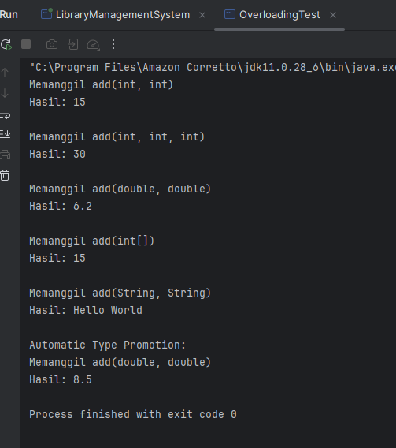
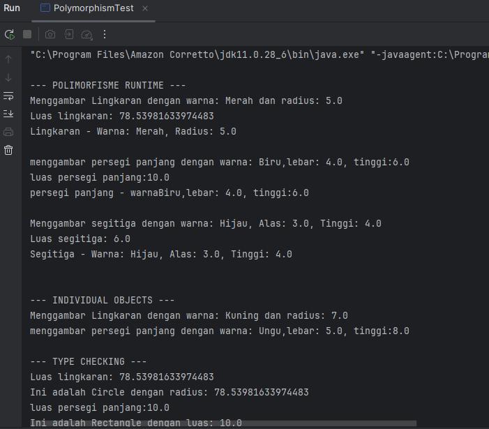

# Laporan Modul 7: Polymorphism
**Mata Kuliah:** Praktikum Pemrograman Berorientasi Objek   
**Nama:** [Nurul Fadila]  
**NIM:** [2024573010026]  
**Kelas:** [TI 2A]

---

## 1. Abstrak
Praktikum ini membahas penerapan konsep polymorphism dalam Pemrograman Berorientasi Objek (PBO) sebagai salah satu fitur penting untuk meningkatkan fleksibilitas dan efisiensi kode program. Polymorphism memungkinkan suatu method yang sama memiliki perilaku berbeda pada setiap objek yang berasal dari class turunan yang berbeda. Laporan ini berisi penjelasan mengenai dua jenis polymorphism, yaitu compile-time polymorphism melalui method overloading dan runtime polymorphism melalui method overriding. Selain itu, praktikum juga menerapkan penggunaan upcasting, superclass reference, serta pemanggilan method dengan objek subclass untuk membuktikan terjadinya dynamic binding. Pada studi kasus yang digunakan, setiap subclass memiliki implementasi method yang berbeda sehingga memudahkan proses generalisasi dan pengelolaan objek secara seragam dalam sebuah hierarki class.

Tujuan praktikum ini adalah untuk memberikan pemahaman kepada mahasiswa mengenai konsep dasar dan mekanisme kerja polymorphism, menunjukkan bagaimana method yang sama dapat berperilaku berbeda pada objek yang berbeda, serta meningkatkan kemampuan dalam merancang program yang lebih modular, fleksibel, dan mudah dikembangkan. Melalui praktikum ini, mahasiswa dapat mengaitkan konsep teoritis PBO dengan penerapan langsung dalam kode program, sehingga mampu mengembangkan solusi perangkat lunak yang lebih efisien dengan memanfaatkan fitur polymorphism secara optimal.

---
## 2. Praktikum
### Praktikum 1 - Memahami Method Overloading (Compile-time Polymorphism)
#### Dasar Teori
Method Overloading merupakan salah satu bentuk polymorphism dalam Pemrograman Berorientasi Objek (PBO) yang terjadi pada compile-time, sehingga sering disebut sebagai compile-time polymorphism atau static polymorphism. Konsep ini memungkinkan sebuah class memiliki beberapa method dengan nama yang sama, tetapi dibedakan melalui jumlah parameter, tipe parameter, atau urutan parameter. Dengan demikian, pemanggilan method yang tepat akan ditentukan oleh compiler berdasarkan signature method yang sesuai.

Method overloading digunakan untuk memberikan fleksibilitas dan kenyamanan dalam pemanggilan method yang memiliki tujuan serupa, tetapi menerima data dengan cara yang berbeda. Misalnya, sebuah method bernama add() dapat dibuat dalam beberapa versi untuk menangani penjumlahan bilangan bulat, pecahan, atau lebih dari dua nilai. Karena pemilihan method dilakukan saat proses kompilasi, overloading dapat meningkatkan readability dan konsistensi kode tanpa mengurangi performa program.

Dalam Java, aturan utama method overloading adalah:

Nama method harus sama.

Parameter harus berbeda (jumlah, tipe, atau urutan).

Tipe return tidak dapat digunakan sebagai pembeda.

Method dapat memiliki akses modifier berbeda.

Method overloading juga mendukung prinsip abstraksi dan code reusability, karena programmer dapat menyediakan berbagai cara untuk memproses data dengan nama method yang seragam tetapi implementasi berbeda sesuai kebutuhan.

#### Langkah Praktikum
1. Buat sebuah package baru di dalam package modul_7 dengan nama praktikum_1
2. Buat class Calculator dengan method overloading:
   
         public class Calculator {
         public int add(int a, int b) {
         System.out.println("Memanggil add(int, int)");
         return a + b;
         }

         // Overload method untuk menjumlahkan tiga integer
         public int add(int a, int b, int c) {
         System.out.println("Memanggil add(int, int, int)");
         return a + b + c;
         }

         // Overload method untuk menjumlahkan dua double
         public double add(double a, double b) {
         System.out.println("Memanggil add(double, double)");
         return a + b;
         }

         // Overload method untuk menjumlahkan array integer
         public int add(int[] numbers) {
         System.out.println("Memanggil add(int[])");
         int sum = 0;
         for (int num : numbers) {
         sum += num;
         }
         return sum;
         }

         // Overload method untuk concatenate strings
         public String add(String a, String b) {
         System.out.println("Memanggil add(String, String)");
         return a + b;
         }
         }

3. Buat class OverloadingTest untuk testing:
   
         public class OverloadingTest {
         public static void main(String[] args) {
         Calculator calc = new Calculator();

        // Test berbagai versi method add
        System.out.println("Hasil: " + calc.add(5, 10));
        System.out.println();

        System.out.println("Hasil: " + calc.add(5, 10, 15));
        System.out.println();

        System.out.println("Hasil: " + calc.add(3.5, 2.7));
        System.out.println();

        int[] numbers = {1, 2, 3, 4, 5};
        System.out.println("Hasil: " + calc.add(numbers));
        System.out.println();

        System.out.println("Hasil: " + calc.add("Hello", " World"));
        System.out.println();

        // Demonstrasi automatic type promotion
        System.out.println("Automatic Type Promotion:");
        System.out.println("Hasil: " + calc.add(5, 3.5)); // int + double
         }
         }

#### Screenshoot Hasil

#### Analisa dan Pembahasan
1. Pembuatan Class Calculator dengan Method Overloading

Pada class Calculator, dibuat beberapa method bernama add() yang masing-masing memiliki parameter berbeda. Hal ini merupakan contoh penerapan method overloading, yaitu kondisi ketika beberapa method memiliki nama yang sama, tetapi signature yang berbeda. Java memilih method yang tepat berdasarkan tipe dan jumlah parameter yang diberikan.

a. Method add(int a, int b)
public int add(int a, int b) {
System.out.println("Memanggil add(int, int)");
return a + b;
}

Method ini digunakan untuk menjumlahkan dua nilai bertipe int. Saat dipanggil dengan dua bilangan bulat, compiler akan memilih method ini.

b. Method add(int a, int b, int c)
public int add(int a, int b, int c) {
System.out.println("Memanggil add(int, int, int)");
return a + b + c;
}

Overloading ini menambahkan variasi parameter, yaitu tiga integer. Karena signature berbeda, method dapat hidup berdampingan dengan method pertama.

c. Method add(double a, double b)
public double add(double a, double b) {
System.out.println("Memanggil add(double, double)");
return a + b;
}

Method ini memproses dua angka bertipe double. Compiler akan memilih method ini ketika argumen berupa bilangan pecahan.

d. Method add(int[] numbers)
public int add(int[] numbers) {
System.out.println("Memanggil add(int[])");
int sum = 0;
for (int num : numbers) {
sum += num;
}
return sum;
}

Overloading ini menerima array integer, lalu melakukan penjumlahan menggunakan perulangan. Pemilihan method berdasarkan tipe parameter unik: int[].

e. Method add(String a, String b)
public String add(String a, String b) {
System.out.println("Memanggil add(String, String)");
return a + b;
}

Method ini bukan menjumlahkan angka, tetapi menggabungkan dua string (concatenation). Hal ini menunjukkan bahwa overloading tidak harus digunakan untuk operasi matematika—yang penting adalah parameter berbeda.

2. Pengujian dengan Class OverloadingTest

Class OverloadingTest menjalankan seluruh variasi method add untuk menunjukkan cara Java memilih method yang sesuai berdasarkan parameter.

a. Pemanggilan add(int, int)
calc.add(5, 10);

Output:

“Memanggil add(int, int)”

Hasil: 15

Compiler memilih versi dua integer.

b. Pemanggilan add(int, int, int)
calc.add(5, 10, 15);

Output:

“Memanggil add(int, int, int)”

Hasil: 30

Dipilih karena jumlah parameter = 3.

c. Pemanggilan add(double, double)
calc.add(3.5, 2.7);

Output:

“Memanggil add(double, double)”

Hasil: 6.2

Compiler memilih method double karena kedua nilai memiliki tipe double.

d. Pemanggilan add(int[])
calc.add(numbers);

Output:

“Memanggil add(int[])”

Hasil: jumlah elemen array = 15

Method dipilih berdasarkan tipe parameter array.

e. Pemanggilan add(String, String)
calc.add("Hello", " World");

Output:

“Memanggil add(String, String)”

Hasil: “Hello World”

Menunjukkan bahwa overloading dapat digunakan untuk berbagai jenis operasi.

3. Demonstrasi Automatic Type Promotion

Bagian akhir menguji kemampuan Java melakukan automatic type promotion.

calc.add(5, 3.5); // int + double

Tidak ada method add(int, double)

Java akan promote nilai int menjadi double

Sehingga method yang dipilih adalah:

add(double, double)

Output:

“Memanggil add(double, double)”

Hasil: 8.5

Ini membuktikan bahwa dalam overloading, Java akan memilih method yang parameter-nya paling cocok, dan melakukan type promotion jika diperlukan.

### Praktikum 2 - Memahami Method Overriding (Runtime Polymorphism)
#### Dasar Teori
Method Overriding merupakan salah satu bentuk polymorphism dinamis (runtime polymorphism) dalam Pemrograman Berorientasi Objek (PBO). Konsep ini memungkinkan subclass menyediakan implementasi ulang terhadap method yang sudah didefinisikan dalam superclass dengan nama, parameter, dan tipe return yang sama. Tujuannya adalah agar subclass dapat memiliki perilaku yang lebih spesifik tanpa mengubah struktur dasar method yang diwariskan.

Pada method overriding, pemanggilan method yang tepat ditentukan saat program berjalan (runtime), bukan saat kompilasi. Mekanisme ini disebut dynamic binding atau late binding. Ketika sebuah objek direferensikan menggunakan tipe superclass, tetapi objek sebenarnya adalah instance dari subclass, maka versi method milik subclass lah yang akan dijalankan. Hal ini yang membuat overriding menjadi kunci utama dari polymorphism dinamis, karena memungkinkan satu referensi memiliki perilaku berbeda tergantung pada objek aktual yang memanggilnya.

#### Langkah Praktikum
1. Buat sebuah package baru di dalam package modul_7 dengan nama praktikum_2
2. Buat class Shape sebagai superclass:

         public class Shape {
         protected String color;

         public Shape (String color) {
         this.color = color;
         }
         public void draw () {
         System.out.println("menggambar shpae dengan warna:" + color);
         }
         public double calculateArea () {
         System.out.println("menghitung luas shape umum");
         return 0.0;
         }
         public void displayInfo () {
         System.out.println("Shape - Warna " + color);
          }
           }

3. Buat class Circle yang mewarisi Shape:

         public class Circle extends Shape {
          private double radius;

          public Circle(String color, double radius) {
        super(color);
        this.radius = radius;
           }

       @Override
          public void draw() {
        System.out.println("Menggambar Lingkaran dengan warna: " + color + " dan radius: " + radius);
          }

          @Override
          public double calculateArea() {
          double area = Math.PI * radius * radius;
        System.out.println("Luas lingkaran: " + area);
        return area;
       }

       @Override
        public void displayInfo() {
        System.out.println("Lingkaran - Warna: " + color + ", Radius: " + radius);
        }
          }

4. Buat class Rectangle yang mewarisi Shape:

         public class Rectangle extends Shape {
         private double width;
         private double height;

        public Rectangle(String color, boolean filled, double width, double height) {
        super(color, filled);
        this.width = width;
        this.height = height;
        }

        // Implementasi abstract methods
        @Override
        public double calculateArea() {
        return width * height;
         }

        @Override
        public double calculatePerimeter() {
        return 2 * (width + height);
           }

        // Override concrete method
        @Override
         public void displayInfo() {
         System.out.println("RECTANGLE:");
         super.displayInfo();
        System.out.println("Width: " + width);
        System.out.println("Height: " + height);
        System.out.println("Area: " + calculateArea());
        System.out.println("Perimeter: " + calculatePerimeter());
         System.out.println("--------------------");
         }

        // Method khusus Rectangle
        public boolean isSquare() {
        return width == height;
        }
        }

6. Buat class Triangle yang mewarisi Shape:
   
          public class Triangle extends Shape {
         private double base;
       private double height;

        public Triangle(String color, double base, double height) {
          super(color);
       this.base = base;
          this.height = height;
          }
    
          @Override
          public void draw() {
          System.out.println("Menggambar segitiga dengan warna: " + color + ", Alas: " + base + ", Tinggi: " + height);
          }

        @Override
        public double calculateArea() {
       double area = 0.5 * base * height;
          System.out.println("Luas segitiga: " + area);
       return area;
          }

         @Override
          public void displayInfo() {
          System.out.println("Segitiga - Warna: " + color + ", Alas: " + base + ", Tinggi: " + height);}
        }

7. Buat class PolymorphismTest untuk testing:

         public class PolymorphismTest {
        public static void main(String[] args) {
        // Demonstrasi runtime polymorphism
        Shape[] shapes = new Shape[3];
        shapes[0] = new Circle("Merah", 5.0);
        shapes[1] = new Rectangle("Biru", 4.0, 6.0);
        shapes[2] = new Triangle("Hijau", 3.0, 4.0);

        System.out.println("\n--- POLIMORFISME RUNTIME ---");
        for (Shape shape : shapes) {
            shape.draw();        // Akan memanggil method sesuai objek sebenarnya
            shape.calculateArea(); // Akan memanggil method sesuai objek sebenarnya
            shape.displayInfo(); // Akan memanggil method sesuai objek sebenarnya
            System.out.println();
        }

        // Demonstrasi dengan individual objects
        System.out.println("\n--- INDIVIDUAL OBJECTS ---");
        Shape shape1 = new Circle("Kuning", 7.0);
        Shape shape2 = new Rectangle("Ungu", 5.0, 8.0);

        shape1.draw(); // Memanggil Circle's draw()
        shape2.draw(); // Memanggil Rectangle's draw()
          // Type casting dan instanceof
        System.out.println("\n--- TYPE CHECKING ---");
          for (Shape shape : shapes) {
          if (shape instanceof Circle) {
          Circle circle = (Circle) shape;
       System.out.println("Ini adalah Circle dengan radius: " + circle.calculateArea());
          } else if (shape instanceof Rectangle) {
          Rectangle rectangle = (Rectangle) shape;
          System.out.println("Ini adalah Rectangle dengan luas: " + rectangle.calculateArea());
          } else if (shape instanceof Triangle) {
          Triangle triangle = (Triangle) shape;
          System.out.println("Ini adalah Triangle dengan luas: " + triangle.calculateArea());
          }
          }
           }
              }

#### Screenshoot Hasil

#### Analisa dan Pembahasan
1. Class Shape sebagai Superclass

Class Shape berfungsi sebagai superclass yang mendefinisikan atribut dan perilaku dasar dari semua bentuk bangun datar.

Atribut dan Konstruktor
protected String color;
public Shape(String color) {
this.color = color;
}

Atribut color dibuat protected, sehingga subclass dapat mengaksesnya.

Constructor menerima warna sebagai parameter dan menginisialisasinya.

Method umum yang dapat dioverride
public void draw() { ... }
public double calculateArea() { ... }
public void displayInfo() { ... }

draw() → menampilkan pesan menggambar bentuk umum.

calculateArea() → default mengembalikan 0.0, karena luas bentuk umum tidak didefinisikan.

displayInfo() → menampilkan informasi warna.

Ketiga method ini dirancang untuk dioverride oleh subclass sehingga masing‐masing bentuk memiliki perilaku spesifik.

2. Class Circle – Contoh Overriding untuk Bentuk Lingkaran

Class Circle menggunakan keyword extends Shape, artinya ia mewarisi semua atribut dan method dari Shape.

Konstruktor
public Circle(String color, double radius) {
super(color);
this.radius = radius;
}

Keyword super digunakan untuk memanggil constructor milik Shape.

Menambahkan atribut baru : radius.

Overriding draw()
@Override
public void draw() {
System.out.println("Menggambar Lingkaran...");
}

Lingkaran memiliki cara menggambar yang berbeda, sehingga overriding diperlukan.

Overriding calculateArea()
@Override
public double calculateArea() {
double area = Math.PI * radius * radius;
}

Menghitung luas lingkaran sesuai rumus πr².

Overriding displayInfo()

Menampilkan informasi lengkap lingkaran: warna + radius.

✔ Circle menunjukkan runtime polymorphism karena ketika objek Circle dipanggil melalui referensi Shape, method yang berjalan tetap milik Circle.

3. Class Rectangle – Pewarisan dan Overriding

Class ini mewarisi dari Shape dan menambahkan dua atribut: width dan height.

Konstruktor (ada kesalahan kecil di kode kamu)
public Rectangle(String color, double width, double height) {
super(color);
this.width = width;
this.height = height;
}

Pada kode awal terdapat parameter filled dan pemanggilan super(color, filled) yang tidak ada pada superclass—ini seharusnya diperbaiki.

Overriding calculateArea()
public double calculateArea() { return width * height; }

Menghitung luas persegi panjang.

Overriding calculatePerimeter()

Rectangle menambahkan method perimeter sesuai rumus 2(w + h).

Overriding displayInfo()

Menggunakan:

super.displayInfo();

untuk menampilkan informasi dari superclass, kemudian menambah info width, height, area, dan perimeter.

Method tambahan
public boolean isSquare() { return width == height; }

Contoh method khusus subclass yang tidak ada di superclass.

4. Class Triangle – Overriding Sesuai Karakteristik Segitiga

Class Triangle menambahkan atribut base dan height.

Overriding draw()

Menampilkan bagaimana menggambar segitiga.

Overriding calculateArea()
double area = 0.5 * base * height;

Overriding displayInfo()

Menampilkan warna, alas, dan tinggi.

✔ Sama seperti Circle dan Rectangle, Triangle menunjukkan dynamic binding ketika dipanggil menggunakan referensi Shape.

5. Class PolymorphismTest – Demonstrasi Runtime Polymorphism
   A. Array dari Shape
   Shape[] shapes = new Shape[3];
   shapes[0] = new Circle("Merah", 5.0);
   shapes[1] = new Rectangle("Biru", 4.0, 6.0);
   shapes[2] = new Triangle("Hijau", 3.0, 4.0);

Meskipun tipe referensi adalah Shape, objek sebenarnya adalah Circle, Rectangle, dan Triangle.

Inilah inti runtime polymorphism → method yang dipanggil adalah method milik objek sebenarnya (dynamic dispatch).

B. Perulangan memanggil method overriding
shape.draw();
shape.calculateArea();
shape.displayInfo();

Output menyesuaikan objek aktual, bukan tipe referensi.

✔ Ini membuktikan konsep dynamic binding: Java menentukan method mana yang dipanggil saat runtime.

6. Individual Objects
   Shape shape1 = new Circle("Kuning", 7.0);
   Shape shape2 = new Rectangle("Ungu", 5.0, 8.0);

Kedua variabel bertipe Shape, namun method yang dipanggil tetap dari subclass masing-masing.

7. Type Checking & Casting menggunakan instanceof

Bagian ini digunakan untuk mengidentifikasi jenis objek sebenarnya dalam array:

if (shape instanceof Circle) {
Circle circle = (Circle) shape;
}

Tujuan:

Mengecek tipe objek sebenarnya.

Menggunakan downcasting untuk mengakses method khusus subclass jika diperlukan.

Hasil

Setiap shape dikenali sebagai Circle, Rectangle, atau Triangle

---

## 3. Kesimpulan

Praktikum ini memberikan pemahaman mendalam mengenai konsep dasar polymorphism dalam Pemrograman Berorientasi Objek (PBO), khususnya pada bahasa Java. Melalui serangkaian implementasi dan pengujian kode, mahasiswa dapat melihat bagaimana overloading dan overriding bekerja untuk meningkatkan fleksibilitas program.

1. Method Overloading (Compile-time Polymorphism)

Melalui pembuatan class Calculator, praktikum menunjukkan bahwa method overloading memungkinkan beberapa method memiliki nama yang sama tetapi berbeda pada:

jumlah parameter,

tipe data parameter,

atau urutan parameter.

Hasilnya, pemilihan method dilakukan pada saat compile-time, sehingga program mampu menangani berbagai tipe input tanpa mengganti nama method. Konsep ini menawarkan:

kemudahan penggunaan,

kejelasan API kelas,

serta peningkatan fleksibilitas dan keterbacaan kode.

2. Method Overriding (Runtime Polymorphism)

Pada bagian inheritance kelas Shape – Circle – Rectangle – Triangle, mahasiswa mempelajari bahwa method overriding memungkinkan subclass memberikan implementasi baru terhadap method superclass.
Pemanggilan method ditentukan pada runtime, sesuai tipe objek sebenarnya, bukan tipe referensinya. Konsep ini menunjukkan bahwa:

objek yang berbeda dapat merespons method yang sama dengan cara berbeda,

memudahkan penerapan prinsip abstraction dan dynamic dispatch,

meningkatkan kemampuan perluasan program tanpa memodifikasi kode lama.

3. Implementasi Polymorphism dalam Array of Objects

Penggunaan array Shape[] shapes membuktikan bahwa polymorphism memungkinkan:

penyimpanan berbagai objek subclass dalam satu referensi superclass,

pemanggilan method yang berbeda sesuai objek aktual,

penerapan desain program yang lebih modular dan mudah dikembangkan.

4. Penerapan Type Checking dan Casting

Melalui instanceof dan casting, mahasiswa memahami cara:

mengenali jenis objek sebenarnya,

mengakses method khusus subclass,

melakukan kontrol lebih detail pada objek polimorfik.

---

## 5. Referensi
1. W3Schools – Java Method Overloading & Overriding
https: //www.w3schools.com/java/
2. modul 7 - Polymorphism //https://hackmd.io/@mohdrzu/BJlT87vJZe//
---