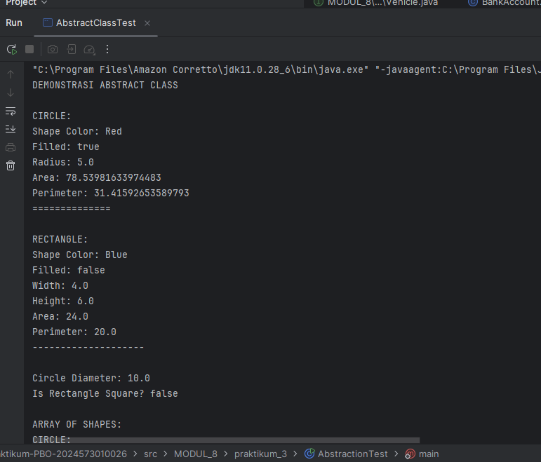
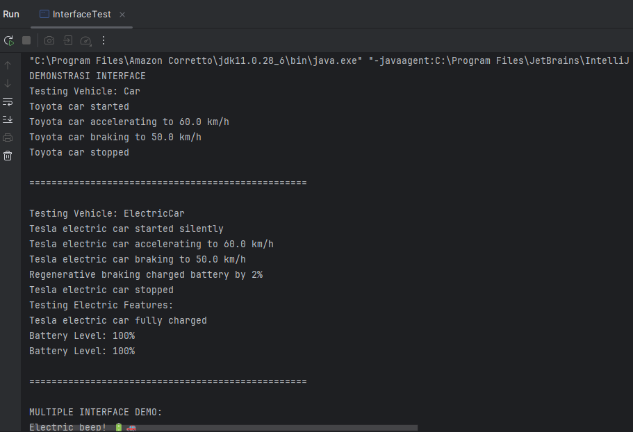
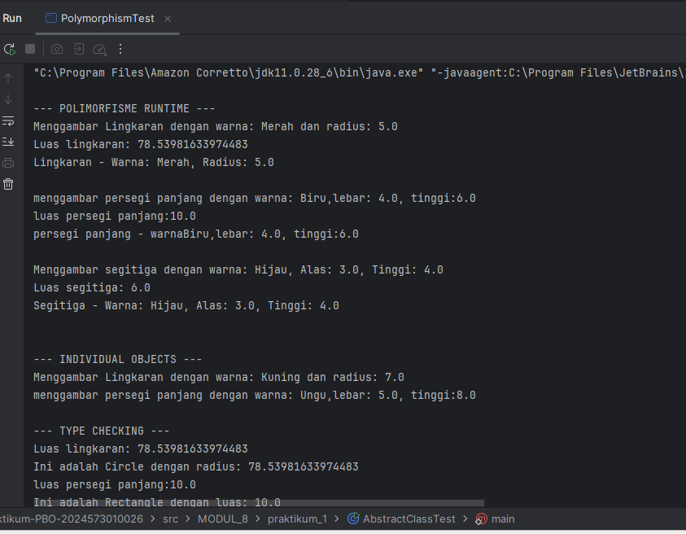

# Laporan Modul 8: Abstraction
**Mata Kuliah:** Praktikum Pemrograman Berorientasi Objek   
**Nama:** [Nurul Fadila]  
**NIM:** [2024573010026]  
**Kelas:** [ti 2a]

---

## 1. Abstrak
Abstraksi adalah konsep dalam object-oriented programming (OOP) yang bertujuan untuk menyederhanakan kompleksitas sistem dengan menyembunyikan detail-detail teknis yang tidak perlu.

Inti dari abstraksi adalah tentang fokus pada 'apa' yang dilakukan suatu objek atau komponen, bukan 'bagaimana' hal itu dilakukan. Dalam praktiknya, abstraksi membantu programmer mendefinisikan interface, menunjukkan operasi yang dapat dilakukan oleh suatu objek, tanpa harus menyertakan detail tentang logika internal atau implementasi di balik operasi tersebut.

Misalnya, ketika menggunakan remote TV, kita hanya perlu tahu cara mengoperasikannya tanpa harus memahami mekanisme internalnya. Dalam OOP, objek menyediakan abstraksi yang menyembunyikan detail implementasi internal. Seperti remote TV, user hanya perlu tahu metode apa dari objek yang tersedia untuk dipanggil dan parameter input apa yang diperlukan untuk memicu operasi tertentu.

Dalam desain software, abstraksi berguna agar sistem dapat dibagi menjadi komponen-komponen yang lebih kecil dan lebih mudah dikelola, di mana masing-masing menyembunyikan kompleksitasnya sendiri. Hal ini tidak hanya memudahkan proses pengembangan, tetapi juga memfasilitasi maintenance dan testing software.

Selain itu, abstraksi juga bisa dipakai untuk mengubah implementasi internal suatu komponen tanpa memengaruhi komponen lain yang berinteraksi dengan komponen tersebut, asalkan interface yang digunakan tetap konsisten.

---
## 2. Praktikum
### Praktikum 1 - Memahami Abstract Class dan Abstract Method
#### Dasar Teori
Abstract Class
Abstract class adalah kelas yang tidak dapat diinstansiasi (tidak bisa dibuat objeknya langsung). Kelas ini berfungsi sebagai kerangka dasar (template) untuk kelas-kelas turunannya.

Ciri-ciri Abstract Class:
Dideklarasikan dengan keyword abstract
Tidak bisa dibuat objeknya dengan new
Dapat memiliki method abstrak dan method konkret (biasa)
Dapat memiliki constructor, field, dan method seperti kelas biasa
Abstract Method
Abstract method adalah method yang hanya dideklarasikan tanpa implementasi (tanpa body). Implementasinya wajib diberikan oleh subclass yang mewarisinya.

Ciri-ciri Abstract Method:
Hanya deklarasi tanpa body {}
Harus berada dalam abstract class
Subclass wajib mengoverride method abstrak ini
Dideklarasikan dengan keyword abstract

#### Langkah Praktikum
1. Buat sebuah package baru di dalam package modul_8 dengan nama praktikum_1
2. Buat abstract class Shape:

        package modul_8.praktikum1;
            
            public abstract class Shape {
            protected String color;
            protected boolean filled;
            
                // Constructor
                public Shape(String color, boolean filled) {
                    this.color = color;
                    this.filled = filled;
                }
            
                // Abstract methods
                public abstract double calculateArea();
                public abstract double calculatePerimeter();
            
                // Concrete methods
                public String getColor() {
                    return color;
                }
            
                public void setColor(String color) {
                    this.color = color;
                }
            
                public boolean isFilled() {
                    return filled;
                }
            
                public void setFilled(boolean filled) {
                    this.filled = filled;
                }
            
                public void displayInfo() {
                    System.out.println("Shape Color: " + color);
                    System.out.println("Filled: " + filled);
                }
            }
3. Buat class Circle yang mewarisi Shape:

         package modul_8.praktikum1;
            
         public class Circle extends Shape {
         private double radius;
            
             public Circle(String color, boolean filled, double radius) {
                 super(color, filled);
                 this.radius = radius;
             }
            
             // Implementasi abstract methods
             @Override
             public double calculateArea() {
                 return Math.PI * radius * radius;
             }
            
             @Override
             public double calculatePerimeter() {
                 return 2 * Math.PI * radius;
             }
            
             // Override display method
             @Override
             public void displayInfo() {
                 System.out.println("CIRCLE");
                 super.displayInfo();
                 System.out.println("Radius: " + radius);
                 System.out.println("Area: " + calculateArea());
                 System.out.println("Perimeter: " + calculatePerimeter());
                 System.out.println("===============");
             }
            
             // Method khusus
             public double getDiameter() {
                 return 2 * radius;
             }
         }
4. Buat class Rectangle yang mewarisi Shape:
        
        package modul_8.praktikum1;
         public class Rectangle extends Shape {
         private double width;
         private double height;

        public Rectangle(String color, boolean filled, double width, double height) {
            super(color, filled);
            this.width = width;
            this.height = height;
        }
    
        @Override
        public double calculateArea() {
            return width * height;
        }
    
        @Override
        public double calculatePerimeter() {
            return 2 * (width + height);
        }
    
        @Override
        public void displayInfo() {
            System.out.println("RECTANGLE");
            super.displayInfo();
            System.out.println("Width: " + width);
            System.out.println("Height: " + height);
            System.out.println("Area: " + calculateArea());
            System.out.println("Perimeter: " + calculatePerimeter());
            System.out.println("-----------------------");
        }
    
        public boolean isSquare() {
            return width == height;
        }
         }
5. Buat class AbstractClassTest untuk testing:

        package modul_8.praktikum1;
         public class AbstractClassTest {
         public static void main(String[] args) {

            Circle circle = new Circle("Red", true, 5.0);
            Rectangle rectangle = new Rectangle("Blue", false, 4.0, 6.0);
    
            System.out.println("DEMONSTRASI ABSTRACT CLASS");
    
            Shape shape1 = circle;
            Shape shape2 = rectangle;
    
            shape1.displayInfo();
            System.out.println();
    
            shape2.displayInfo();
            System.out.println();
    
            System.out.println("Circle Diameter: " + circle.getDiameter());
            System.out.println("Is Rectangle Square? " + rectangle.isSquare());
    
            System.out.println("\nARRAY OF SHAPES");
            Shape[] shapes = new Shape[3];
            shapes[0] = new Circle("Green", true, 3.0);
            shapes[1] = new Rectangle("Yellow", true, 5.0, 5.0);
            shapes[2] = new Circle("Purple", false, 7.0);
    
            double totalArea = 0;
            for (Shape shape : shapes) {
                shape.displayInfo();
                totalArea += shape.calculateArea();
                System.out.println();
            }
    
            System.out.println("Total Area of All Shapes: " + totalArea);
        }
         }

#### Screenshoot Hasil

#### Analisa dan Pembahasan

1. Abstract Class Shape

Pada bagian awal, dibuat sebuah abstract class bernama Shape.
Tujuan dari kelas abstrak ini adalah menjadi blueprint bagi berbagai bentuk (Circle, Rectangle, dll). Kelas abstrak tidak dapat di-instansiasi secara langsung dan hanya berfungsi sebagai induk untuk kelas turunan.

Karakteristik penting dari class Shape:
✔ Atribut Protected
protected String color;
protected boolean filled;

Penggunaan protected memungkinkan atribut dapat diakses oleh subclass, namun tetap tidak dapat diakses dari luar paket atau objek langsung → bentuk dari abstraksi + enkapsulasi.

✔ Constructor
public Shape(String color, boolean filled)

Digunakan untuk menginisialisasi nilai dasar untuk semua bentuk.

✔ Abstract Methods
public abstract double calculateArea();
public abstract double calculatePerimeter();

Metode ini wajib diimplementasikan oleh semua subclass karena setiap bentuk memiliki rumus luas dan keliling yang berbeda.
Ini merupakan inti dari abstraksi, yaitu hanya mendefinisikan “apa” yang harus dilakukan, bukan “bagaimana”.

✔ Concrete Methods

Getter/setter dan displayInfo() dibuat non-abstrak sehingga dapat digunakan langsung oleh subclass.

2. Class Circle (Subclass dari Shape)

Circle melakukan inheritance dari class Shape dan menyediakan implementasi konkret dari metode abstrak.

✔ Implementasi Abstract Method
@Override
public double calculateArea() {
return Math.PI * radius * radius;
}

@Override
public double calculatePerimeter() {
return 2 * Math.PI * radius;
}

Rumus ini menunjukkan bahwa setiap jenis Shape memiliki cara perhitungan spesifik.

✔ Overriding displayInfo()
@Override
public void displayInfo() {
System.out.println("CIRCLE");
super.displayInfo();
...
}

✓ Menampilkan informasi dasar dari Shape
✓ Menambah informasi khusus Circle
Ini adalah penerapan polymorphism (runtime overriding).

✔ Method Khusus Subclass
public double getDiameter() {
return 2 * radius;
}

Circle memiliki perilaku yang tidak dimiliki Shape lain → konsep specialized behavior.

3. Class Rectangle (Subclass dari Shape)

Rectangle juga mewarisi Shape.

✔ Implementasi abstract method
public double calculateArea() { return width * height; }
public double calculatePerimeter() { return 2 * (width + height); }

✔ Overriding displayInfo()

Menampilkan data khas Rectangle seperti width dan height.

✔ Method tambahan
public boolean isSquare() {
return width == height;
}

Ini menunjukkan bahwa subclass dapat memiliki karakteristik tambahan di luar yang diwariskan.

4. Testing dengan Class AbstractClassTest

Bagian ini mendemonstrasikan konsep-konsep OOP: abstraksi, inheritance, polymorphism, overriding, dan array of objects.

a. Membuat objek Circle dan Rectangle
Circle circle = new Circle("Red", true, 5.0);
Rectangle rectangle = new Rectangle("Blue", false, 4.0, 6.0);

b. Upcasting ke tipe abstract class (Polymorphism)
Shape shape1 = circle;
Shape shape2 = rectangle;

Meskipun variabel bertipe Shape, method yang dijalankan tetap milik subclass → runtime polymorphism.

c. Memanggil override displayInfo()

Setiap objek akan menjalankan versi displayInfo() masing-masing, membuktikan bahwa method overriding berjalan.

d. Memanggil method khusus subclass
circle.getDiameter();
rectangle.isSquare();

Method ini tidak ada di kelas abstrak Shape → hanya bisa dipanggil melalui objek langsung, bukan referensi Shape.

e. Array of Shape
Shape[] shapes = new Shape[3];

Menampung objek Circle dan Rectangle secara bersamaan karena keduanya merupakan turunan dari Shape.

f. Perhitungan total area menggunakan polymorphism
totalArea += shape.calculateArea();

Walaupun tipe referensi adalah Shape, method yang dipanggil tetap milik subclass masing-masing.

### Praktikum 2 - Memahami Interface
#### Dasar Teori
Interface adalah kontrak yang mendefinisikan method yang harus diimplementasikan oleh class yang menggunakannya. Interface hanya berisi deklarasi method tanpa implementasi (kecuali default dan static methods di Java 8+).

Karakteristik Interface:
Semua method secara default abstract dan public.
Semua variables secara default public, static, dan final.
Mendukung multiple inheritance.
Dapat memiliki default dan static methods.
Dapat memiliki private methods.

#### Langkah Praktikum
1. Buat sebuah package baru di dalam package modul_8 dengan nama praktikum_2
2. Buat interface Vehicle:
        
        package modul_8.praktikum2;
        
        public interface Vehicle {
        // Constant fields (public static final by default)
        int MAX_SPEED = 200;
        
            // Abstract methods (public abstract by default)
            void start();
            void stop();
            void accelerate(double speed);
            void brake();
        
            // Default method (Java 8+)
            default void honk() {
                System.out.println("Beep beep!");
            }
        
            // Static method (Java 8+)
            static void displayMaxSpeed() {
                System.out.println("Maximum speed for all vehicles: " + MAX_SPEED + " km/h");
            }
        }
3. Buat interface Electric:

         package modul_8.praktikum2;

        public interface Electric {
        void charge();
        int getBatteryLevel();
        void setBatteryLevel(int level);
        
            default void displayBatteryInfo() {
                System.out.println("Battery Level: " + getBatteryLevel() + "%");
            }
        }
4. Buat class Car yang mengimplementasi Vehicle:
   
         package modul_8.praktikum2;

        public class Car implements Vehicle {
        private String brand;
        private double currentSpeed;
        private boolean isRunning;
        
            public Car(String brand) {
                this.brand = brand;
                this.currentSpeed = 0;
                this.isRunning = false;
            }
        
            @Override
            public void start() {
                if (!isRunning) {
                    isRunning = true;
                    System.out.println(brand + " car started");
                } else {
                    System.out.println(brand + " car is already running");
                }
            }
        
            @Override
            public void stop() {
                if (isRunning) {
                    isRunning = false;
                    currentSpeed = 0;
                    System.out.println(brand + " car stopped");
                } else {
                    System.out.println(brand + " car is already stopped");
                }
            }
        
            @Override
            public void accelerate(double speed) {
                if (isRunning) {
                    currentSpeed += speed;
                    if (currentSpeed > MAX_SPEED)
                        currentSpeed = MAX_SPEED;
        
                    System.out.println(brand + " car accelerating to " + currentSpeed + " km/h");
                } else {
                    System.out.println("Please start the car first");
                }
            }
        
            @Override
            public void brake() {
                if (currentSpeed > 0) {
                    currentSpeed -= 10;
                    if (currentSpeed < 0) currentSpeed = 0;
        
                    System.out.println(brand + " car braking to " + currentSpeed + " km/h");
                } else {
                    System.out.println(brand + " car is already stopped");
                }
            }
        
            // Getter methods
            public String getBrand() { return brand; }
            public double getCurrentSpeed() { return currentSpeed; }
            public boolean isRunning() { return isRunning; }
        }

5. Buat class ElectricCar yang mengimplementasi kedua interface:

        public class ElectricCar implements Vehicle, Electric {
        private String brand;
        private double currentSpeed;
        private boolean isRunning;
        private int batteryLevel;
        
            public ElectricCar(String brand) {
                this.brand = brand;
                this.currentSpeed = 0;
                this.isRunning = false;
                this.batteryLevel = 100; // Fully charged
            }
        
            // Implement Vehicle interface methods
            @Override
            public void start() {
                if (batteryLevel > 0) {
                    if (!isRunning) {
                        isRunning = true;
                        System.out.println(brand + " electric car started silently");
                    } else {
                        System.out.println(brand + " electric car is already running");
                    }
                } else {
                    System.out.println("Cannot start the car. Battery is empty. Please charge first.");
                }
            }
        
            @Override
            public void stop() {
                if (isRunning) {
                    isRunning = false;
                    currentSpeed = 0;
                    System.out.println(brand + " electric car stopped");
                } else {
                    System.out.println(brand + " electric car is already stopped");
                }
            }
        
            @Override
            public void accelerate(double speed) {
                if (isRunning && batteryLevel > 0) {
                    currentSpeed += speed;
        
                    // Battery consumption
                    batteryLevel -= (int)(speed / 10);
                    if (batteryLevel < 0) batteryLevel = 0;
        
                    if (currentSpeed > MAX_SPEED) currentSpeed = MAX_SPEED;
        
                    System.out.println(brand + " electric car accelerating to " + currentSpeed + " km/h");
                    System.out.println("Battery level now: " + batteryLevel + "%");
                } else {
                    System.out.println("Please start the car first");
                }
            }
        
            @Override
            public void brake() {
                if (currentSpeed > 0) {
                    currentSpeed -= 10;
                    if (currentSpeed < 0) currentSpeed = 0;
        
                    System.out.println(brand + " electric car braking to " + currentSpeed + " km/h");
        
                    // Regenerative braking: battery gains slightly
                    batteryLevel += 2;
                    if (batteryLevel > 100) batteryLevel = 100;
        
                    System.out.println("Regenerative braking charged battery by 2%");
                } else {
                    System.out.println(brand + " electric car is already stopped");
                }
            }
        
            // Override default method
            @Override
            public void honk() {
                System.out.println("Electric beep! ⚡");
            }
        
            // Electric interface methods
            @Override
            public void charge() {
                batteryLevel = 100;
                System.out.println(brand + " electric car fully charged");
            }
        
            @Override
            public int getBatteryLevel() {
                return batteryLevel;
            }
        
            @Override
            public void setBatteryLevel(int level) {
                if (level >= 0 && level <= 100) {
                    batteryLevel = level;
                } else {
                    System.out.println("Battery level must be between 0 and 100%");
                }
            }
        
            public String getBrand() { return brand; }
            public double getCurrentSpeed() { return currentSpeed; }
            public boolean isRunning() { return isRunning; }
        }
6. Buat class InterfaceTest untuk testing:

        public class InterfaceTest {
        public static void main(String[] args) {
        System.out.println("DEMOSTRASI INTERFACE");
        
                // Test regular car
                Car car = new Car("Toyota");
                testVehicle(car);
        
                System.out.println("\n" + "=".repeat(50) + "\n");
        
                // Test electric car
                ElectricCar electricCar = new ElectricCar("Tesla");
                testVehicle(electricCar);
                testElectric(electricCar);
        
                System.out.println("\n" + "=".repeat(50) + "\n");
        
                // Demonstrasi multiple interface implementation
                System.out.println("MULTIPLE INTERFACE DEMO");
                electricCar.honk(); // Overridden default method
                electricCar.displayBatteryInfo(); // Default method from Electric interface
        
                // Static method call
                Vehicle.displayMaxSpeed();
        
                // Interface constants
                System.out.println("MAX_SPEED constant: " + Vehicle.MAX_SPEED + " km/h");
            }
        
            public static void testVehicle(Vehicle vehicle) {
                System.out.println("Testing Vehicle: " + vehicle.getClass().getSimpleName());
                vehicle.start();
                vehicle.accelerate(50);
                vehicle.accelerate(80);
                vehicle.honk(); // Default method
                vehicle.brake();
                vehicle.stop();
            }
        
            public static void testElectric(Electric electric) {
                System.out.println("Testing Electric Features:");
                electric.displayBatteryInfo();
                electric.charge();
                electric.displayBatteryInfo();
            }
        }
#### Screenshoot Hasil

#### Analisa dan Pembahasan
1. Interface Vehicle

Interface Vehicle mendefinisikan perilaku umum dari sebuah kendaraan tanpa memberikan implementasi (kecuali default & static method).
Interface ini digunakan untuk standar kontrak bahwa setiap kendaraan harus dapat:

start()

stop()

accelerate()

brake()

✔ Konstanta di interface
int MAX_SPEED = 200;

Di Java, semua variabel dalam interface bersifat:

public

static

final

Sehingga konstanta ini dapat dipakai oleh semua kelas yang mengimplementasinya.

✔ Abstract method
void start();
void stop();
void accelerate(double speed);
void brake();

▪ Semua method adalah public & abstract secara default.
▪ Tidak memiliki body → wajib diimplementasikan di class turunannya.

✔ Default method (Java 8+)
default void honk() {
System.out.println("Beep beep!");
}

▪ Memiliki implementasi
▪ Boleh dipakai langsung atau dioverride oleh subclass
Ini menunjukkan evolusi interface agar tetap kompatibel tanpa merusak class lama.

✔ Static method
static void displayMaxSpeed()

▪ Dipanggil melalui Vehicle.displayMaxSpeed()
▪ Digunakan sebagai utilitas pada level interface, bukan objek.

2. Interface Electric

Interface ini digunakan untuk fitur listrik yang tidak dimiliki kendaraan biasa.

✔ Metode wajib
void charge();
int getBatteryLevel();
void setBatteryLevel(int level);

✔ Default method
default void displayBatteryInfo()

Memberikan fungsi langsung tanpa harus implementasi di semua kelas yang menggunakan interface Electric.

✔ Konsep penting

Interface ini akan menunjukkan multiple inheritance ketika digunakan pada ElectricCar.

3. Class Car implements Vehicle

Car adalah kendaraan biasa, sehingga hanya perlu mengimplementasi interface Vehicle.

✔ Atribut

brand

currentSpeed

isRunning

Penentuan status kendaraan diatur dengan baik melalui variabel ini.

✔ Implementasi metode Vehicle

start():

Menghidupkan kendaraan

Dicegah start ulang jika kendaraan sudah hidup

stop():

Menghentikan kendaraan

Mengatur kecepatan menjadi 0

accelerate():

Menambah kecepatan

Ada pengecekan agar tidak melebihi MAX_SPEED

brake():

Mengurangi kecepatan per 10 km/h

Tidak boleh menjadi negatif

✔ Analisis

Implementasi Car menunjukkan simulasi kendaraan klasik, tanpa fitur baterai atau regenerasi energi.
Kelas ini hanya menggunakan interface Vehicle, sehingga lebih sederhana.

4. Class ElectricCar implements Vehicle & Electric

Kelas ini lebih kompleks karena menggunakan multiple interface implementation, sesuatu yang tidak dapat dilakukan dengan class biasa (Java tidak mendukung multiple inheritance class, tapi mendukung multiple interface).

✔ Atribut tambahan

Selain atribut Vehicle (brand, speed, isRunning), ElectricCar memiliki:

batteryLevel

✔ Karakteristik penting ElectricCar:
1) start()

Hanya bisa start jika baterai > 0

Menggunakan pesan berbeda: "started silently"

2) accelerate()

Menambah kecepatan

Menurunkan batteryLevel berdasarkan speed:
batteryLevel -= speed/10

Membatasi kecepatan maksimum sesuai MAX_SPEED

3) brake()

Mengurangi kecepatan

Regenerative braking: baterai bertambah 2%

4) Override honk()
   @Override
   public void honk() {
   System.out.println("Electric beep! ⚡");
   }

Ini menunjukkan bahwa default method pada interface dapat digantikan.

5) Implementasi Electric interface

charge() mengisi baterai ke 100%

Getter dan setter battery level

✔ Analisis

ElectricCar adalah contoh bagus dari:

Multiple inheritance (Vehicle + Electric)

Polymorphism melalui interface

Override default method

Menambahkan perilaku unik untuk kendaraan listrik

5. InterfaceTest – Testing dan Demonstrasi

Testing ini menunjukkan bagaimana interface bekerja saat digunakan dalam berbagai konteks.

✔ testVehicle(Vehicle vehicle)

Method ini menerima tipe Vehicle, sehingga bisa menerima:

Car

ElectricCar

Kelas apapun yang implement Vehicle

Ini menunjukkan polymorphism melalui interface.

Metode mengetes:

start()

accelerate()

brake()

stop()

honk()

✔ testElectric(Electric electric)

Berfungsi untuk kendaraan listrik saja:

Menampilkan battery info

Melakukan charge

✔ Multiple Interface Demo
electricCar.honk();                 // override dari Vehicle
electricCar.displayBatteryInfo();   // default dari Electric
Vehicle.displayMaxSpeed();          // static method
System.out.println(Vehicle.MAX_SPEED);

✔ Analisis

Testing ini memperlihatkan:

Cara memanggil default method

Cara memanggil static method interface

Cara memanggil konstanta interface

Polymorphism pada parameter method

### Praktikum 3 - Abstraksi dengan Access Modifiers
#### Dasar Teori
Access modifiers adalah kata kunci yang menentukan sejauh mana sebuah atribut atau method dapat diakses dari bagian lain dalam program.
Di Java terdapat empat jenis access modifier:

a. public

Dapat diakses dari mana saja (kelas lain, package lain).

Digunakan untuk method yang ingin disediakan kepada pengguna.

b. protected

Dapat diakses oleh:

kelas itu sendiri,

subclass,

kelas dalam package yang sama.

Sangat berguna dalam pewarisan (inheritance).

c. default (tanpa modifier)

Akses hanya dalam package yang sama.

Disebut juga package-private.

d. private

Hanya dapat diakses dalam kelas yang sama.

Digunakan untuk menyembunyikan data (data hiding).

Hubungan Abstraksi dengan Access Modifiers

Abstraksi sangat erat kaitannya dengan access modifiers karena tujuan abstraksi adalah menyembunyikan detail internal, sedangkan access modifiers mengatur tingkat penyembunyian tersebut.

a. Abstraksi → menyembunyikan detail
b. Access modifiers → mengatur apa yang boleh dilihat

Dengan demikian:

Atribut biasanya private agar tidak dimanipulasi langsung.

Method penting yang harus digunakan objek lain biasanya public.

Method internal pendukung dapat dibuat private atau protected.

#### Langkah Praktikum
1. Buat sebuah package baru di dalam package modul_8 dengan nama praktikum_3
2. Buat class BankAccount yang mengimplementasi abstraksi:
   
         package modul_8.praktikum3;

         public class BankAccount {
         // Private fields - hidden from outside world
         private String accountNumber;
         private String accountHolder;
         private double balance;
         private String password;

        // Constructor
        public BankAccount(String accountNumber, String accountHolder, double initialBalance, String password) {
            this.accountNumber = accountNumber;
            this.accountHolder = accountHolder;
            this.balance = initialBalance;
            this.password = password;
        }
    
        // Public method - interface to the outside world
        public double getBalance() {
            return balance;
        }
    
        public String getAccountNumber() {
            return accountNumber;
        }
    
        public String getAccountHolder() {
            return accountHolder;
        }
    
        public void deposit(double amount) {
            if (amount > 0) {
                balance += amount;
                System.out.println("Successfully deposited: " + amount);
                logTransaction("DEPOSIT", amount);
            } else {
                System.out.println("Invalid deposit amount");
            }
        }
    
        public boolean withdraw(double amount, String inputPassword) {
            if (authenticate(inputPassword)) {
                if (amount > 0 && amount <= balance) {
                    balance -= amount;
                    System.out.println("Successfully withdrawn: " + amount);
                    logTransaction("WITHDRAW", amount);
                    return true;
                } else {
                    System.out.println("Invalid withdraw amount or insufficient funds");
                }
            } else {
                System.out.println("Authentication failed!");
            }
            return false;
        }
    
        public boolean transfer(BankAccount recipient, double amount, String inputPassword) {
            if (authenticate(inputPassword)) {
                if (amount > 0 && amount <= balance) {
                    balance -= amount;
                    recipient.deposit(amount);
                    System.out.println("Transfer successful to: " + recipient.getAccountNumber());
                    logTransaction("TRANSFER TO: " + recipient.getAccountNumber(), amount);
                    return true;
                }
            }
            return false;
        }
    
        // Private method - hidden implementation detail
        private boolean authenticate(String inputPassword) {
            return this.password.equals(inputPassword);
        }
    
        // Protected method - visible to subclasses
        protected void applyInterest(double rate) {
            double interest = balance * rate;
            balance += interest;
            System.out.println("Interest applied: " + interest);
        }
    
        protected void logTransaction(String type, double amount) {
            System.out.println("[LOG] => Type: " + type + ", Amount: " + amount + ", New Balance: " + balance);
        }
    
        // Public method: shows account info (without sensitive data)
        public void displayAccountInfo() {
            System.out.println("--------------------");
            System.out.println("Account Holder: " + accountHolder);
            System.out.println("Account Number: " + accountNumber);
            System.out.println("Balance: " + balance);
            System.out.println("--------------------");
        }
         }

3. Buat class SavingsAccount yang mewarisi BankAccount:

            package modul_8.praktikum3;

         public class SavingsAccount extends BankAccount {
         private double interestRate;

        public SavingsAccount(String accountNumber, String accountHolder,
                              double initialBalance, String password, double interestRate) {
            super(accountNumber, accountHolder, initialBalance, password);
            this.interestRate = interestRate;
        }
    
        // Public method to apply interest
        public void applyMonthlyInterest() {
            applyInterest(interestRate / 12); // Calling protected method from parent
            System.out.println("Monthly interest applied at rate: " + interestRate + "% annually");
        }
    
        @Override
        public void displayAccountInfo() {
            super.displayAccountInfo();
            System.out.println("Account Type: Savings");
            System.out.println("Annual Interest Rate: " + interestRate + "%");
            System.out.println("--------------------");
        }
         }

4. Buat class AbstractionTest untuk testing:

             package modul_8.praktikum3;

             public class AbstractionTest {
             public static void main(String[] args) {
             System.out.println("DEMONSTRASI ABSTRAKSI DENGAN ACCESS MODIFIERS");

                // Create accounts
                BankAccount account1 = new BankAccount("ACC001", "Alice Johnson", 1000.0, "pass123");
                SavingsAccount account2 = new SavingsAccount("SAV001", "Bob Smith", 5000.0, "save456", 3.5);
        
                // Test public interface
                System.out.println("\n--- Testing Basic Bank Account ---");
                account1.displayAccountInfo();
                account1.deposit(500.0);
                account1.withdraw(200.0, "pass123");
                account1.displayAccountInfo();
        
                System.out.println("\n--- Testing Savings Account ---");
                account2.displayAccountInfo();
                account2.applyMonthlyInterest();
                account2.displayAccountInfo();
        
                System.out.println("\n--- Testing Transfer ---");
                account2.transfer(account1, 1000.0, "save456");
                account1.displayAccountInfo();
                account2.displayAccountInfo();
        
                System.out.println("\n--- Testing Abstraction Benefits ---");
        
                // Cannot access private members directly
                // System.out.println(account1.balance); // ERROR - private field
                // System.out.println(account1.password); // ERROR - private field
        
                // Cannot call private methods
                // account1.authenticate("pass123"); // ERROR - private method
                // account1.logTransaction("TEST", 100); // ERROR - private method
        
                // Protected method is accessible through public interface in subclass
                // account1.applyInterest(5.0); // ERROR - protected method not accessible outside hierarchy
        
                System.out.println("\nDEMOSTRASI KEAMANAN ABSTRAKSI");
        
                // Attempt unauthorized access
                System.out.println("Attempting unauthorized withdrawal...");
                boolean success = account1.withdraw(1000.0, "wrongpassword");
                System.out.println("Withdrawal successful: " + success);
        
                System.out.println("Attempting invalid deposit...");
                account1.deposit(-100.0); // Invalid amount
        
                System.out.println("\nFinal Account Status:");
                account1.displayAccountInfo();
                account2.displayAccountInfo();
            }
             }
#### Screenshoot Hasil

#### Analisa dan Pembahasan
Praktikum ini bertujuan menunjukkan bagaimana abstraksi dalam OOP bekerja dengan bantuan access modifiers seperti:

private

public

protected

Konsep ini sangat penting dalam sistem perbankan yang membutuhkan keamanan data dan kontrol akses.

1. Analisa Class BankAccount – Implementasi Abstraksi

Walaupun bukan abstract class, BankAccount tetap menerapkan abstraksi melalui access modifiers.

1.1 Private Fields → Data Hidden (Encapsulation + Abstraction)
private String accountNumber;
private String accountHolder;
private double balance;
private String password;

Semua data sensitif dibuat private, artinya:

Tidak bisa diakses langsung dari luar class

Hanya bisa diakses melalui method tertentu → abstraksi dan keamanan lebih terjamin

Password & balance tidak bisa dimodifikasi oleh pihak luar secara sembarangan

✔ Ini meniru sistem bank nyata: data tidak boleh langsung diakses.

1.2 Public Methods → Interface untuk dunia luar
public void deposit(double amount)
public boolean withdraw(double amount, String inputPassword)
public boolean transfer(BankAccount recipient, double amount, String inputPassword)

Method ini adalah API (antarmuka publik) yang boleh digunakan nasabah.

Semua logika internal seperti pengecekan password, logging transaksi, dan perhitungan saldo disembunyikan.

1.3 Private Methods → Detail implementasi disembunyikan
1) authenticate()
   private boolean authenticate(String inputPassword)

Hanya tersedia di dalam class BankAccount.

Pengguna tidak pernah tahu bagaimana proses autentikasi dilakukan.
Inilah abstraksi dalam keamanan.

2) logTransaction()
   private void logTransaction(...)

Tujuannya:

Mencatat transaksi

Menjaga integritas data

Disembunyikan agar tidak bisa dimanipulasi pihak luar

Dengan cara ini, user tidak bisa mengubah log transaksi sembarangan.

1.4 Protected Methods → Hanya untuk subclass
protected void applyInterest(double rate)

Tidak dapat dipanggil langsung dari luar class

Hanya bisa dipanggil oleh subclass seperti SavingsAccount

Kenapa protected?

Karena bunga hanya boleh dihitung oleh jenis rekening tertentu (misal tabungan, deposito).

1.5 Public Safe Display Method
public void displayAccountInfo()

Menampilkan data aman tanpa password.

✔ Password tidak ditampilkan
✔ Menunjukkan bagaimana abstraksi melindungi informasi penting

2. Analisa Class SavingsAccount – Pewarisan & Pemanfaatan Protected Member

SavingsAccount adalah subclass yang mewarisi BankAccount.

✔ Menambah fitur: bunga tabungan
private double interestRate;

✔ Menggunakan protected method
applyInterest(interestRate / 12);

Ini sangat penting:

applyInterest() tidak bisa dipanggil dari luar

Tetapi bisa dipanggil dari subclass

Menunjukkan abstraksi + inheritance bekerja bersama

✔ Override displayAccountInfo()

Menambah informasi:

Jenis akun

Bunga tahunan

3. Analisa AbstractionTest – Demonstrasi Keuntungan Abstraksi

Program pengujian menampilkan semua manfaat abstraksi:

3.1 Tidak bisa akses data private

Baris berikut akan error:

// account1.balance
// account1.password
// account1.authenticate()

✔ Menunjukkan private melindungi data sensitif
✔ Pengguna hanya berinteraksi melalui method yang aman

3.2 Protected tidak bisa dipanggil dari luar
// account1.applyInterest(5.0);

✔ Protected melindungi fungsi internal agar tidak disalahgunakan

3.3 Demonstrasi keamanan

Percobaan withdraw dengan password salah:

Authentication failed!
Withdrawal successful: false

✔ Membuktikan password aman
✔ Menunjukkan abstraksi melindungi proses internal

3.4 Validasi input

Deposit negatif:

Invalid deposit amount

Withdraw > saldo:

Invalid withdraw amount or insufficient funds

✔ Abstraksi memastikan class tetap dalam keadaan valid (data integrity)

3.5 Transfer antar rekening
Transfer successful to: ACC001
[LOG] => Type: TRANSFER ..., New Balance: ...

✔ Menggunakan internal deposit() dan withdraw()
✔ logTransaction() berjalan otomatis tanpa harus dipanggil user

---

## 3. Kesimpulan

Tulis kesimpulan dari praktikum ini

---

## 5. Referensi
Cantumkan sumber yang Anda baca (buku, artikel, dokumentasi) — minimal 2 sumber. Gunakan format sederhana (judul — URL).

---